#### [https://tinyurl.com/05142020LB](https://tinyurl.com/05142020LB)


# VMware Tanzu Workshop 
----------------------------------------------------------
## [Tanzu Workshop Agenda](https://drive.google.com/open?id=1pzVmFNv7hlpOGGuU-C5YopBR9VIRz6FU)
(12:30PM to 4:00PM on 05/14/2020)

- Introduction
     - Workshop Orientation
     - VMware Tanzu Portfolio of Products 
- Platform Architecture 
     - Installation Overview
     - Operations Manager
     - Tile Installation
     - Client Tools
- Demo & Hands-on TKGI Labs on the cloud
     - Operator Experience
     - Developer Experience
     - Observability & Management Tools
     - Contrasting with Tanzu Application Service
- Next Steps & Feedback
-----------------------------------------------------
## Technical Pre-Requisites
- You should be able to access:

    - https://zoom.us/test
    - https://chess.cfapps.io
    - [Workshop Google Sheet](https://docs.google.com/spreadsheets/d/17AG0H2_zJNXWIP8ZOsXjjlPCPKwhskRTg5bgkRR4maI)

### If using a Windows PC
- You will need to use [PuTTY](./PuTTY_and_SSH.md) to access a Ubuntu VM (public IP address) using a `.ppk` private-key file.
- To download [`fuse.ppk`](./fuse.ppk) you can install and use [wget](http://downloads.sourceforge.net/gnuwin32/wget-1.11.4-1-setup.exe) in a PowerShell window.
```
help wget
cd ~\Downloads
wget https://raw.githubusercontent.com/rm511130/Tanzu-Workshop-TKGI/master/fuse.ppk -Outfile fuse.ppk
```
- If you rather not install [wget](http://gnuwin32.sourceforge.net/packages/wget.htm), you can simply click on [`fuse.ppk`](./fuse.ppk) then cut-&-paste its contents to a local file in your Windows machine. The file must be named `fuse.ppk` and set to read-only mode.
- If you need help installing or using PuTTY with [fuse.ppk](./fuse.ppk) check these [detailed instructions](./PuTTY_and_SSH.md).
- If you successfully tested the access to the `ubuntu@user1.pks4u.com` VM, you are ready for the workshop.

### If using a Mac 
- You will need to SSH into a Ubuntu VM (public IP address) using a private-key `.pem` file
- Using a Terminal Window, execute the following commands to download `fuse.pem` and set the downloaded file to read-only mode:
```
cd ~/Downloads
wget https://raw.githubusercontent.com/rm511130/Tanzu-Workshop-TKGI/master/fuse.pem
chmod 400 ~/Downloads/fuse.pem
```
- You can now test whether SSH is working with the `fuse.pem` private key using the following command:
```
ssh -i ~/Downloads/fuse.pem ubuntu@user1.pks4u.com
```
- Please `exit` from the Ubuntu VM if your test was successful. You are ready for the workshop.

### If using Google Chrome or Firefox as your Browser

- Throughout this workshop you will be frequently asked to cut & paste commands from this github page to your terminal window.
- Consequently, the [CodeCopy](https://github.com/zenorocha/codecopy#install) browser extension for Firefox & Google Chrome can be a valuable add-on to have. 
- If installing add-ons does not infringing on corporate security policies, please go ahead and install CodeCopy.


-----------------------------------------------------
## A Brief Introduction - VMware Tanzu

- [VMware Tanzu](https://drive.google.com/open?id=1idNKL_eTxKu5pEc6Z7GwLaJ_W5zaBmOxFecH96gI3ds) &nbsp;&nbsp;&nbsp; by Matt Helmers - Acct Exec.

<!-- - [Three Types of Code & Shared KPIs](https://drive.google.com/open?id=12yG6cpR6NP12IjATRhrdq3-65ZUBb6ZaZjgS94wZrsk) &nbsp;&nbsp;&nbsp; by Matt Popovich - Senior Solution Engineer -->

- [VMware Customer Stories](https://tanzu.vmware.com/customers)

- ["Simply put, we're here to help you build, run, manage, connect and protect any cloud environment", Pat Gelsinger, CEP VMWare](https://www.youtube.com/watch?v=6uQu3ZKJ28o)

- Enterprises rely on software and scalable environments to improve business outcomes.
- A critical factor is the *velocity* of:
    - how ideas are converted to new features, new apps, and new services.
    - how you can expand your infrastructure to make use of private/public/hybrid clouds.
- The ever-accelerating pace of change generates a daunting backlog of work for IT leaders.
- Operations are under pressure to reduce technology spend while addressing security vulnerabilities where perimeters encompass mobile, public and private infrastructure. 
- Applications and the underlying infrastructure need to be self-monitoring and self-healing, while remaining highly available.
- The competing mandates - velocity, security, scalability, stability and operational efficiency - force enterprises to re-evaluate how they develop, architect, and operate software. 

VMware is your trusted partner to help address all of these challenges.

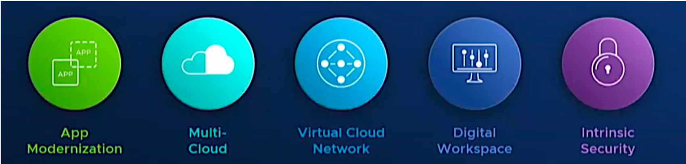


-----------------------------------------------------
## Guidelines & Conventions for this Workshop 

_- TKG / TKG Plus / TKGI are product names aligned to how VMware names all its products in compute, networking and other areas. The ‘i’ in ‘TKGI‘ stands for ‘integrated‘, given the integrated operating system lifecycle management and software defined networking components that are core to the product value. TKGI used to be called PKS (Pivotal Kubernetes Service), so throughout this workshop you will see reminants of the PKS name. For example: the PKS CLI (Command Line Interface)._

- This self-paced workshop includes presentations, videos, demos and hands-on labs. 
- The labs are interdependent and must be executed in order.
- Please use the [Workshop Google Sheet](https://docs.google.com/spreadsheets/d/17AG0H2_zJNXWIP8ZOsXjjlPCPKwhskRTg5bgkRR4maI) to claim a userID for this workshop. For example, Ralph Meira is user1.
- Update the same [Workshop Google Sheet](https://docs.google.com/spreadsheets/d/17AG0H2_zJNXWIP8ZOsXjjlPCPKwhskRTg5bgkRR4maI) as you progress through the Labs, by placing an "X" in the appropriate column.
- Each workshop participant will be assigned a Ubuntu VM previously set up for the execution of hands-on Labs. Your Laptop or Desktop will only be used for two purposes: 
     - SSH'ing or PuTTY'ing into the Ubuntu VM 
     - Browsing web pages
- When carrying out hands-on labs, you will be asked to cut-&-paste the commands shown `in boxes like this one` from this github page to your Ubuntu VM Terminal Window. However, when issuing commands, please make sure to alter the userID to match the one you have claimed, e.g.:
  - `ssh -i fuse.pem ubuntu@user3.pks4u.com` is for `user3` 
  - `ssh -i fuse.pem ubuntu@user15.pks4u.com` is for `user15` 
- In order to simplify the cut-&-paste-&-replace steps described above, once you are operating on your Ubuntu VM Terminal, we will define environment variables that will hold your specific login name as claimed in the [Workshop Google Sheet](https://docs.google.com/spreadsheets/d/17AG0H2_zJNXWIP8ZOsXjjlPCPKwhskRTg5bgkRR4maI). In this way, the cut-&-paste steps will not require you to edit the command line before pressing `return`.

- Throughout this document, when it's time for hands-on labs, you will see the following icon:
     


- The following icon will show up once or twice during the hands-on labs. It's to remind you to pay special attention to the syntax of the commands you are being asked to execute. The commands will need to match the UserID you claimed for yourself in the [Workshop Google Sheet](https://docs.google.com/spreadsheets/d/17AG0H2_zJNXWIP8ZOsXjjlPCPKwhskRTg5bgkRR4maI).
     


-----------------------------------------------------
## Architecture, Installation & Set-up 

- A Map of the Tanzu Portfolio of products:

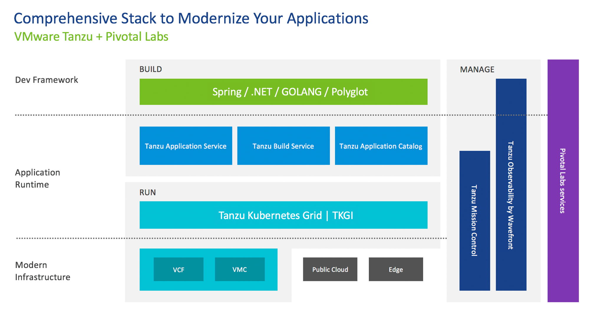

- The diagram below shows the general layout of the VMs, K8s Clusters and Platforms that we will be using during this workshop.

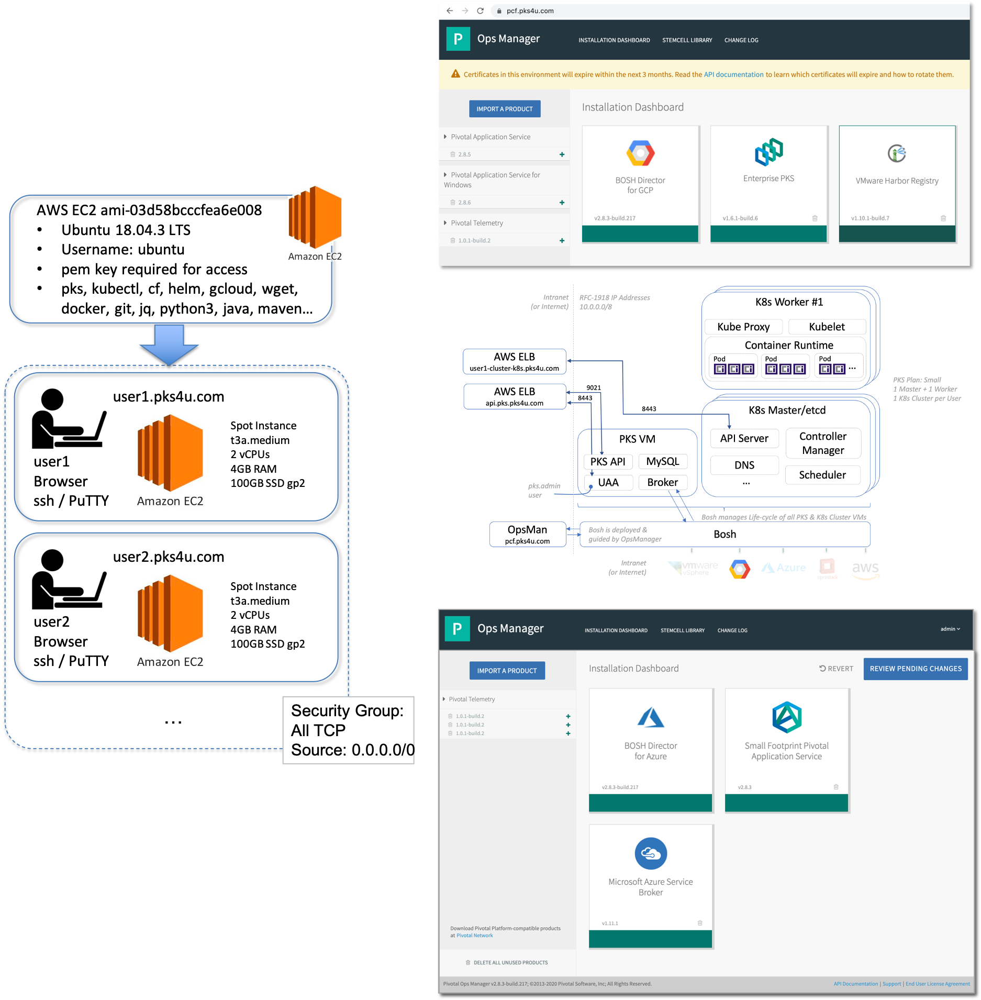

- The videos in this section are great for brushing up on your understanding of the technologies we will be working with during this workshop. 

- If you are comfortable with Containers, Docker and Kubernetes, then please move ahead to Lab-1.

   - [Containers vs. VMs 101 in 8 minutes](https://www.youtube.com/watch?v=L1ie8negCjc)

   - [Containers - Deep Dive in 18 minutes](https://www.youtube.com/watch?v=EnJ7qX9fkcU)

   - [Kubernetes 101 in 5 minutes](https://www.youtube.com/watch?v=PH-2FfFD2PU)

   - [PKS on vSphere, AWS, Azure, and/or GCP](https://docs.pivotal.io/pks/1-6/installing.html)


-----------------------------------------------------

### LAB-1: SSH into your Linux Workshop VM environment & Test the Command Line Interface tools

- Let's start by logging into the Workshop environment from your machine (Mac, PC, Laptop, Desktop, Terminal, VDI). You will need to use the following private key: 
   - [fuse.pem](./fuse.pem) if using a Mac.
   - [fuse.ppk](./fuse.ppk) if using a Windows PC.

- Note that the examples shown below apply to `user1`. If, for example, you are `user11`, your Ubuntu VM will be at `user11.pks4u.com`.


- In the pre-requisites section of this workshop, you were asked to use `ssh` or `PuTTY` to access the Ubuntu VM that has been assigned to your [UserID](https://docs.google.com/spreadsheets/d/17AG0H2_zJNXWIP8ZOsXjjlPCPKwhskRTg5bgkRR4maI). Please go ahead and create a Terminal Session into your VM. The example shown below applies to `user1` if he or she had downloaded the `fuse.pem` key to a Mac. If you need, the `PuTTY` instructions for Windows PC users can be found [here](./PuTTY_and_SSH.md).

```
ssh -i ~/Downloads/fuse.pem ubuntu@user1.pks4u.com 
```

- Once logged in, you can ignore any messages that ask you to perform a `do-release-upgrade`. 

- Please check whether the greeting information matches your UserID. For example, `user22` should see something like this:

```
my_number is 22
openjdk version "11.0.7" 2020-04-14
OpenJDK Runtime Environment (build 11.0.7+10-post-Ubuntu-2ubuntu218.04)
OpenJDK 64-Bit Server VM (build 11.0.7+10-post-Ubuntu-2ubuntu218.04, mixed mode, sharing)
Your UserID is user22
Your DevopsID is devops22
Your Namespace in the Shared-Cluster is namespace22
Your role in the Shared-Cluster is vmware-role22
```

- If you believe your greeting information to be wrong, please alert the workshop organizers. 

- If all is well, please proceed by executing the following commands. These commands will validate that your VM has all the necessary CLIs and frameworks for this workshop.

```
pks --version
kubectl version -o json 2>/dev/null
cf --version
git version
docker --version
go version
jq --version
python3 --version
helm version
java -version
mvn -version
```

- If any of the commands shown above did not work or produced and error, please alert the workshop organizers.

- Congratulations, you have completed LAB-1.

Please update the [Workshop Google Sheet](https://docs.google.com/spreadsheets/d/17AG0H2_zJNXWIP8ZOsXjjlPCPKwhskRTg5bgkRR4maI) with an "X" in the appropriate column.

-----------------------------------------------------
### LAB-2: Running a simple GoLang and a Spring/Java Program Locally (on your Ubuntu VM)

- During this Lab, we will experiment with [GoLang](https://golang.org/) and [Spring/Java](https://spring.io/) examples.
- We will first run these two examples of code "natively" on your Ubuntu VM.
- You will then create Docker Images of these programs and, once again, run them locally using the Docker Engine that has been pre-installed on your Ubuntu VM. 
- If you are a Developer, the steps in this Lab should be very easy and familiar to you. 
- If you are an Infrastructure person, the steps in this Lab will help you understand what developers do locally on their machines. 

#
#### LAB-2A 
 

- Using your Ubuntu VM, you are going to take this [Factorial GoLang Program](https://github.com/rm511130/fact/blob/master/fact.go) and run it locally.

- Execute the following commands:

```
cd ~ 
git clone https://github.com/rm511130/fact  
cd ~/fact  
go run fact.go 
```

- It may take a few seconds, but you should see a log message indicating that your code is `using port 3000`.

- Leave the code running and use a browser to access the following URL. Remember to use the proper FQDN that corresponds to your UserID: e.g. `user20` should use `http://user20.pks4u.com`.
```
http://user1.pks4u.com:3000/1500
``` 

- Did it work? 
  - Take a look at the [code](https://github.com/rm511130/fact/blob/master/fact.go). 
  - Did you find in the code the additional endpoints that you can call? Try them out:
     - `http://user1.pks4u.com:3000/version` 
     - `http://user1.pks4u.com:3000/header`
  - Did you see the logs on the Terminal Window of your VM?

- Use `CTRL-C` on your Ubuntu VM to cancel out of the `go run fact.go` command.

- Let's proceed with a Java/Spring example.


#
#### LAB-2B 
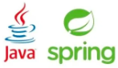    

- Execute the following commands:

```
cd ~ 
git clone https://github.com/rm511130/spring-petclinic.git
cd spring-petclinic
```
```
./mvnw -Dmaven.test.skip=true package
```
```
./mvnw spring-boot:run
```

- Once you see in your logs that `Tomcat started on port(s): 8080` you can proceed to test your `Pet Clinic` program.

- To test, open a browser to access the following URL. Remember to use the proper FQDN that corresponds to your UserID: e.g. `user11` should use `http://user11.pks4u.com`.

```
http://user1.pks4u.com:8080
```
- If the `Pet Clinic` App is running you have a good Spring/Java example to work with.

- You can use `CRTL-C` on your Ubuntu VM to cancel out of the `java -jar target/*.jar` command.

**Let's recap:** 
- Your Linux VM is able to run GoLang and Spring/Java programs. 
- Your Linux VM has a public IP address and a FQDN (Fully Qualified Domain Name) that lets your friends access and test your Apps. You can also test your code locally using localhost or 127.0.0.1.
- The code examples you executed provided an http interface accessible from a browser.
- A developer typically starts by writing his/her code locally. It's when he/she pushes the code to a server that differences in configuration and dependencies can lead to the famous "...but it worked on my machine..." comments. In the following hands-on labs, we will see how Container Images can help in this area.

#
#### LAB-2C
    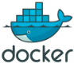    

- Using your Ubuntu VM let's take a look at the `Dockerfile` in the `~/fact` directory. 

```
cat ~/fact/Dockerfile
```

- Execute the following commands to start with a clean slate and build a Docker Image of your GoLang factorial program:

```
docker system prune -a -f     # deletes old container images
if [ "$(docker ps -aq -f status=running)" ]; then docker stop $(docker ps -a -q); fi; # stops any running containers
cd ~/fact
docker build -t fact .        # the dot is important 
```

- Execute the following command to run the `Fact` docker image locally on your Ubuntu VM using `port 3000`:

```
docker run -d --publish 3000:3000 --name fact --rm fact
```

- Using `curl` on your Ubuntu VM, or if you'd like, using a browser, access the following URL to test your `Fact` program. You will need to replace `$user` by your correct UserID if using a browser.

```
curl http://$user.pks4u.com:3000/5; echo
```

- During the `docker build` phase, did you notice how many layers were used to create the Docker Image of your GoLang factorial program? Execute the following commands, one-by-one, to learn more about your Docker Image. Pay attention to the layers and how recent they are:

```
docker image inspect fact
```
```
docker history fact
```
```
docker ps
```

- Now let's start an interactive bash shell on your container:

```
docker exec -it fact bash
```
 - You should see a prompt that looks something like this: `root@627ac94efaa7:/go/src/app#`
 - Let's keep working inside your container.
 - Execute the following commands:
 
 ```
 curl http://127.0.0.1:3000/5; echo
 ```
 ```
 cat /etc/*release
 ```
 ```
 whoami
 exit
 ```
 - What release of the OS was used?
 - What was the answer to the `whoami` command?
 
#
#### LAB-2D
        

- Now let's create a Docker Image from the Petclinic Jar file you created during Lab-2. 
- Execute the following commands to take a look at the `Dockerfile` we will be using:

```
cd ~/spring-petclinic
cat Dockerfile
```

- Let's build a Docker Container Image and run it locally on your Ubuntu VM. Use the following commands:

```
docker build -t petclinic . 
docker run -d --publish 80:8080 --name petclinic --rm petclinic
```

- It will take around 15 seconds for your Petclinic App to start running. You will then be able to access it at the following URL. Please make sure to edit the `<userID#>` and replace it with the appropriate UserID you claimed at the beginning of the workshop.

```
http://<userID#>.pks4u.com
```

- Let's now take a look at the layers used in the creation of your Petclinic container image:

```
docker history petclinic
```
```
docker exec -it petclinic sh -c "cat /etc/*release" | head -n 4
```

- As you can see, as a developer, you have a lot of control over what layers and operating systems are employed in building a container image.

**Let's recap:** 
- You built and executed a couple of Docker Images on your Ubuntu VM using essentially the same files you had during Lab-2.
- Using various commands on your Ubuntu VM and in a Docker container, you were able to see that many layers (and software versions) were assembled together on your behalf as a result of the `docker build` commands.
- Now that you have a working, local container image of your `fact` and `petclinic` programs, as a developer, you should feel reassured that your Apps have a good chance of working in their containerized image format, when pushed to a server. This is one of the main reasons for the success of Container Images among developers.

Congratulations, you have completed LAB-2.

Please update the [Workshop Google Sheet](https://docs.google.com/spreadsheets/d/17AG0H2_zJNXWIP8ZOsXjjlPCPKwhskRTg5bgkRR4maI) with an "X" in the appropriate column.

-----------------------------------------------------
### LAB-3: Connecting to TKGI API and Resizing a Kubernetes Cluster

- The creation of a Kubernetes Cluster takes some time, so we created a Kubernetes Cluster for you in preparation for this workshop. The command used was:

```
# pks create-cluster user1-cluster -e user1-cluster-k8s.pks4u.com --plan small --num-nodes 1  # do not execute
```

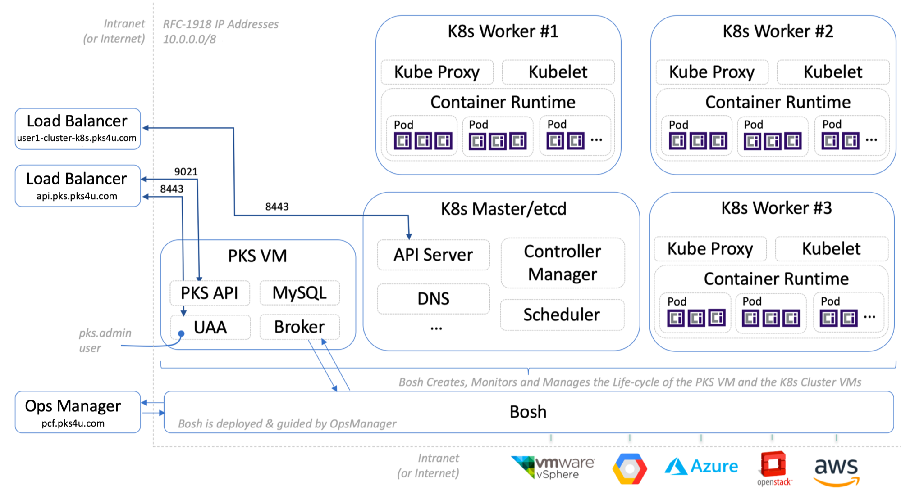


- During this lab you are going to assume the role of a Platform DevOps person.
- Execute the following commands to log into the TKGI Control Plane. 
- The use of `$devops` will align each command to your UserID.

```
pks login -a https://api.pks.pks4u.com:9021 -p password -k -u $devops
pks clusters
pks plans
```
- Let's get more detailed information about your cluster.

```
pks cluster $user-cluster
rm ~/.kube/config
pks get-credentials $user-cluster
```
- If prompted for a password, use `password`. Please continue by executing the following commands:

```
kubectl cluster-info
kubectl get all --all-namespaces
```

- If kubectl auto-completion is not switched-on for your Ubuntu VM, you can execute the following commands to activate it:
```
echo "source <(kubectl completion bash)" >> ~/.bashrc
exit
# and log back into your Ubuntu VM using PuTTY or SSH 
```

- Let's scale your cluster horizontally by adding an additional K8s worker node:

```
pks resize $user-cluster --num-nodes 2
```

- Use the following command to monitor the growth of your cluster:

```
pks cluster $user-cluster
```

- You should see output similar to the example below:

```
PKS Version:              1.6.1-build.6
Name:                     user1-cluster
K8s Version:              1.15.5
Plan Name:                small
UUID:                     1210f5d8-c292-4f22-a0d8-0147b87b4ed0
Last Action:              UPDATE
Last Action State:        in progress
Last Action Description:  Instance update in progress
Kubernetes Master Host:   user1-cluster-k8s.pks4u.com
Kubernetes Master Port:   8443
Worker Nodes:             2
Kubernetes Master IP(s):  10.0.11.10
Network Profile Name:     
```
- Note in the output shown above the line that indicates the active resizing of your cluster:

```
Last Action State:        in progress
```
- You don't need to wait while the expansion of the worker nodes is progressing. Let's proceed with the next steps.

- Had we wished to scale the cluster vertically, we would have followed the instructions found [here](https://docs.pivotal.io/pks/1-6/scale-clusters.html). Changing the `plan` of how clusters are built is an TKGI Operator function.

**Let's recap:** 
- You logged into the TKGI Control Plane as a DevOps user, and scaled an existing cluster.
- Even though you are a DevOps user, you did not see any other K8s Clusters. You are an isolated tenant of the TKGI platform.
- You executed a few `kubectl` commands against your cluster as a DevOps TKGI Manager.

Please update the [Workshop Google Sheet](https://docs.google.com/spreadsheets/d/17AG0H2_zJNXWIP8ZOsXjjlPCPKwhskRTg5bgkRR4maI) with an "X" in the appropriate column.

Congratulations, you have completed LAB-3.

-----------------------------------------------------
### LAB-4: Deploying Apps to Kubernetes Clusters

- Docker Images identical to the ones you created during Lab-2C and Lab-2D have been tagged and uploaded into the Public Docker Hub as [rmeira/fact](https://hub.docker.com/repository/docker/rmeira/fact) and [rmeira/petclinic](https://hub.docker.com/repository/docker/rmeira/petclinic). The short documentation found at [rmeira/fact](https://hub.docker.com/repository/docker/rmeira/fact) contains the steps taken to tag and upload a Docker Image into the Public Docker Hub. 

#
#### LAB-4A
        

- Let's use the [rmeira/fact](https://hub.docker.com/repository/docker/rmeira/fact) image to run the Factorial program on your Kubernetes cluster.

- Execute the following commands:

```
kubectl create deployment fact --image=rmeira/fact
kubectl get all
kubectl expose deployment fact --type=LoadBalancer --port=80 --target-port=3000
```
- It takes a minute to create a load balancer and to expose a K8s service, so let's first test if there is a pod running the `rmeira/fact` container image using the following commands:

```
kubectl get pods
```
- If you see that your `fact` pod is up and running, please proceed with the following commands:

```
pod_name=$(kubectl get pods | grep fact | awk '{ print $1 }'); echo $pod_name
kubectl exec -t -i $pod_name bash
```

- The `kubectl exec` command opens a terminal session on a container that is running the `fact` Docker Image in your cluster. You should see a prompt similar to the example: `root@factorial:/go/src/app#`

- Continue with the following commands to test whether the `fact` program is running:

```
curl 127.0.0.1:3000/40; echo
exit
```
- The `exit` command you just executed will bring you back to the command prompt on your Ubuntu VM. Let's check whether your service has been assigned a load balancer External-IP address, and whether the `pks resize` command from the previous lab has completed successfully.

```
kubectl get service
pks cluster $user-cluster
```
- Execute the commands above every 30 seconds until you see:
   - an `External IP` show up for the `fact` service
   - _Note: you may also see a `Last Action State: succeeded` and `Worker Nodes: 2`_
   
- As soon as the `External IP` address for the `fact` service is available, no matter whether or not the `pks resize` command is still `in progress`, you can proceed by executing the following command to test your `fact` docker image:

```
curl http://<External-IP>/10; echo
```
- You should see the results of the `10!` calculation.

#
#### LAB-4B
        

- Let's use the [rmeira/petclinic](https://hub.docker.com/repository/docker/rmeira/petclinic) image to run the `Petclinic` program on your Kubernetes cluster.

- Execute the following commands:

```
kubectl create deployment petclinic --image=rmeira/petclinic
kubectl get all
kubectl expose deployment petclinic --type=LoadBalancer --port=8080
```
- It takes a minute to create a load balancer and to expose a K8s service. You can see the pod being created using the following command:

```
kubectl get pods -w
```

- You can use `CTRL-C` to cancel out of the `-w` watch mode.

- Similarly, the command below will display information about your K8s services:

```
kubectl get service -w
```
- You can use `CTRL-C` to cancel out of the `-w` watch mode once you see an `External IP` show up for the `Petclinic` service
   
- As soon as the `External IP` address is available, access the following URL using a browser to verify that your `Petclinic` docker image is working as expected:

```
http://<External-IP>:8080
```
- You should see the `Petclinic` App.

**Let's recap:**
- Even though the `pks resize` command was still `in progress`, you were able to carry out App deployments.
- You deployed the `fact` and `petclinic` images to your K8s cluster and tested that both were working.
- Kubernetes fetches images from a registry which, until now, was the public Docker Hub. We will see in the next Lab how to use Harbor, an Enterprise-Class registry.
- You exposed both `fact` and `petclinic` deployments as services available on the Internet.
- You did not get SSL encrypted, secure URLs accessible on the Internet, but anyone with access to the correct `External IP` addresses is able to run/access your `fact` and `petclinic` programs.
- If you did wish to secure your programs with TLS and a Let's Encrypt (CA) Certificate, you would need to follow these [instructions](https://docs.bitnami.com/kubernetes/how-to/secure-kubernetes-services-with-ingress-tls-letsencrypt/).

Congratulations, you have deployed a GO App and a Spring Boot App to a K8s cluster, and completed LAB-4.

Please update the [Workshop Google Sheet](https://docs.google.com/spreadsheets/d/17AG0H2_zJNXWIP8ZOsXjjlPCPKwhskRTg5bgkRR4maI) with an "X" in the appropriate column.

-----------------------------------------------------
### LAB-5: Using Harbor, Clair and Notary

- Let's see how Harbor, Clair and Notary enhance the Ops and Devs experience.


- Harbor was installed next to TKGI in Ops Manager, and `user1`, `user2`, ... were all created using the *same password*: `Password1`. Note: *Don't* change `Password1` to `Password<#>` because you are `user<#>`, every user was created with the same password: `Password1`. 

- Log into Harbor using a browser: [`https://harbor.pks4u.com/`](https://harbor.pks4u.com/)

- To get acquainted with Harbor's GUI, follow the example below, clicking where the yellow arrows are pointing, so you can get an idea of how Harbor works. Your userID has been given administrator privileges, so please be careful not to change Harbor's configuration.

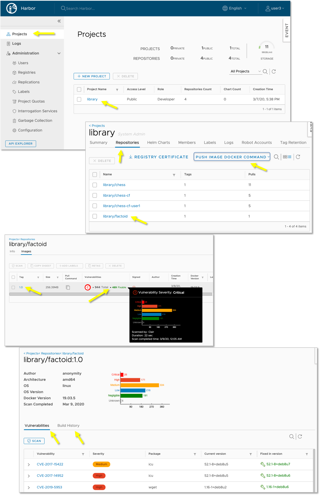

- Keep Harbor open. You will come back to it in a few minutes.

- Execute the following command:

```
docker images
```
- Verify that you have at least two docker images that are local to your Ubuntu VM: `fact` and `petclinic`. 
- Proceed by executing the following commands to log into Harbor from your Ubuntu VM and to upload images to the Harbor registry:

```
docker login -p Password1 harbor.pks4u.com -u $user
docker images
docker tag fact harbor.pks4u.com/library/$user-fact:latest
docker tag petclinic harbor.pks4u.com/library/$user-petclinic:latest
docker images
docker push harbor.pks4u.com/library/$user-fact:latest
docker push harbor.pks4u.com/library/$user-petclinic:latest
```
- Now look for your programs in the Harbor browser session you were asked to leave open.

- If it hasn't happened yet, go ahead and select your `userID-fact` image and scan it for vulnerabilities. 
- Do the same for your `userID-petclinic` image.
- How many CVEs are your `fact` and `petclinic` Apps exposed to?

- Now execute the following command on your Ubuntu VM:

```
docker pull harbor.pks4u.com/library/$user-fact:latest
```

- The message you received back is a reflection of Harbor's configuration. Note that the image you pushed to Harbor is also not signed. We can set Harbor's configuration to prevent unsigned images from being pulled as well.

- Execute the following command:

```
docker pull harbor.pks4u.com/library/fact-alpine:latest
```
- This image should have downloaded without problems because it does not expose you to any critical CVEs. Execute the following command to confirm the status of your local Docker images:

```
docker images
```

**Let's recap:**
- You were able to target a Harbor registry.  
- You uploaded container images and downloaded a container image.
- You scanned container images and saw that Harbor did not allow you to download images with `high` or `critical` vulnerabilities.

Congratulations, you have completed LAB-5.

Please update the [Workshop Google Sheet](https://docs.google.com/spreadsheets/d/17AG0H2_zJNXWIP8ZOsXjjlPCPKwhskRTg5bgkRR4maI) with an "X" in the appropriate column.


-----------------------------------------------------
### LAB-6: Scaling an App on Kubernetes

- Now let's scale up and down the number of pods running the `fact` docker image.


- For this Lab you will need to open 3 (three) terminal windows that access your Ubuntu VM. Please arrange them side by side, per the example below, keeping all 3 terminal windows simultaneously visible on your screen. 
- If using PuTTY, you can right-click on the top border of your existing terminal window and use the "Duplicate Session" option. 
- If using a Mac, you can open more terminal windows using ⌘ N, command-N. You will need to use the `ssh` command to log into your Ubuntu VM.

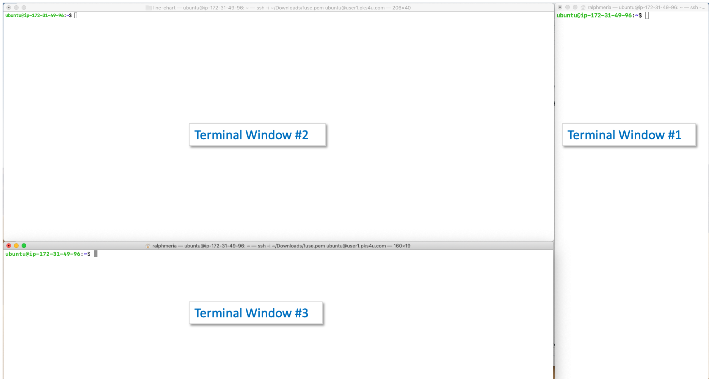

- Let's denominate as Terminal Window #1 the long, narrower terminal window on the right-side of your screen. 
- Using Terminal Window #1, execute the following command to retrieve the `External IP` address of your `fact` service.
```
kubectl get service
```
- Using Terminal Window #1, execute the following command using the `External IP` of your `fact` service.
```
# example: while true; do curl http://35.227.49.80/10; echo; done; #

while true; do curl http://<External IP>/10; echo; done;
```
- You should see a never ending flow of `10!` calculations. This will be our _canary query_. It will help us determine if Kubermetes is properly orchestrating the deployment of additional containers, and linking them to the `fact` service.
- Practice using `CTRL-C` on Terminal Window #1 to stop the processing of `10!`, and then use `<arrow up>` to re-issue the `while true` command to restart the _canary query_ test cycle.

- Let's denominate as Terminal Window #2 the top, wider terminal window.
- Using Terminal Window #2, execute the following command:
```
watch kubectl get pods -o wide
```

- Using Terminal Window #3, i.e. the remaining terminal window that has an available Linux prompt, execute the following commands:
```
kubectl scale deployment fact --replicas=20
```

- Your screen should look like the example shown below:

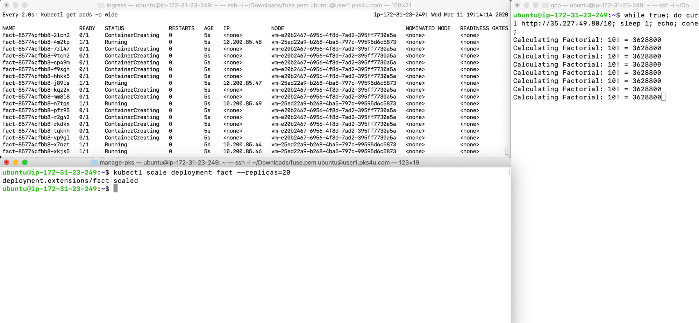


- On Terminal Window #2, you should see an output similar to the example shown below:

```
NAME                  READY  STATUS    RESTARTS   AGE    IP            NODE                                     
fact-85774cfbb8-268th  1/1   Running      0       3m29s  10.200.44.8   vm-635fc928-8e80-4c61-7498-142b72106e16
fact-85774cfbb8-4l4wt  1/1   Running      0       3m29s  10.200.44.15  vm-635fc928-8e80-4c61-7498-142b72106e16
fact-85774cfbb8-72rqk  1/1   Running      0       3m29s  10.200.85.19  vm-25ed22a9-b268-4ba5-797c-99595d6c5873
fact-85774cfbb8-7v7sv  1/1   Running      0       3m29s  10.200.85.20  vm-25ed22a9-b268-4ba5-797c-99595d6c5873  
...
```
- Note in the output shown above that under `NODE` we see two different VM identifiers. That is to be expected given that you resized your K8s cluster to two worker nodes during Lab-4.

- While changing the number of `replicas`, did you see any error messages on Terminal Window #1?

```
curl: (7) Failed to connect to 35.227.49.80 port 80: Connection refused
```

- If you did see error messages, it's because additional tuning of the containers is necessary. We need to introduce the concept of configuring [Liveness, Readiness and Startup Probes](https://kubernetes.io/docs/tasks/configure-pod-container/configure-liveness-readiness-startup-probes/#configure-probes) so that Kubernetes will know to direct traffic to the pods only when they are ready and healthy. Luckily, we created our `fact` program with a `/health` end-point, so we're half-way to a solution.

- Keep Terminal Windows #1 and #2 running. We will come back to them shortly.

- Let's try to fix the `Connection Refused` issue by amending the existing deployment specifications with the yaml snippet shown below:

```
      containers:
      - image: rmeira/fact
        ports:
          - containerPort: 3000
            protocol: TCP
        readinessProbe:
          httpGet:
            path: /health
            port: 3000
          initialDelaySeconds: 5
          periodSeconds: 10
        livenessProbe:
          httpGet:
            path: /health
            port: 3000
          initialDelaySeconds: 10
          periodSeconds: 20
```

- Here are the steps to follow:

```
cd ~
kubectl get deployment fact -o yaml > fact-deployment.yml
```

- You then need to alter the contents of the `fact-deployment.yml` file to include the yaml snippet shown above. 
- *However*, since it's very easy to get the yaml formatting wrong, and the purpose of this workshop is not to test your editing skills, let's proceed by using the `fact-deployment-with-readiness-probe.yml` file, available in your home directory, to recreate a working deployment of your `fact` program.

- Delete and recreate, using [`fact-deployment-with-readiness-probe.yml`](./fact-deployment-with-readiness-probe.yml), your `fact` deployment with the following commands:

```
kubectl delete deployment fact
kubectl apply -f fact-deployment-with-readiness-probe.yml
```

- It will take K8s a few seconds to achieve the desired state described in the `fact-deployment-with-readiness-probe.yml`.

- When you will see the `10!` calculations on Terminal Window #1, you can proceed ahead to the next step.

- Observe whether the `Connection Refused` issue occurs when scaling up and down the number of pods in your deployment:

```
kubectl scale deployment fact --replicas=20
```

- Wait until all the pods are running before proceeding with the scaling down command:

```
kubectl scale deployment fact --replicas=1
```

- Clean-up: 
    - We will need three Terminal Windows during the next Lab, so don't close any Terminal Windows just yet.
    - please use CTRL-C to halt any loops that may still be actively creating output to any of your Terminal Windows. 
    - please execute the following commands:
    
    ```
    kubectl delete deployment fact petclinic
    kubectl delete service fact petclinic
    ```

**Let's recap:** 
- The `fact` image deployed with the `kubectl create deployment fact --image=rmeira/fact` command had to be amended with a `livenessProbe` and a `readinessProbe` to reduce the impact of scaling horizontally the number of running pods. 
- Kubernetes developers need to understand their environment quite well from a DevOps perspective when developing more complex, microservices based, distributed systems. Order Entry systems, for example, can't afford to suffer from hiccups when the platform is auto-scaling to handle increases in demand.
- For the more advanced users, you may wish to experiment with scaling the K8s cluster using the `pks resize <cluster-name> --num-nodes <#>` command while deploying and scaling the `fact` app. Additional commands such as `kubectl drain <node>` and `kubectl uncordon <node>` also demonstrate the power K8s puts at your fingertips for draining workloads from nodes.
- Advanced workload placement and management using K8s clusters can be a fun area to [explore](https://kubernetes.io/docs/concepts/cluster-administration/manage-deployment/).

Congratulations, you have completed LAB-6.

Please update the [Workshop Google Sheet](https://docs.google.com/spreadsheets/d/17AG0H2_zJNXWIP8ZOsXjjlPCPKwhskRTg5bgkRR4maI) with an "X" in the appropriate column.

-----------------------------------------------------
### LAB-7: K8s Soft and TKGI Hard Tenancy


- We have to be extra-cautious during this Lab because it can be destructive depending on the username you employ.

- Your `devops<#>` user is only allowed to see and manage the K8s clusters that it created, and it's also limited to only creating K8s clusters within the sizing limits and machine types defined by the TKGI Administrator. Please execute the following commands:

```
pks login -a https://api.pks.pks4u.com:9021 -p password -k -u $devops 
pks clusters
pks get-credentials $user-cluster        # if asked, password = password
```

- Now, let's try to resize your K8s cluster to 10 worker nodes:
```
pks resize $user-cluster --num-nodes 10
```


- Let's try to delete (*not yours, but*) a colleague's cluster:
```
pks delete-cluster user25-cluster   # make sure you know what you are doing before proceeding with this step
```

- As you can see TKGI Administrators have placed guardrails that kept you from making your K8s cluster too big, or from deleting a cluster that was not yours.

- Let's deploy a new App to your `user<#>-cluster`:

```
kubectl create deployment timer-test --image=rmeira/timer-test
kubectl expose deployment timer-test --type=LoadBalancer --port=80 --target-port=3000
```
- Execute the command below until you see an `External IP` address assigned to your service. You can then use `CTRL-C` to cancel the `watch` loop:

```
watch kubectl get service timer-test
```

- Using the `External IP` address, execute the following command and leave it running. Use Terminal Window #1 for this step.

```
while true; do curl http://<External-IP>/5000000000; echo; done
```
- Go back from time to time to this Terminal Window #1 to see how your `timer-test` is responding. 
- Check with other colleagues, that are also part of this workshop, whether they have started their `timer-test`.
- We will come back to it in a little while, but the main concept here is that your cluster is a TKGI tenant with hard isolation from other TKGI tenants. Workloads running in separate clusters will not affect your `timer-test` response times.

- Now to the dangerous part of this Lab. Using a second Terminal Window, execute the following command to become a TKGI Administrator:

```
pks login -a https://api.pks.pks4u.com:9021 -u pks_admin -p password -k
```
- Now take a look at the scope of control of the `pks_admin` user, by executing the following command:
```
pks clusters
```
- When logged-in with the scope of a TKGI Administrator, you can see and manage all K8s Clusters created via the TKGI Control Plane. Please make sure not to delete or resize any clusters.

- We have a `shared-cluster` that has not been used in any labs. Execute the following command to learn more about this `shared-cluster`:

```
pks get-credentials shared-cluster                 
```
- If asked for a password, use `password`. Please continue with the following commands:

```
pks cluster shared-cluster
kubectl cluster-info
kubectl get namespaces
```

- Now, you are going to use the `role` and a `namespace` that were assigned to your UserID. Execute the following commands:

```
kubectl get role $role -n $namespace -o yaml
kubectl get rolebinding $role -n $namespace -o yaml
```

- The `role` and `rolebinding` shown above, limit your `userID` to only be able to perform commands within the scope of your `namespace<#>`.

- Let's switch to playing the role of a developer. We will switch to being `user<#>` instead of `pks_admin` or `devops<#>`. Please execute the following commands:

```
rm ~/.kube/config            # this eliminates all previously used login token information on your Ubuntu VM
./get-pks-k8s-config.sh --API=api.pks.pks4u.com --CLUSTER=shared-cluster-k8s.pks4u.com --USER=$user     # password = password
```
- Now let's check if the `~/.kube/config` you deleted a few seconds ago is back with the correct scopes:

```
cat ~/.kube/config
```

- You are now logged into the `shared-cluster` as the `user<#>` you selected. You are also limited to the role assigned to `user<#>` which is only allowed to operate within a single `namespace<#>`.

- Let's execute the following commands to initiate a `timer-test` in the `shared-cluster` within your `namespace<#>` that has been limited to only allow `user<#>` access and control. Execute the following commands:

```
kubectl create deployment timer-test --image=rmeira/timer-test -n $namespace
kubectl expose deployment timer-test --type=LoadBalancer --port=80 --target-port=3000 -n $namespace
```
- Wait until you have an `External IP` assigned to your service:

```
watch kubectl get service timer-test -n $namespace
```

- Once you have an `External IP` for your service, use `CRTL-C` to stop the `watch` loop and proceed with the following command using the `Externam IP` address assigned to your `timer-test` service:

```
while true; do curl http://<External IP>/5000000000; echo; done
```

- As more of your colleagues start their `timer-test` programs in their respective namespaces, you will start to see why namespace-based isolation of workloads is called soft-isolation.

- Leave open all your Terminal Windows that are running the `timer-test` program. We will get back to them in a few minutes.

**Let's recap:** 
- TKGI allows for isolation of workloads in a multi-tenant environment where users such as `devops1` have `management` scope to create and manage their own K8s clusters within the limits set by the operators who set up the TKGI control plane. 
- TKGI enables the separation of responsibilities between DevOps and Ops, without the risk of allowing DevOps to overconsume resources beyond what is approved or available.
- K8s roles and rolebindings are an effective way to limit the scope of control for an individual or a group of users to specific namespaces.
- K8s namespaces share Master Nodes, Worker Nodes, and Networking, so they can expose workloads to noisy-neighbor effects. K8s has the flexibility to set CPU and Memory limits for workloads, but the sharing and utilization of resources has to be monitored carefully.

Congratulations, you have completed LAB-7.

Please update the [Workshop Google Sheet](https://docs.google.com/spreadsheets/d/17AG0H2_zJNXWIP8ZOsXjjlPCPKwhskRTg5bgkRR4maI) with an "x" in the appropriate column.

-----------------------------------------------------
### LAB-8: A quick look at [TMC (Tanzu Mission Control)](https://players.brightcove.net/1534342432001/default_default/index.html?videoId=6074617846001) 

- VMware's Vision for Tanzu Mission Control is to enable your enterprise:
    - To Manage Any K8s Cluster on Any Public/Private IaaS
    - To Manage Many K8s Clusters across Many Public/Private IaaS
    - Where "Manage" means audit, enforce policies, create, delete, upgrade, ...
    
- VMware's Tanzu Mission Control's current release covers:
    - Attaching any K8s Cluster from any Cloud for monitoring, auditing, and enforcing policies.
    - Life-cycle management of K8s Clusters created on AWS and vSphere. Azure and GCP to follow shortly.
    


- Let's start this lab by looking at a [short 4-minute demo of TMC](https://bcove.video/2VCXSmk)

- In order to attach your `user<#>-cluster` to Tanzu Mission Control you will need a YAML file.

- Your unique YAML file can be found in the [Workshop Google Sheet](https://docs.google.com/spreadsheets/d/17AG0H2_zJNXWIP8ZOsXjjlPCPKwhskRTg5bgkRR4maI). Scroll to the right and look under column R for your YAML file information.

- Please execute the following commands to focus back on your individual k8s cluster:

```
pks login -a https://api.pks.pks4u.com:9021 -p password -k -u $devops      # user the appropriate devops<#>
pks clusters
pks get-credentials $user-cluster
```
- If asked for a password, use `password`. 

- Please continue with the command you obtained from column R of the [Workshop Google Sheet](https://docs.google.com/spreadsheets/d/17AG0H2_zJNXWIP8ZOsXjjlPCPKwhskRTg5bgkRR4maI). The command is very similar to the one shown below:

```
# kubectl apply -f 'https://tanzupaorg.tmc.cloud.vmware.com/installer?<use your assigned code from spreadsheet>' 
```
- Once the connection has been verified the presenter will be able to demo you your cluster attached to TMC.

**Let's recap:** 
- TMC is a leap forward in simplification and breadth of control for the world of Kubernetes.
- TMC allows you to visualize in a single location all the K8s clusters your enterprise is using.
- TMC allows you to create, upgraded, delete K8s clusters on AWS, and soon on all Public IaaS.

Congratulations, you have completed LAB-8.

Please update the [Workshop Google Sheet](https://docs.google.com/spreadsheets/d/17AG0H2_zJNXWIP8ZOsXjjlPCPKwhskRTg5bgkRR4maI) with an "X" in the appropriate column.


-----------------------------------------------------
### LAB-9: A quick look at [Tanzu Observability by Wavefront](https://cloud.vmware.com/tanzu-observability) 

- Observability goes beyond the scope of Tanzu Mission Control, so VMware has Tanzu Observability by Wavefront.

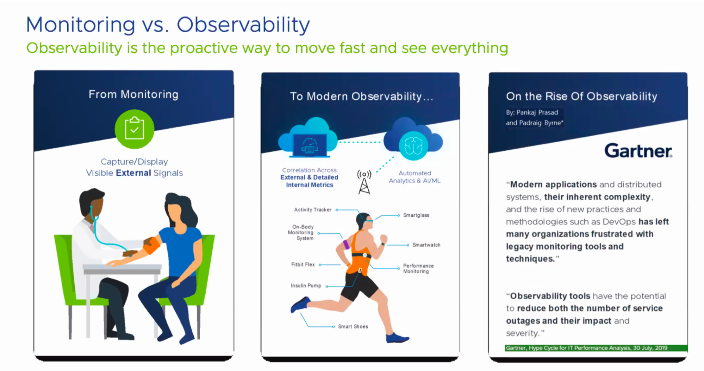

- Please watch this [6 minutes video](https://www.youtube.com/watch?v=nZnbdNHFNyU) to better understand Tanzu Observability by Wavefront.


- In this Lab we will take a look at how easy it is to integrate TKGI with Wavefront:

- If you were following the Labs one-by-one and in sequence, you should still have three Terminal Windows up and running. Two of them should have `timer-test` running in a loop, demonstrating the difference between workload isolation by cluster vs. workload isolation by namespacing.

- Using the third Terminal Window, let's focus on your individual cluster using the `devops` username: 

```
pks login -a https://api.pks.pks4u.com:9021 -p password -k -u $devops
pks clusters    # you should only see one
pks get-credentials $user-cluster
```
- If asked for a password, use `password`. Please continue with the following commands:

```
kubectl cluster-info
helm repo add wavefront https://wavefronthq.github.io/helm/
helm repo update
kubectl create namespace wavefront
```
- For the next command you will need your individual `Helm` command which can be found under Column S of the [Workshop Google Sheet](https://docs.google.com/spreadsheets/d/17AG0H2_zJNXWIP8ZOsXjjlPCPKwhskRTg5bgkRR4maI).

- The command you shoud copy-&-past-&-execute should look like the example shown below:

```
# helm install wavefront wavefront/wavefront --set wavefront.url=https://surf.wavefront.com --namespace wavefront --set wavefront.token=<your-own-wavefront-token> --set clusterName=user1-cluster
```

- Now ask the workshop organizer to show your cluster data on Wavefront.


**Let's recap:** 
- Tanzu Observability by Wavefront is often referred to as *TO*.
- TO requires the execution of a simple helm chart to integrate with any K8s cluster.
- Wavefront provides a SaaS based approach to handle terabytes of data in the most cost-effective way.

Congratulations, you have completed LAB-9.

Please update the [Workshop Google Sheet](https://docs.google.com/spreadsheets/d/17AG0H2_zJNXWIP8ZOsXjjlPCPKwhskRTg5bgkRR4maI) with an "x" in the appropriate column.


-----------------------------------------------------
### LAB-10: A quick look at [TAS (Tanzu Application Service)](https://cloud.vmware.com/tanzu-application-service) 

- Tanzu Application Service for K8s is a Platform as a Service that builds and manages secure container images while taking advantage of the power afforded by Kubernetes' orchestration of containers. 
- Developers love TAS because there are no IP addresses, no complex YAML files, no need to understand load balancing, routing, SSL certificates, or specifics of any given Public IaaS. TAS is all about getting from source code to production via a simple `cf push`.
- Operators love TAS because it is self-monitoring and self-healing. Through TAS, Ops can enforce policies, carry out updates/upgrades of O/S and middleware layers, add database and other services to the developer's marketplace, expand the environment horizontally and vertically, while maintaining high-availability. 
- TAS effectively simplifies and streamlines developer and operator tasks, enabling productivity, while enforcing security best practices and development techniques that deliver significant gains in speed to market.  

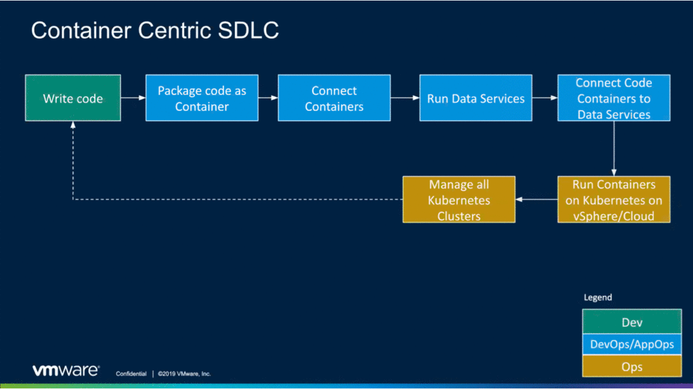


- Execute the following commands from your Ubuntu VM to eliminate all the superfluous files:

```
cd ~/fact;   rm Dockerfile Procfile README.md; rm -rf .git; ls -las
```
- Log into TAS (Tanzu Application Service) and `cf push` your application: 

```
cf login -a api.sys.13.83.100.157.cf.pcfazure.com -p password --skip-ssl-validation -u $user
```
```
cf push -m 128M -b go_buildpack fact-$user
```

- Wait for the `cf push` to complete and grab the URL next `routes:`, then execute the following command:

```
curl -k https://fact-$user.apps.13.83.100.157.cf.pcfazure.com/100; echo 
```

- You just deployed and tested your `fact.go` code using the latest sanitized versions of all the container image layers necessary to run your App.
- Your App has an SSL encrypted URL that routes and load-balances user requests automatically to your App instance(s).
- Your App is running in the Cloud on Highly Available, self-monitoring, self-healing, multi-zone infrastructure.
- Your App has been auto-instrumented for APM (Application Performance Monitoring) and Log aggregation.

- Now let's scale your App horizontally:

```      
cf scale fact-$user -i 5
```
```
cf app fact-$user
```
- Now let's scale your App vertically:

```
cf scale fact-$user -m 64M
```
```
cf app fact-$user
```
- Now let's create a shell into one of your App containers and learn more about it:

```
cf ssh fact-$user                      # to create an ssh session into a container
```
- Execute the following commands to learn about the OS Layer in the container and validate that the user is not `root`:

```
cat /etc/*release | head -4            # to verify which version of Linux is being used
whoami                                 # to validate that you are not root
```
- Continuing to use the shell session you started with the `cf ssh` command execute the following:

```
for i in {2..50}; do kill -9 $i; done         # this will force your container to crash
```

- Now let's check the status of your App:

```
cf app fact-$user                      # to check the status of your App and all its instances
```

- Now let's check events & log aggregation. Execute the commands shown below:

```
cf events fact-$user
cf logs fact-$user --recent
```

- We could extend this Lab with App auto-scaling, or by using `cf bind-service` to bind your App to a database. Execute the following command to see the types of services that can be made available as self-service options to developers:

```
cf marketplace
```

- If you are developing modern Apps, Tanzu Application Service can significantly change the developer's experience.

- By delivering TAS for Kubernetes, VMware effectively automates away all the k8s complexities and guarantees the consistent creation of curated, secure container images that will run on k8s clusters on any cloud infrastructure, with the proven efficiency of a `cf push` dial-tone.

Congratulations, you have completed all the LABs in this Workshop.

------------------------
## Wrapping-up

We covered a lot of ground today. Lots of new concepts and hopefully lots of valuable learning opportunities. We've only scratched the surface. VMware has a robust set of services and documented best practices to help you get started with greenfield projects and/or brownfield modernizations from old architectures to modern cloud native solutions.

Thank you for your time and attention. Please take 30 seconds to provide us some [feedback](https://forms.gle/AQU3Ky3bfduB2c7y6).
