##### https://tinyurl.com/pcf4cas


# Transforming How The World Builds Software 
-----------------------------------------------------
## Workshop Contents
(9:30AM to 3:30PM Breakfast & Lunch Included)

- Pivotal Mission & Applicability to C.A.S.
     - Value Statement
     - Case Studies
-  PCF Installation Steps
     - Operations Manager
     - Tile(s) Installation
- Demo & Hands-on
     - Developer Experience
        - PAS & PKS
     - Day 2 Operations
        - Scaling
        - Health Monitoring
        - Patching
        - Upgrading
     - Pivotal Container Service (Kubernetes) workload deployment
     - Pivotal Application Service for higher level developer productivity
- Pivotal Data Update and Q&A
- Next Steps
-----------------------------------------------------
## Technical Pre-Requisites
- A Mac or PC with internet connection, running a browser that can access https://chess.cfapps.io
- Ability to access and update this [Workshop Google Sheet](https://drive.google.com/open?id=1YcaNLkBqXHgYZch6yV8Kvf2G2AUG-trKSQQvejpstv8)
- Ability to SSH into an Ubuntu VM (public IP address) using a private-key file

  e.g. `ssh -i fuse.pem ubuntu@user1.ourpcf.com`
  - [fuse.pem](https://github.com/rm511130/PCF4CAS/blob/master/fuse.pem) must be set using `chmod 400` to read-only by owner
  - If using Powershell on a Windows machine read these [instructions](https://superuser.com/questions/1296024/windows-ssh-permissions-for-private-key-are-too-open)
  
-----------------------------------------------------

## Guidelines for this Workshop
- This workshop includes presentations, demos and hands-on labs. 
- The labs are interdependent and must be executed in order.
- Please use the [Workshop Google Sheet](https://drive.google.com/open?id=1YcaNLkBqXHgYZch6yV8Kvf2G2AUG-trKSQQvejpstv8) to claim a user-id for this workshop. For example, Ralph Meira is user1.
- Update the same [Workshop Google Sheet](https://drive.google.com/open?id=1YcaNLkBqXHgYZch6yV8Kvf2G2AUG-trKSQQvejpstv8) as you progress through the Labs, by placing an "x" in the appropriate column.
- When carrying out hands-on labs, you can cut-&-paste the commands shown `in boxes like this one`. However, when issuing commands, please make sure to alter the userID to match the one you have claimed, e.g.:
  - `ssh -i fuse.pem ubuntu@user3.ourpcf.com` is for `user3` 
  - `ssh -i fuse.pem ubuntu@user15.ourpcf.com` is for `user15`
- Don't get stuck. Ask for help. The goal is to learn concepts and understand how Pivotal can help CAS be successful.
- The PAS and PKS platforms we will be using were created using self-signed certificates, so you will sometimes have to click through warning screens about insecure pages.
- Each workshop participant will be assigned an Ubuntu VM which has been readied for the execution of hands-on Labs. Your Laptop or Desktop will only be used for two purposes: 
     - SSH'ing into the Ubuntu VM 
     - Browsing web pages
- When it's time for hands-on labs, you will see the following icon:
     


-----------------------------------------------------
## Tell us about Chemical Abstracts Services

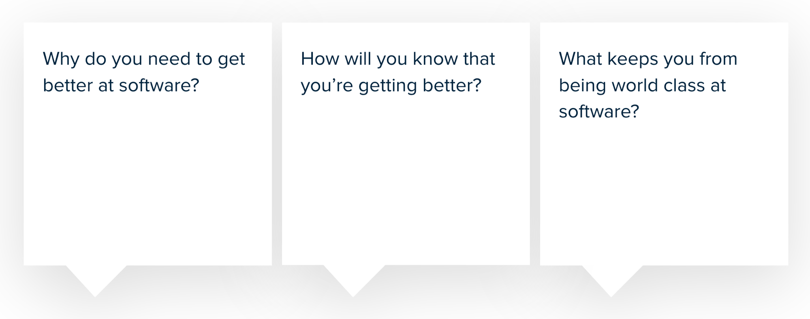

-----------------------------------------------------

## Pivotal's Beliefs and Value Statements
- Enterprises rely on software to improve business outcomes.
- They depend on velocity of converting ideas to new features, new applications, new capabilities, and new services.
- The pace of change is generating a daunting backlog of work for IT leaders, who are also under pressure to reduce technology spend and limit security vulnerabilities.
- The competing mandates - velocity, security, and operational efficiency - force enterprises to re-evaluate how they develop, architect, and operate software. 
- Pivotal helps enterprises accelerate their transition to continuous delivery, reducing waste (costs and time) through process and automation to achieve world-class efficiency and productivity.
- Pivotal’s customers are achieving are compelling Business Outcomes.

-----------------------------------------------------

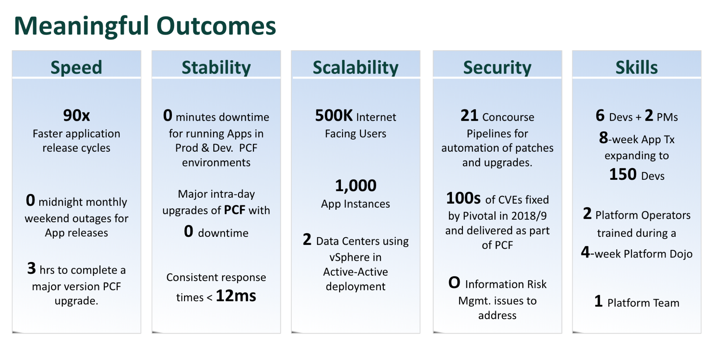

-----------------------------------------------------

## Case Studies

World-class teams of agile developers, product managers, and designers can adopt the [Pivotal way](https://pivotal.io/labs) of building and deploying software with quality and sustainable velocity in a cost-effective manner. The techniques Pivotal uses and advocates involve Minimum Viable Products (MVPs), Lean experiments, Identifying & testing assumptions, Data driven decisions, User-centered designs, Prototyping, Pair Programming, Test-Driven Development (TDD), Short Iterations, Continuous Integration and Deployment.

The results are amazing:
- Build working software at a consistent speed and quality in the face of changing requirements.
- Ensure the software solves a real problem for real users in a desirable and usable product.
- Reduce the risk of building the wrong thing while comfortably changing direction.


https://pivotal.io/customers

-----------------------------------------------------

## PCF Architecture, Installation & Set-up 

- [Containers 101](https://drive.google.com/open?id=1vRisBwfNmD22o_d7OC_OWS9g-M2b2p_q)

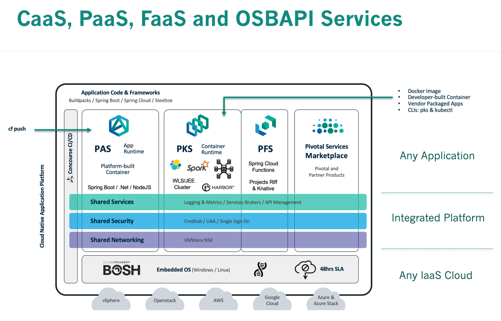

- [PKS 1.4 on vSphere](https://drive.google.com/file/d/1Jwytpm-kO0trS-5vAUKRssSVCXv98G0o/view)


-----------------------------------------------------

### LAB-1: SSH into your Linux Workshop environment & test the Command Line Interface tools

Let's start by logging into the Workshop environment from your machine (Mac, PC, Laptop, Desktop, Terminal, VDI). You will need to use the following private key: [fuse.pem](https://github.com/rm511130/PCF4CAS/blob/master/fuse.pem).

Note that the examples shown below apply to `user1`. If, for example, you are `user11`, your Ubuntu VM will be at `user11.ourpcf.com`.


```
ssh -i ./fuse.pem ubuntu@user1.ourpcf.com
```

Once logged in, you can ignore any messages that ask you to perform a `do-release-upgrade`. Please proceed by executing the following commands:

```
pks --version
```

```
kubectl version
```
If you see a connection refused message, don't worry, it is expected and not a problem.

```
cf --version
```

```
git version
```

```
docker --version
```

If all the commands shown above displayed their respective CLI versions, you have successfully completed Lab-1.

Please update the [Workshop Google Sheet](https://drive.google.com/open?id=1YcaNLkBqXHgYZch6yV8Kvf2G2AUG-trKSQQvejpstv8) with an "x" in the appropriate column.

Note: if you had to install the pks, kubectl and cf CLIs on a brand-new machine, you would need to download the binary files from [PivNet](http://network.pivotal.io) and place them under `/usr/local/bin` using `chmod +x` to make them executable.

Congratulations, you have completed LAB-1.

-----------------------------------------------------

### LAB-2: Connecting to PCF PAS (Pivotal Application Service) 

Pivotal Application Service is the PaaS (Platform as a Service) component of the Pivotal Cloud Foundry ecosystem. It is the best place for developing and running applications (incl. Java, .NET, Spring, Node.js, Go, ...). PAS can be deployed on all major IaaS solutions (vSphere, OpenStack, GCP, AWS and Azure) to deliver a simple and consistent interface to Developers (Apps Manager, CF CLI) and Operators (Ops Manager, CF CLI, Bosh).

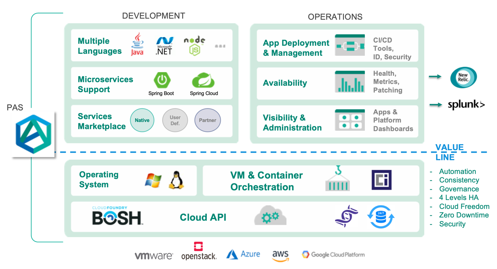

Assuming you completed LAB-1 successfully, you should be logged into an Ubuntu VM hosted on AWS. Using this VM, change the User_ID in the following command and execute it to connect to PCF/PAS (Pivotal Application Service) - make sure to use the correct User-ID, i.e. the one claimed in the [Workshop Google Sheet](https://drive.google.com/open?id=1YcaNLkBqXHgYZch6yV8Kvf2G2AUG-trKSQQvejpstv8) 


```
cf login -a api.sys.ourpcf.com --skip-ssl-validation -u user1 -p password      # change -u userX to match your User-ID
```

You will land in an ORG and SPACE that were created just for you to use and manage during this workshop. ORGs are often used to isolate Business Products (Application Initiatives), and SPACEs are used to isolate Apps in DEV, TEST, and PROD phases. If an ORG manager has added you to his/her ORG, you will be presented with options when logging-in. Choose the ORG# that matches your UserID. For example, `user23` should choose `org23`.

Let's continue:

```
cf create-space development
cf orgs; cf spaces
cf target -s development
```

Grant a colleague of yours access to your `development` space. In the example shown below `user1` is granting `user2` the right to access the `development` space in `org1`. `user2` is being granted the role of `SpaceDeveloper`. You can pick the userID of anyone participating in this workshop, but make sure you are referencing your ORG (and not `org1`) in the command below:

```
cf set-space-role user2 org1 development SpaceDeveloper
cf space-users org1 development
```

Let's see how many languages is PCF/PAS able to support out-of-the-box:
```
cf buildpacks
```

The list is actually much longer. Take a look at: https://github.com/cloudfoundry-community/cf-docs-contrib/wiki/Buildpacks


**Let's recap:** You have access to PAS (Pivotal Application Service), to an ORG and two spaces that can be used for your projects. You can develop code in the development SPACE and promote it into the production SPACE. You have used RBAC (Role Based Access Controls) to give another developer access to your development SPACE. You validated that PAS supports many development languages.

Congratulations, you have completed LAB-2. 

-----------------------------------------------------

### LAB-3: "Here is my source code, Run it on the cloud for me, I do not care how."
###        - The Developer's Haiku

Let's continue from Lab-2 by cloning some code from github. You should continue to use your Ubuntu VM.


```
cf target   # just to check your current ORG and SPACE
cd ~        # just to make sure you are in your home directory
git clone https://github.com/rm511130/chess; cd chess; ls -las
```

Your code is in the `cat index.php` file. It's a ♞ Chess Game written in Javascript.
The `cat manifest.yml` states that your code requires 100MB of RAM and a random URL to avoid collision with other colleagues.

Let's `cf push` your Chess App.

```
cf push
```

The previous command builds and runs a container for you. Once the process has been completed, you should look for the random route URL that PAS created for you. The output will look something like this:

```
name:              chess
requested state:   started
routes:            chess-intelligent-oryx.apps.ourpcf.com
last uploaded:     Fri 07 Jun 18:02:10 UTC 2019
stack:             cflinuxfs3
buildpacks:        php 4.3.70
```

Access _your_ route / URL or ask someone to access it. You should see something similar to this:

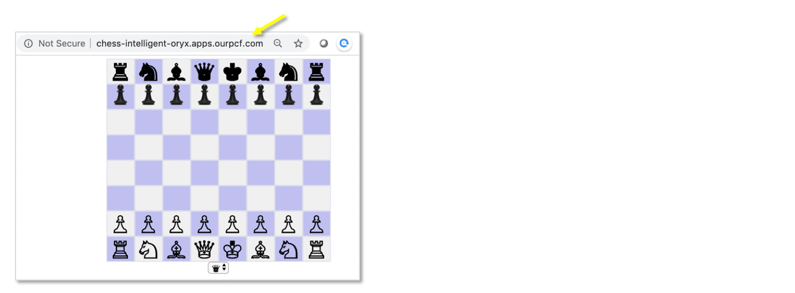

**Let's recap:** You have deployed the code for a Chess App into a public cloud without having to worry about IP addresses, ports, middleware, containers, VMs, network routers, application routes, DNS entries, certificates, logging, performance monitoring, app health-management, HA considerations, cloud infrastructure provider CLIs, CVE (Common Vulnerabilities and Exposures), firewalls, etc., and you didn't have to open a service ticket. 

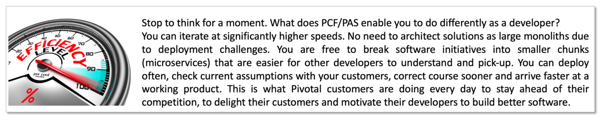

Let's proceed. You can easily scale your App Instances:
- horizontally, by increasing the number of containers running your Chess App (see example below)
- or vertically, by adding more memory or disk-space to your containers

and you can log into any specific container. Let's try this:


```
cf scale chess -i 3
cf ssh chess -i 2
ps -ef
```

While still ssh'ed into one of the three Chess App containers, look for the lowest PID corresponding to the `diego-sshd`  process. In the example shown below, the PID we are looking for is `15`. In your case it may be another number.
Issue a `kill` command on the `diego-sshd` PID per the example below.

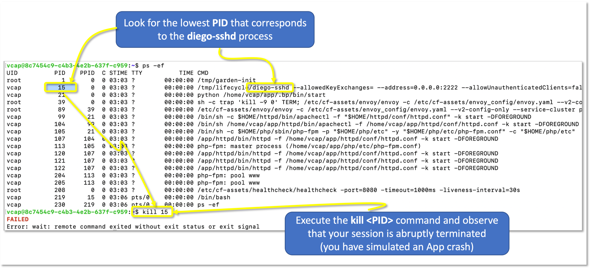

Now try the following commands:


```
cf events chess
cf app chess
```

You should see in the events log that the App crash was logged as an event.
The second command should show you that PCF/PAS has already spawned a new container of the Chess App, maintaining the 3 out of 3 containers running as you had requested. The loadbalanced routing of user requests to the Chess App containers was handled automatically for you by the PCF/PAS platform.

Take a look at the aggregated logs from all your Chess App containers.

```
cf logs chess --recent
```

When the `--recent` flag is removed, the `cf logs chess` command will provide you with a rolling log of what is being sent to stdout by all the containers running your Chess App: there's no need to log into each container to extract logs.

**Let's recap:** You just scaled the number of containers running the same Chess App. PAS provided automatic loadbalanced routing across all three containers, and you accessed the 3rd container (by using `-i 2`) which is useful for debugging specific issues to any given container type or container instance. You simulated an App Crash and saw how PCF/PAS remediated the issue within seconds. You accessed logs and events without having to ask operations for help.

Congratulations, you have completed LAB-3.

-----------------------------------------------------

### LAB-4: Apps Manager & Ops Manager

Ops Manager is the operator's GUI. Workshop participants will find it at [`http://opsman.ourpcf.com`](http://opsman.ourpcf.com) but there's no need to perform any developer-related steps in Ops Manager. The images below show the key features of Ops Manager and we will describe them to you once the workshop gets to Lab-4.

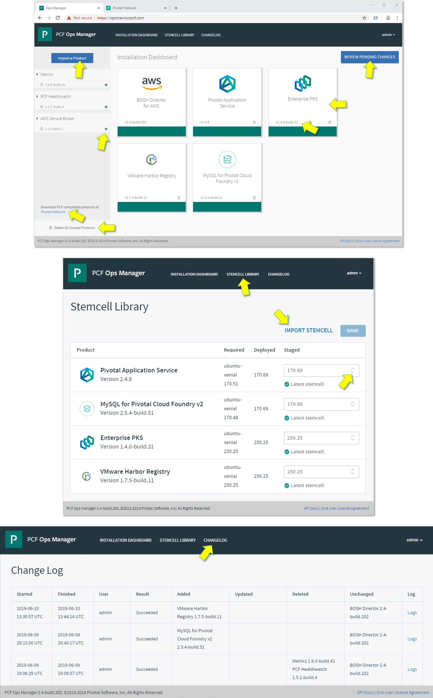

PivNet is the name commonly used when we refer to [`https://network.pivotal.io`](https://network.pivotal.io). PivNet is the source of all Software Bits from Pivotal and Third-Party vendors. You can also download buildpacks, stemcells and Pivotal Data Products from PivNet.

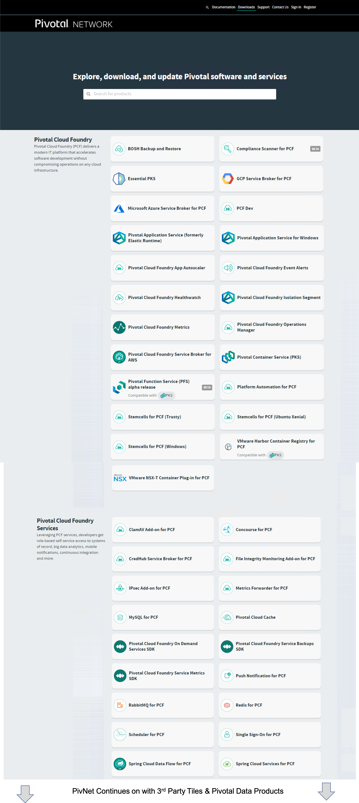

And for the hands-on part of Lab-4, please access Apps Manager using a browser. Apps Manager is the developers' GUI. It can be found at [`http://login.sys.ourpcf.com`](http://login.sys.ourpcf.com). You will need to log-in using your User# and `password` for password. We will also demonstrate the features of Apps Manager, but you are welcome to click around and learn about its features: events, services, routes, tasks, logs, traces, threads, settings, (auto)scaling, metrics, life-cycle management and health-management.


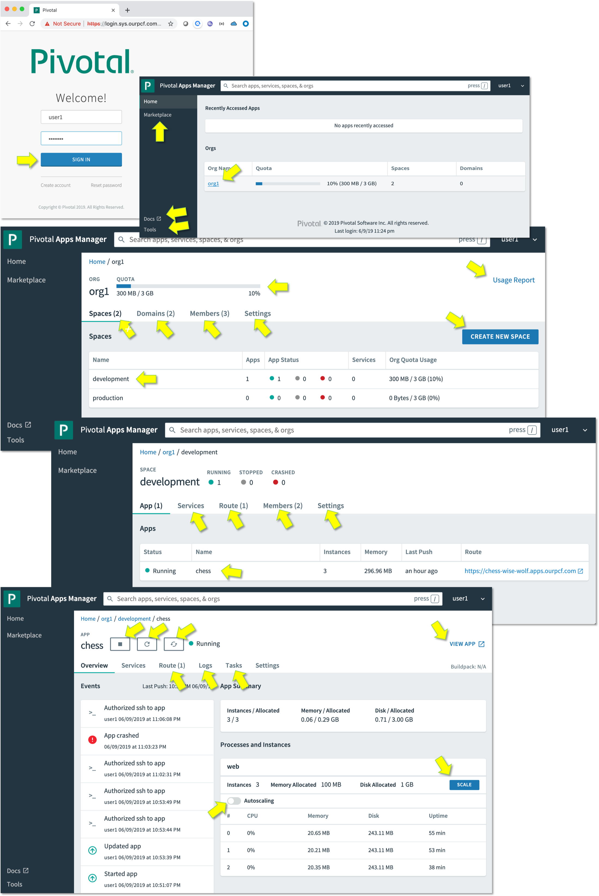

**Let's recap:** In Lab-4 you saw two PCF/PAS GUIs; Apps Manager for Developers, and Ops Manager for Operators. Apps Manager gives you easy access to events, services, routes, tasks, logs, traces, threads, settings, (auto)scaling, metrics, life-cycle management and health-management. Incidentally, Apps Manager is a containerized App running on PCF/PAS. Ops Manager allows operators to install, update, upgrade and monitor PAS services at any point in time during normal work-hours, without asking Developers to stop their activities. You also saw PivNet - the source of all software releases, patches and updates.

Congratulations, if you accessed Apps Manager successfully, you have completed Lab #4. Leave your Apps Manager browser window open because we will come back to it again. 

-----------------------------------------------------

### LAB-5: PAS provides Services, runs Docker Images and Spring Apps

Let's start by requesting a MySQL DB instance. Assuming that you are still logged into your Ubuntu Workshop VM proceed as follows:


```
cf marketplace
cf create-service p.mysql db-small user1-db     # make sure to use a unique name e.g. user2-db, user3-db, etc
cf services
cf service user1-db
```

While Bosh is busy working on instantiating your MySQL database, let's proceed by pushing a Docker image of a simple App written in Go while we wait for the MySQL DB (it should only take a few minutes).

```
cf push factorial --docker-image rmeira/factorial --random-route 
```

Once deployed, you can test `factorial` by using a browser or a `curl` command per the example below. Your specific URL will be different from the example shown below.

```
curl factorial-happy-toucan.apps.ourpcf.com/6; echo
```

You should see results similar to this: 

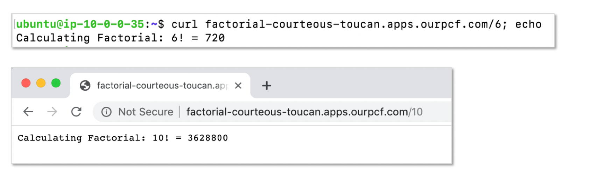

**Quick Recap:** Deploying Docker images to PCF/PAS is simple and easy. You continue to benefit from all the same PAS features described in the previous lab: e.g. application monitoring, health-management, scaling, logging, routing, event tracking, etc.


Let's `cf push` a Spring Boot application:

```
cd ~   # to make sure you are back to your home directory
git clone https://github.com/rm511130/spring-music
cd spring-music; ./gradlew clean assemble
cf push
```
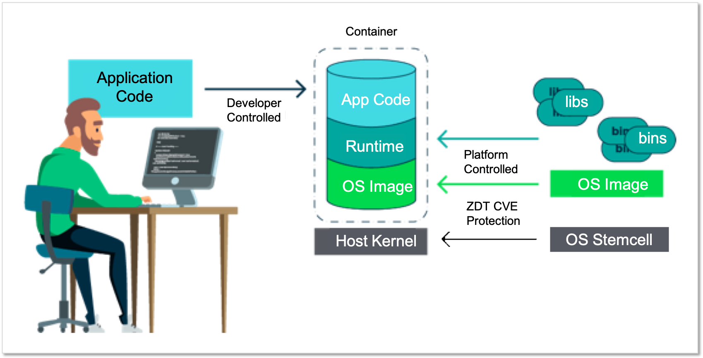

PCF PAS uses its [Java Buildpack](https://www.youtube.com/watch?v=xiWbm3H09dY) to create a container with all the dependencies necessary to run your Spring-Music App.

Look for the route that the `cf push` created for you and access the `Spring-Music` App using a browser. Please note that the `cat manifest.yml` file contains the line `random-route: true` to make sure other workshop labs don't clash with yours.

```
cf app spring-music | grep route
```

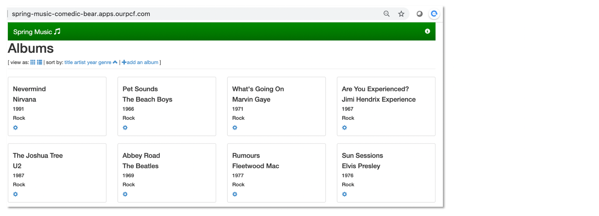


Go back to [Apps Manager](http://login.sys.ourpcf.com) and take a look at how it has recognized and reconfigured itself for the Docker and Spring Boot Apps. 

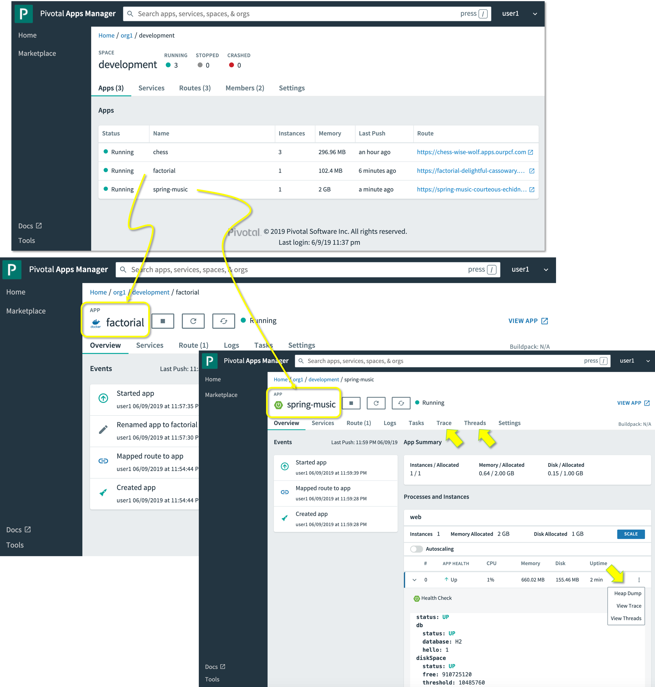


Let's now bind the MySQL DB to the Spring-Music App to experience how to consume services in PCF/PAS:

```
cf services                             # just to check that you have a "create succeeded" next to your MySQL DB
cf bind-service spring-music user1-db   # make sure to bind to the unique DB name you selected at the beginning of this Lab
cf restage spring-music                 # allows spring-music to see and use the MySQL
cf env spring-music                     # shows the MySQL connection string and username created on-demand for you
```

If you now refresh your Spring-Music Browser, you should see the following change:

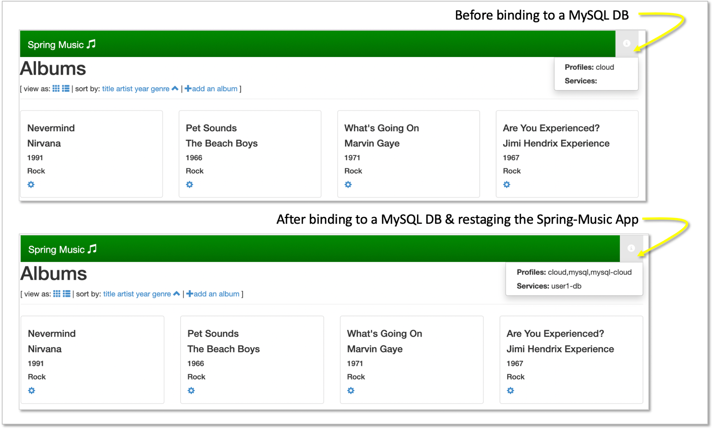

If you are curious about the coding aspects of how Spring-Music consumed the MySQL service, you can take a look at the files under this directory: `/home/ubuntu/spring-music/src/main/java/org/cloudfoundry/samples/music/config/`

**Let's Recap:** Lab-5 didn't take very long and yet you accomplished several outcomes - as a developer, you were able to push a Docker Image and a Spring Boot App. You created a dedicated MySQL DB instance and bound your Spring-Music application to it. 


Let's tidy up so we're not consuming lots of AWS resources. Please note that you need to update `user1-db` with the appropriate DB name you used during this lab:

```
cf unbind-service spring-music user1-db
cf delete-service user1-db
cf delete chess
cf delete factorial
cf delete spring-music
```

**Quick Recap:** You accomplished quite a bit just now. The unwiring of application performance monitoring, log monitoring, and health-check services for three different Apps. You also deleted a database, DNS entries, routing information, VM and containers. You also revoked user access to your Apps. These can be tedious and time-consuming efforts, and yet, you just - as a developer - completed these tasks without opening any support tickets. 

Congratulations, you have completed Lab-5.

-----------------------------------------------------

### LAB-6: Installing the PKS Tile in Ops Manager

Lab-6 involves some reading. Actual hands-on keyboard will only be necessary at the end of Lab-6. This is because the steps we describe below are for Operations to execute during the installation of PKS and during the creation of K8s Clusters.

- K8s (Kubernetes) is an open-source platform for building platforms. It is a system for automating the deployment, scaling, and management of containerized applications. 
- Pivotal Container Service (PKS) enables operators to provision, operate, and manage enterprise-grade Kubernetes clusters using BOSH and Pivotal Ops Manager.
- Neither of the two is a PaaS.

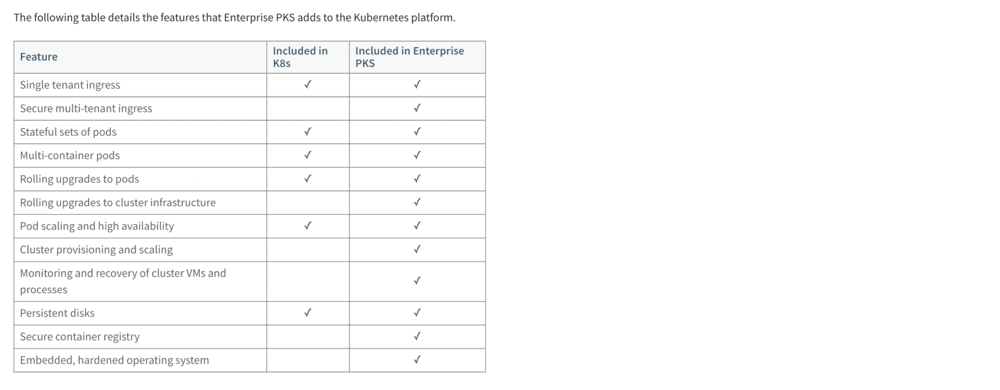

During this workshop we will show you many key aspects of the installation and set-up of the PKS Tile and the creation and management of K8s clusters. However, installing PKS on any IaaS takes at least 1hr, so please watch this compressed [15min video](https://www.youtube.com/watch?time_continue=83&v=Oxw-lucgpX0) to get an idea of the steps involved.

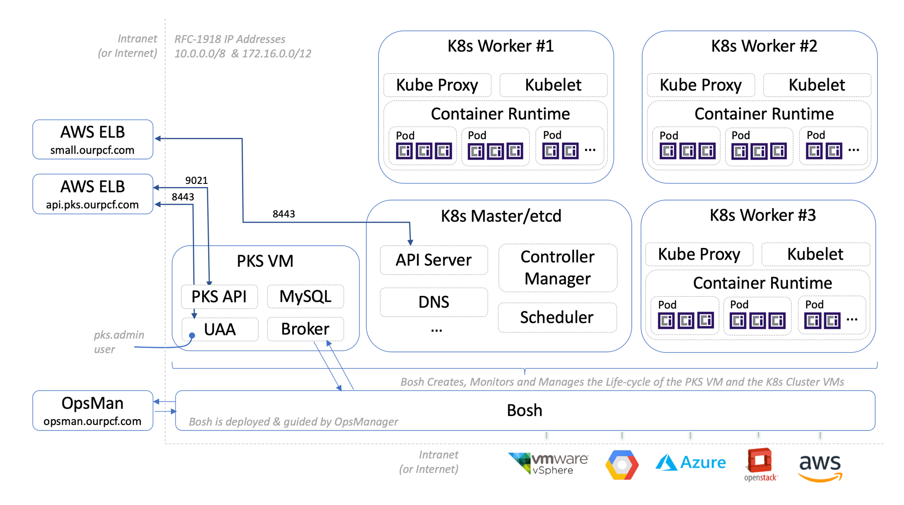

The main steps for the creation of the environment in the diagram shown above are:

1. Set-up the networking infrastructure: e.g. install NSX-T or run Terraform scripts on your IaaS to create load balancers, reserve subnets, establish firewalls, service accounts with the correct permissions.
2. Download the Ops Manager VM bits or Image Metadata from [PivNet](https://network.pivotal.io) and install it on your IaaS
3. Set-up Ops Manager Director: creating Availability Zones, Networks, etc.
4. Download PAS and PKS Tiles from [PivNet](https://network.pivotal.io), import them into Ops Manager, add, set-up and apply.
    
Step 4 is shown in the installation video mentioned above, but it merits a deeper dive. Let's take a look at what happens after the PKS VM is up and running, and what steps are necessary to create a K8s cluster.

- Once the PKS VM is up and running and you have an ELB (Elastic Load Balancer) pointing to it, you can create a `pks_admin` and a `pks_manager` in the UAA (User Account & Authentication) server running inside the PKS VM.

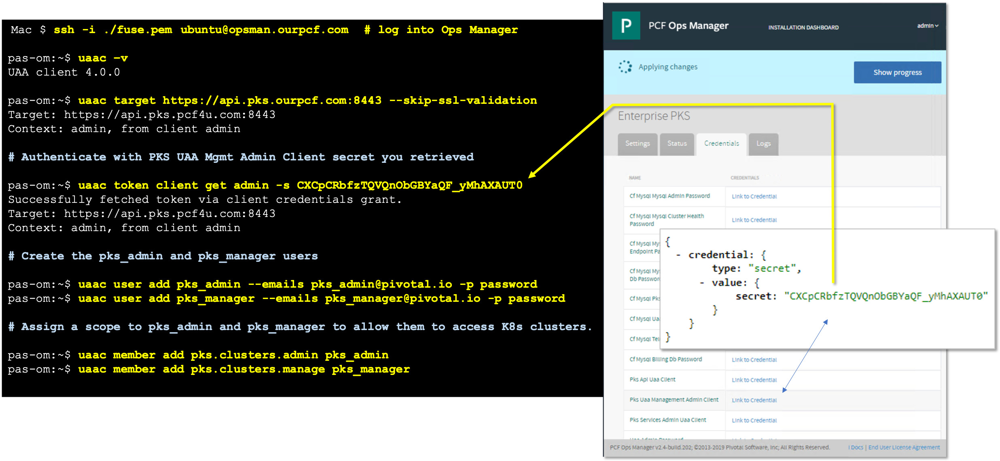

- Using the AWS Console, let's create an AWS ELB (Elastic Load Balancer) in preparation for the creation of our first K8s cluster:

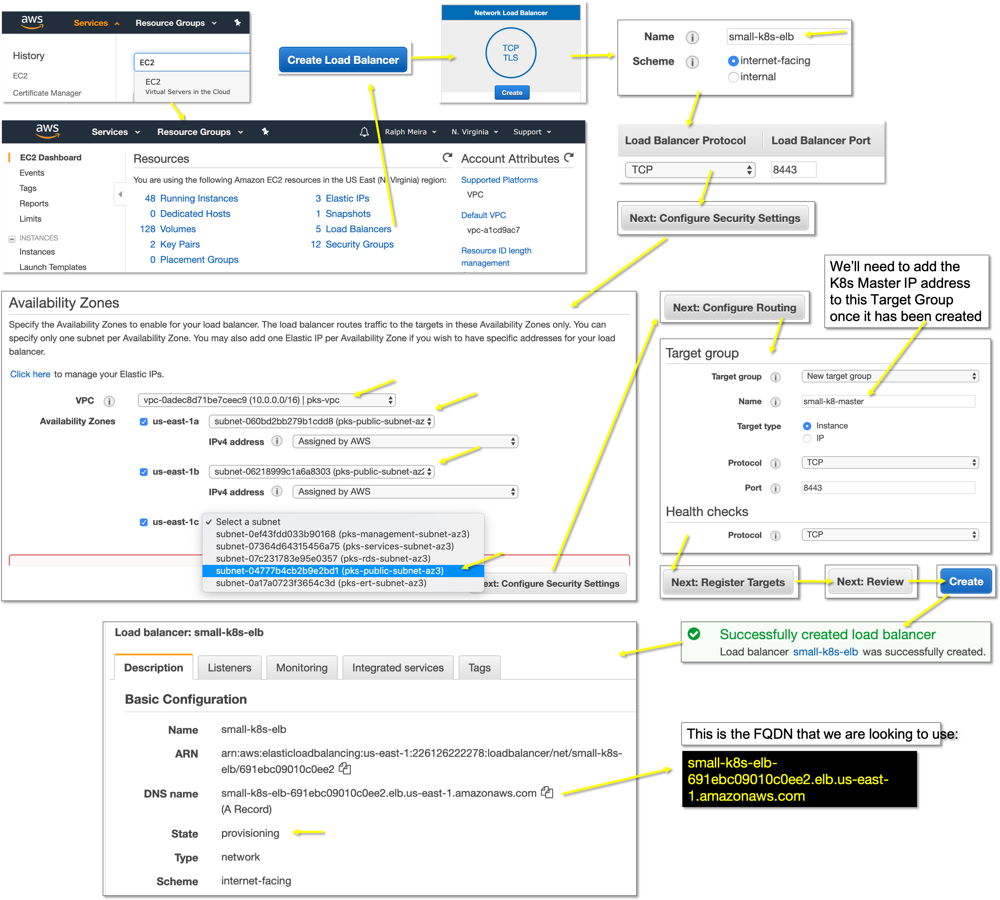

- Now that we have an ELB created for the K8s cluster we are about to create:

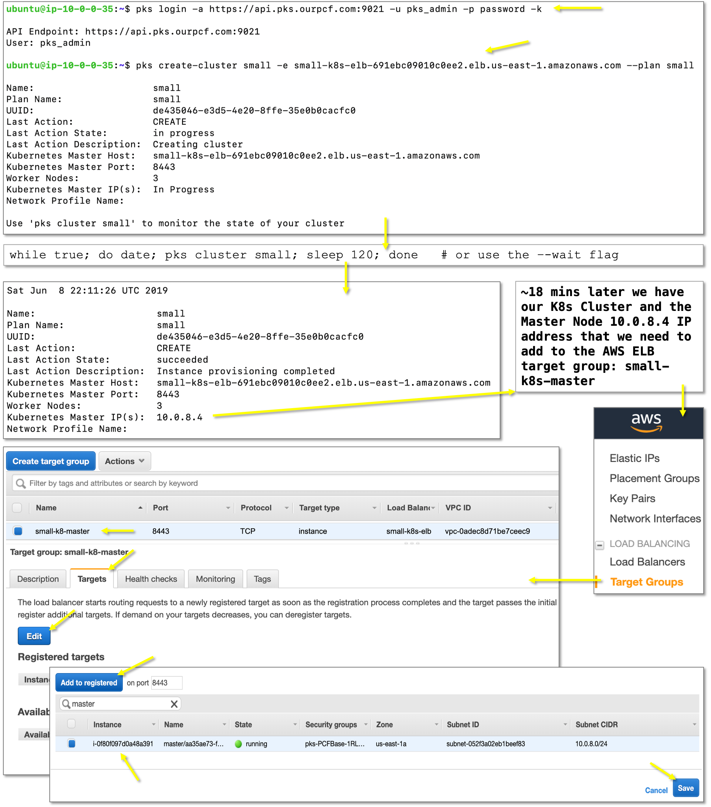

- The K8s Cluster is now almost ready to be handed over to developers whose tool of choice will be the **kubectl** CLI.

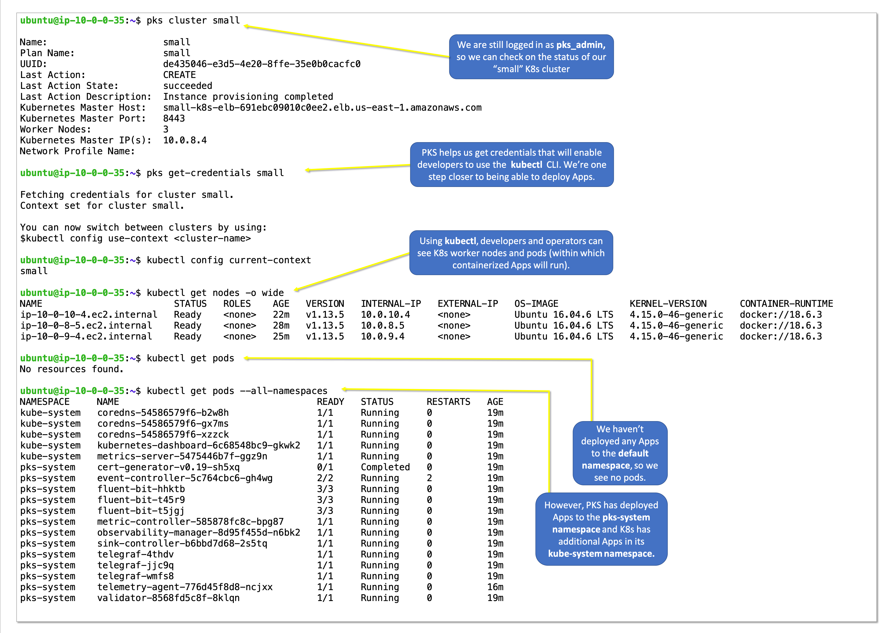

- Note that anyone with access to the `pks_admin` username and password is able to control all K8s clusters. We need more granularity for proper isolation between different software product development groups. You may recall that we also created a `pks_manager` with a different scope of responsibility - `pks.clusters.manage` - which limits the `pks_manager` (usually an operator) to see and manage clusters it creates. Let's see this is action:

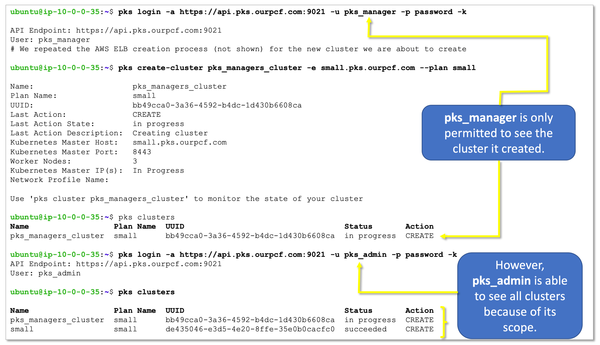

- The PKS CLI allows administrators to create or delete K8s clusters. It also allows operators to resize (up or down) the number of worker nodes in K8s clusters, within the limits set for the chosen K8s plans defined during the PKS set-up process.

```
$ pks

The Pivotal Container Service (PKS) CLI is used to create, manage, and delete Kubernetes clusters. 

To deploy workloads to a Kubernetes cluster created using the PKS CLI, use the Kubernetes CLI, kubectl.

Version: 1.4.0-build.194

Usage:
  pks [command]

Available Commands:
  cluster                View the details of the cluster
  clusters               Show all clusters created with PKS
  create-cluster         Creates a kubernetes cluster, requires cluster name, an external host name, and plan
  create-network-profile Create a network profile
  create-sink            Creates a sink for sending all log data to syslog://
  delete-cluster         Deletes a kubernetes cluster, requires cluster name
  delete-network-profile Delete a network profile
  delete-sink            Deletes a sink from the given cluster
  get-credentials        Allows you to connect to a cluster and use kubectl
  get-kubeconfig         Allows you to get kubeconfig for your username
  help                   Help about any command
  login                  Log in to PKS
  logout                 Log out of PKS
  network-profile        View a network profile
  network-profiles       Show all network profiles created with PKS
  plans                  View the preconfigured plans available
  resize                 Changes the number of worker nodes for a cluster
  sinks                  List sinks for the given cluster
  update-cluster         Updates the configuration of a specific kubernetes cluster

Flags:
  -h, --help      help for pks
      --version   version for pks

Use "pks [command] --help" for more information about a command.
```

- The PKS set-up screens allow for LDAP integration which we are not using during this workshop. So we have also set up every developer's user-id directly in the PKS UAA database using commands similar to the one shown below:

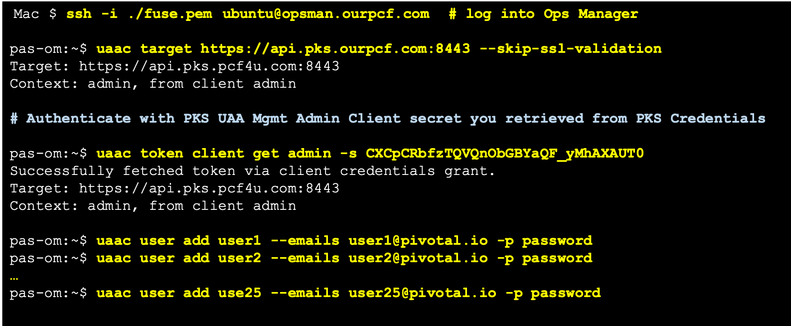

- To conclude Lab-6, let's take a look at the `kubernetes-dashboard` service that every K8s cluster has running in its `kube-system` namespace. 
- The following steps were taken to retrieve worker node IP addresses, the service TCP port, and an access-token that we will need to access the `kubernetes-dashboard` for the `pks_managers_cluster` K8s cluster.

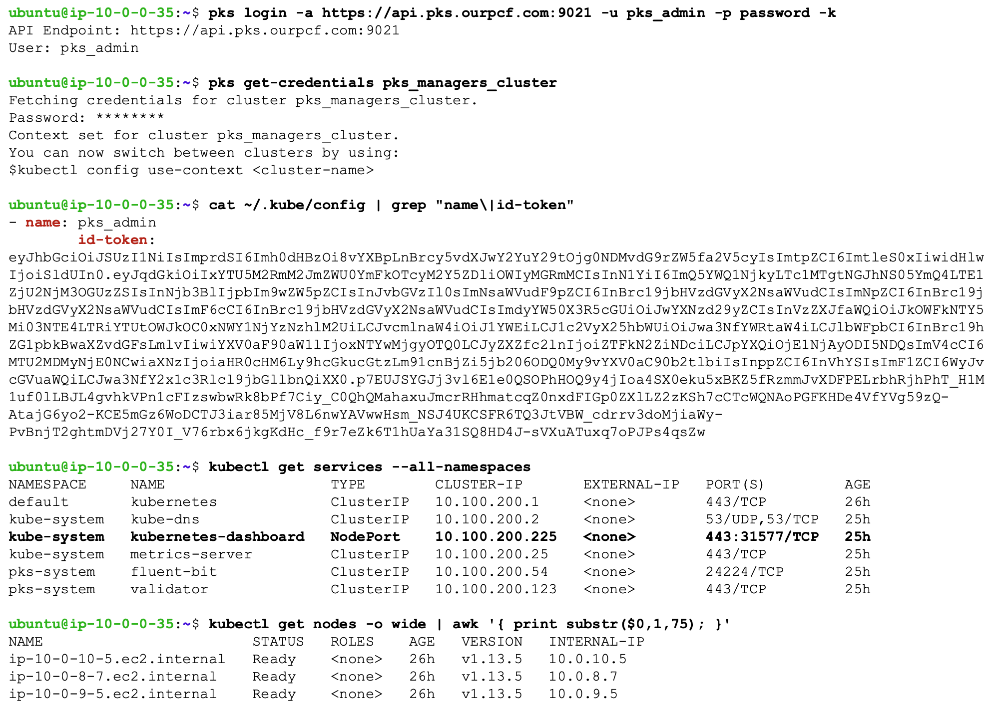

- So we now know that the `pks_managers_cluster` K8s cluster is running on worker nodes with IP Addresses `10.0.10.5, 10.0.8.7 and 10.0.9.5`. We can use these IP addresses to determine their IDs in the AWS Console or we can use Bosh commands to retrieve the same information.
- Note also that the TCP port number `31577` is how we can access the `kubernetes-dashboard`, so we need an AWS ELB that will point us to the worker nodes on their port `31577`. 
- We will also need to make sure that AWS Security Groups allow the ELB to communicate over port `31577` with the worker nodes.

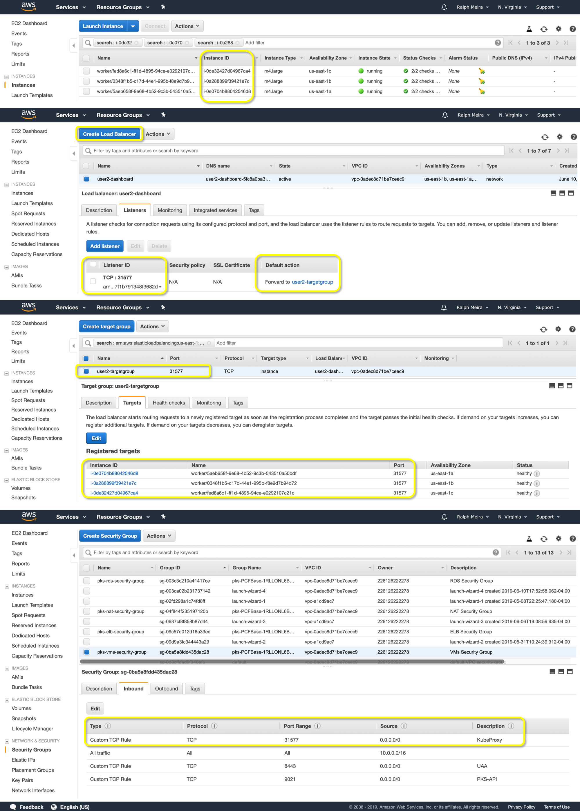

- To make it simpler, we created an easier FQDN for the AWS ELB: [`https://dash.ourpcf.com:31039`](https://dash.ourpcf.com:31039) for you to try out. (Note: you probably noticed that we changed from port 31577 to port 31039. This happened during the prep-work for this workshop. The previous K8s cluster had to be replaced and the new one chose port 31039 for its dashboard). 
- When challenged for a token (see below) you will need to provide the `pks_admin` id-token resulting from the execution of:


```
pks login -a https://api.pks.ourpcf.com:9021 -u pks_admin -p password -k
pks get-credentials pks_managers_cluster
cat ~/.kube/config | grep "name:\|id-token:"
```

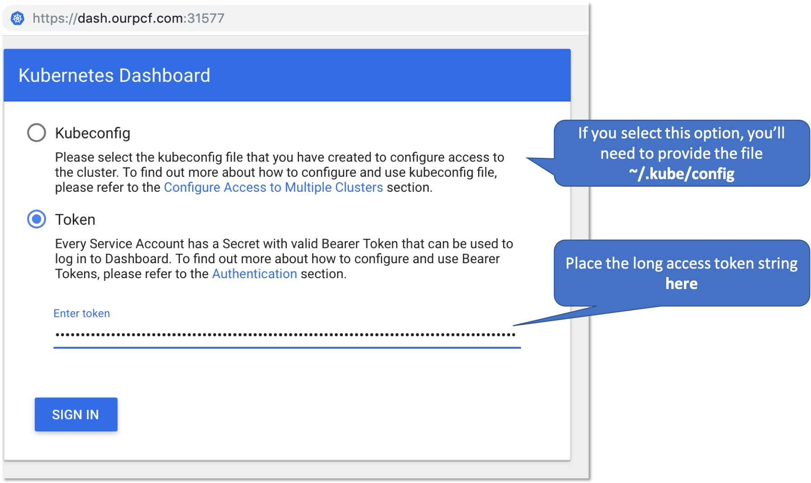

- You should be able to see and click-around the K8s Dashboard specific to the `pks_managers_cluster` K8s cluster:


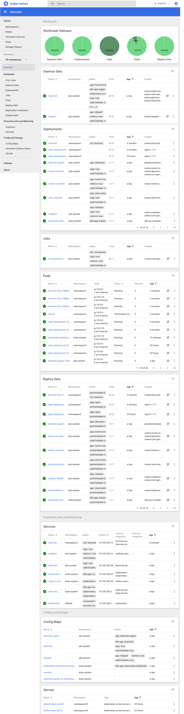

**Let's Recap:** Lab-6 allowed you see the PKS installation steps and the process for the creation of K8s clusters - both involved some AWS (IaaS) set-up steps. You saw how the PKS CLI also helps retrieve credentials for the use of the **kubectl**  CLI, and you also saw that the PKS CLI enables the creation, resizing and deletion of clusters. Finally, you were able to access a K8s Dashboard.

In the next lab we will hand-over a K8s cluster to developers.

-----------------------------------------------------

### LAB-7: Namespaces and Role Binding for Developer Access

In this lab we will cover the creation of namespaces, user roles and how to perform role binding. As a developer, you will get to perform some hands-on work, but first we have a few steps for the Operators and Administrators of the PKS platform.

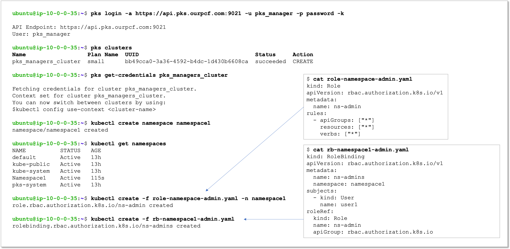

Looking at the steps shown above, working from the bottom-up, we see that: 

- `user1` was given the role `ns-admin` in `namespace1`
- The role `ns-admin` was created with full admin controls (apiGroups, resources and verbs) over `namespace1`
- `namespace1` was created by `pks_manager` in the `pks_managers_cluster`
- And as you may recall, the K8s cluster named `pks_managers_cluster` was created by `pks_manager` using the `small` PKS plan: i.e. 1 Master and 3 Worker Nodes

Not shown here: As part of the set-up process for this workshop, we created namespace1, namespace2, ... namespace25 respectively for each user1, user2 ... user25

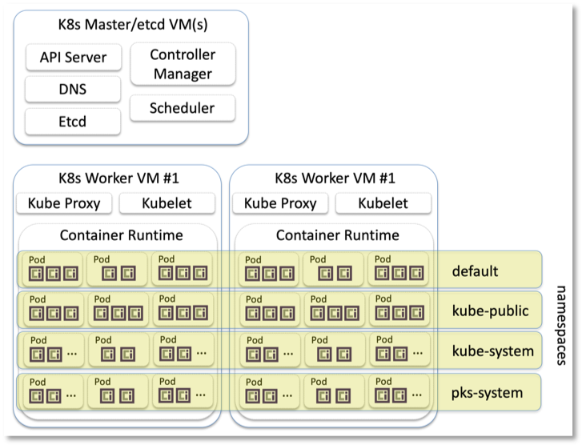

The next few steps are for everyone in the workshop to execute using their Ubuntu VMs on AWS, their user-IDs and the namespace# that corresponds to your user-ID. For example: `user23` should use `namespace23`.


1. Using your Ubuntu VM (and remembering to use the correct UserID) log into PKS to get the Kube Configuration for the `pks_managers_cluster`:

```
pks get-kubeconfig pks_managers_cluster -p password -a https://api.pks.ourpcf.com -k -u user1
```

2. Take a look at the file `cat ~/.kube/config` that was created by Step 1.

3. Create a local `nginx-example-deployment.yaml` file with the following content:

```
apiVersion: apps/v1 # for versions before 1.9.0 use apps/v1beta2
kind: Deployment
metadata:
  name: nginx-deployment
spec:
  selector:
    matchLabels:
      app: nginx
  replicas: 2 # tells deployment to run 2 pods matching the template
  template: # create pods using pod definition in this template
    metadata:
      # unlike pod-nginx.yaml, the name is not included in the 
      # meta data as a unique name is
      # generated from the deployment name
      labels:
        app: nginx
    spec:
      containers:
      - name: nginx
        image: nginx:1.7.9
        ports:
        - containerPort: 80
```

4. Execute the following command to create the NGINX deployment defined above (**make sure to use your own namespace#**):

```
kubectl create -f nginx-example-deployment.yaml -n namespace1
```

5. Take a look at your brand-new deployment, but note that you do not have access to node information:

```
kubectl get nodes
kubectl get deployments -n namespace1
kubectl get pods -n namespace1 -o wide
```

6. Let's also create and access a simple Ubuntu container. Make sure to use the correct namespace and make sure you `exit` from the Ubuntu 18.04 container before you attempt to delete the pod:

```
kubectl run -i --tty ubuntu --image=ubuntu:18.04 --restart=Never -n namespace1 -- /bin/bash -il
root@ubuntu:/# lscpu | grep CPU
root@ubuntu:/# cat /etc/os-release
root@ubuntu:/# free -h
root@ubuntu:/# df -h
root@ubuntu:/# exit
kubectl delete pod ubuntu -n namespace1
```

7. Let's now try to deploy and access a Docker image:

```
kubectl run factorial --replicas=3 -n namespace1 --image=rmeira/factorial
kubectl expose deployment factorial -n namespace1 --type=NodePort --port=80 --target-port=3000 --name=factorial
kubectl get service factorial -n namespace1
kubectl get pods -n namespace1
```

In order to test the deployment of your Factorial Docker Image, you will use a `curl` command that will point at one of the K8s cluster worker nodes using the port mapping that the `kubectl get service factorial -n namespace1` command gave you.

Follow the `curl` command example shown below, but make sure to use the correct port #:

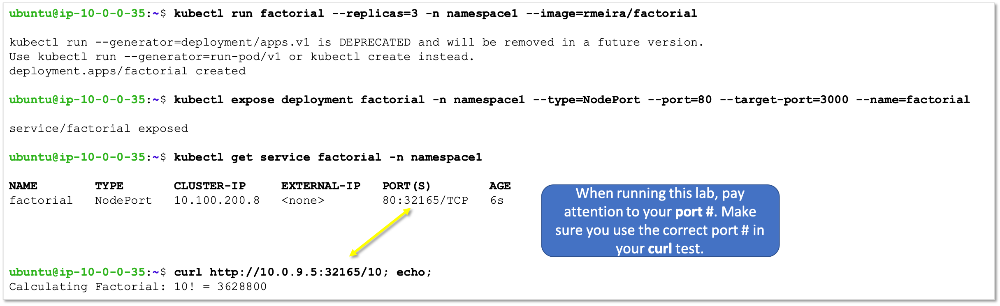

```
curl http://10.0.9.5:32165/10; echo 
```

Let's perform some clean-up:

```
kubectl delete deployment factorial -n namespace1
kubectl delete service factorial -n namespace1
kubectl get pods -n namespace1
```

Additional reading: This [page](https://kubernetes.io/docs/reference/kubectl/cheatsheet/#kubectl-context-and-configuration) contains additional information on how to use the `kubectl` CLI.

**Let's recap:** Using your UserID, you were able to deploy 2 pods running NGINX to a namespace unique to your UserID. You were targeting a small Kubernetes cluster named `pks_managers_cluster`. You were also able to deploy, access and delete an Ubuntu 18.04 Docker image, and a Factorial Docker image. We skipped the need to use Load Balancers because our Workshop Ubuntu VMs were created in the 10.0.0.0/8 subnet to bypass the firewall concerns.

Congratulations, you have completed Lab-7.

-----------------------------------------------------

### LAB-8: Deploying Apps using k8s Services & Creating Nginx Ingress Controller

Let's deploy an app that is accessible in two different ways: as a Service type `Loadbalancer` and as a Service type `Ingress` with an Nginx ingress controller that will route the request for the app.


1. Let's make sure you are logged in properly as a developer. We wish to deploy to the `pks_managers_cluster` using your UserID, so please make sure to alter the command shown below so it matches your UserID:

```
pks get-kubeconfig pks_managers_cluster -p password -a https://api.pks.ourpcf.com -k -u user1 
```

2. In the home directory of your Workshop Ubuntu VM you should find a `guestbook-all-in-one.yaml` file. Let's put it to work making sure that you are pointing at the correct namespace:

```
cd ~
kubectl create -f guestbook-all-in-one.yaml -n namespace1
```

You should see an output similar to the one shown below:

```
service/redis-master created
deployment.apps/redis-master created
service/redis-slave created
deployment.apps/redis-slave created
service/frontend created
deployment.apps/frontend created
```

3. Let's check what services were created:

```
kubectl get services -n namespace1
```

You should see an output similar to the one shown below:

```
NAME           TYPE           CLUSTER-IP       EXTERNAL-IP   PORT(S)        AGE
frontend       LoadBalancer   10.100.200.95    <pending>     80:30075/TCP   92s
redis-master   ClusterIP      10.100.200.247   <none>        6379/TCP       92s
redis-slave    ClusterIP      10.100.200.214   <none>        6379/TCP       92s```
```

The `pending` service would normally require us to create an AWS ELB (Elastic Load Balancer), but since our Ubuntu VM belongs to the 10.0.0.0/8 CIDR, and given that we know the Worker Node IP Addresses (i.e. `10.0.10.5`,`10.0.8.7`,`10.0.9.5`) of the cluster `pks_managers_cluster`, we can use `links` to validate that our Guestbook App is running.
Using `port 30075` (i.e. the port number you obtained from your `LoadBalancer` line in the output shown above), try to connect:

```
links http://10.0.10.5:30075
```

You should see something like this:

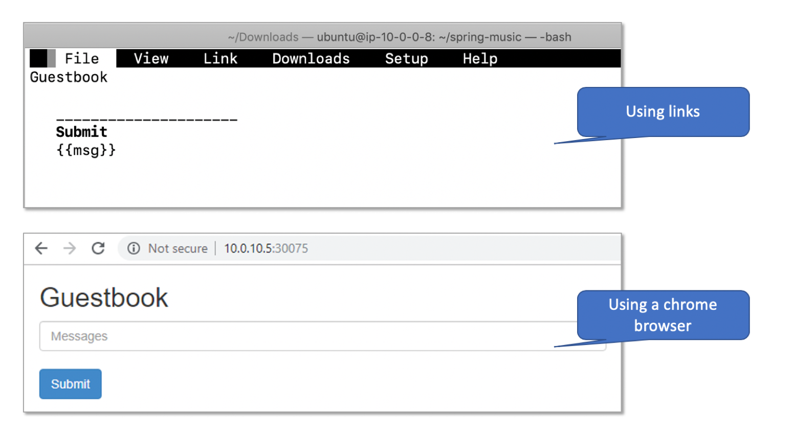


Let's try working with an NGINX Ingress Controller now. 

****ATTENTION****

- The next steps in this lab are configured to be executed by **only one person** using the `pks_admin` user. 
- Whoever gets to this point in the Lab first gets to execute the following steps. 
- **Please make sure you let everyone else know who you are.**


Continuing on your Ubuntu VM. 

1. The `ingress-rbac-allinone.yml` file in the home directory of your Ubuntu VM needs to be updated. When executing the following steps, please use this version instead: [`ingress-rbac-allinone.yml`](https://github.com/rm511130/PCF4CAS/blob/master/ingress-rbac-allinone.yml)

```
pks get-kubeconfig pks_managers_cluster -u pks_admin -p password -a https://api.pks.ourpcf.com -k
kubectl create namespace ingress-nginx
kubectl create -f ingress-rbac-allinone.yml
```

You should see an output like the one shown below:

```
serviceaccount/nginx-ingress-serviceaccount created
deployment.extensions/default-http-backend created
service/default-http-backend created
deployment.extensions/nginx-ingress-controller created
service/nginx-ingress-controller created
service/timesample created
deployment.extensions/timesample created
ingress.extensions/timesample-ingress created
```

2. Let's check what services were created on what ports:

```
kubectl get services -n ingress-nginx
```

You should see an output similar to the one shown below:

```
NAME                       TYPE           CLUSTER-IP       EXTERNAL-IP   PORT(S)        AGE
default-http-backend       ClusterIP      10.100.200.61    <none>        80/TCP         95s
frontend                   LoadBalancer   10.100.200.95    <pending>     80:30075/TCP   17m
nginx-ingress-controller   LoadBalancer   10.100.200.174   <pending>     80:32311/TCP   95s
redis-master               ClusterIP      10.100.200.247   <none>        6379/TCP       17m
redis-slave                ClusterIP      10.100.200.214   <none>        6379/TCP       17m
timesample                 ClusterIP      10.100.200.239   <none>        80/TCP         95s
```

3. Let's test the new `nginx-ingress-controller` and the service `timesample`. Note that the port # in the example below will differ from the port # you will get in the previous step: `kubectl get services -n ingress-nginx`. Use your port # instead.

```
curl http://10.0.10.5:32311/timesample; echo
```

You should get an output that looks something like this:

```
{"date":"Tue Jun 11 18:13:51 GMT 2019","milliseconds":1560276831957}
```

**Quick Recap:** We saw during this lab how to deploy two applications to a K8s cluster. Guestbook leveraged a Redis service and Timesample used an Nginx Ingress Controller. In both cases we would need to create an AWS ELB so that customers could access the Apps but, as developers, we were able to test our Apps by going directly to the correct Worker Nodes and Ports.

Before we can consider this lab complete, let's clean-up using the following command:

```
kubectl delete -f ingress-rbac-allinone.yml
```

It may take a few minutes to complete the deletion process.

Congratulations, you have completed Lab-8.

-----------------------------------------------------

### LAB-9: A quick look at Harbor, Clair and Notary

- This Lab is a demo. No hands-on is required.
- Harbor is a private image registry that combined with Clair image scanning and Notary image signing, provides a complete solution to managing container images.

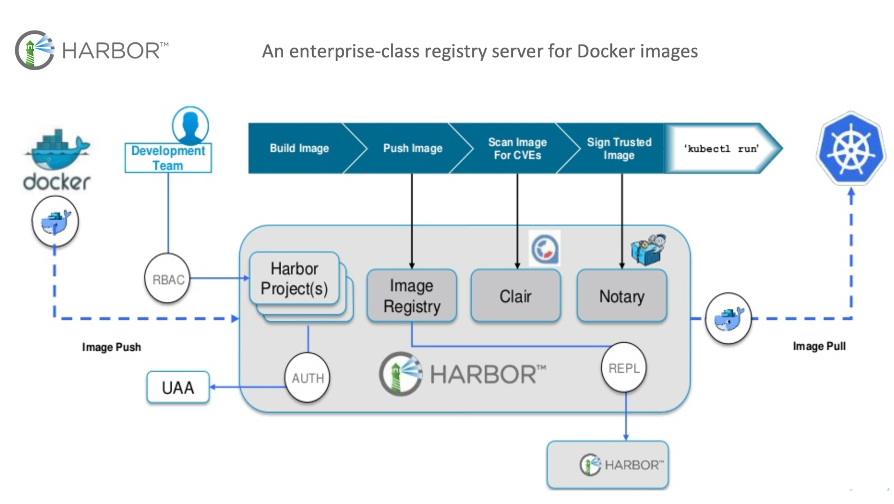

- Harbor is usually wired to consume LDAP services. In this example we are creating a local user for demonstration purposes.

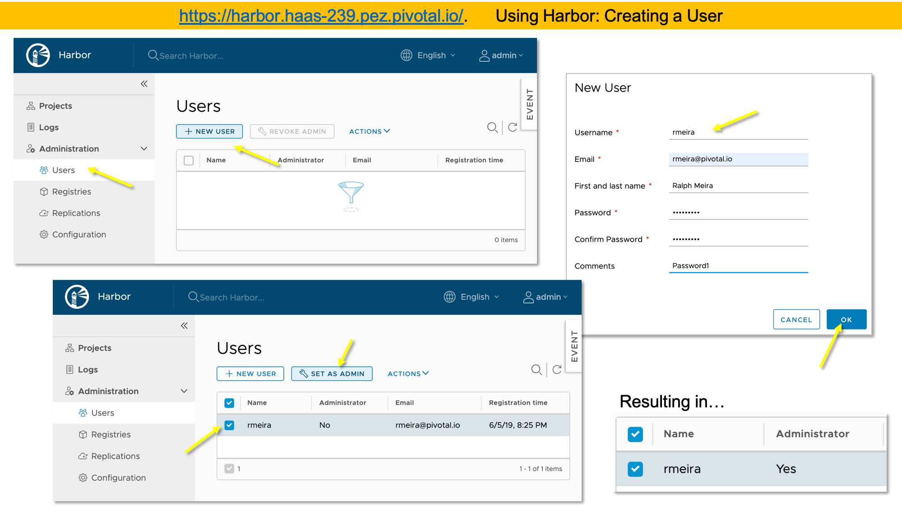

- We see below the typical commands used to push a local Docker image into Harbor:

```
Mac $ docker login -u rmeira -p Password1 harbor.haas-239.pez.pivotal.io
Login Succeeded

Mac $ docker images
REPOSITORY                                         TAG     IMAGE ID        CREATED         SIZE

Mac $ docker pull rmeira/factorial

Mac $ docker tag rmeira/factorial harbor.haas-239.pez.pivotal.io/library/factorial:latest

Mac $ docker images
REPOSITORY                                         TAG     IMAGE ID        CREATED         SIZE
rmeira/factorial                                   latest  c4ba1152cd49    11 months ago   704MB
harbor.haas-239.pez.pivotal.io/library/factorial   latest  c4ba1152cd49    11 months ago   704MB

Mac $ docker push harbor.haas-239.pez.pivotal.io/library/factorial:latest
The push refers to repository [harbor.haas-239.pez.pivotal.io/library/factorial]
f5961e782729: Layer 
…
latest: digest: sha256:b6465e86c0561e26f0ff0239d619dade73692d6ad07c9315adb1ecae0a353d15 size: 2624
```

- Let's see the results of the commands shown above in the Harbor GUI:

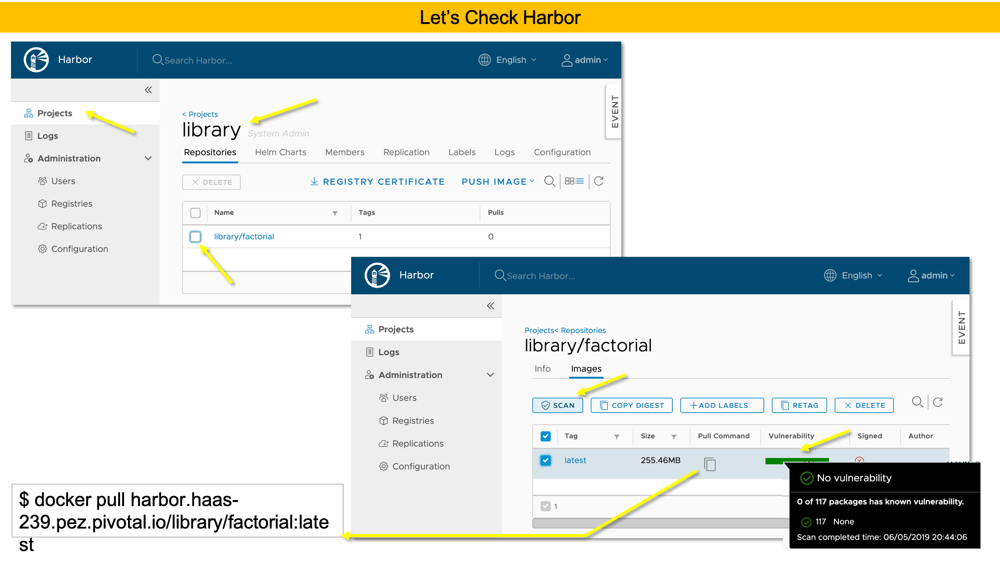

- Adding users to projects in Harbor is also a simple task:

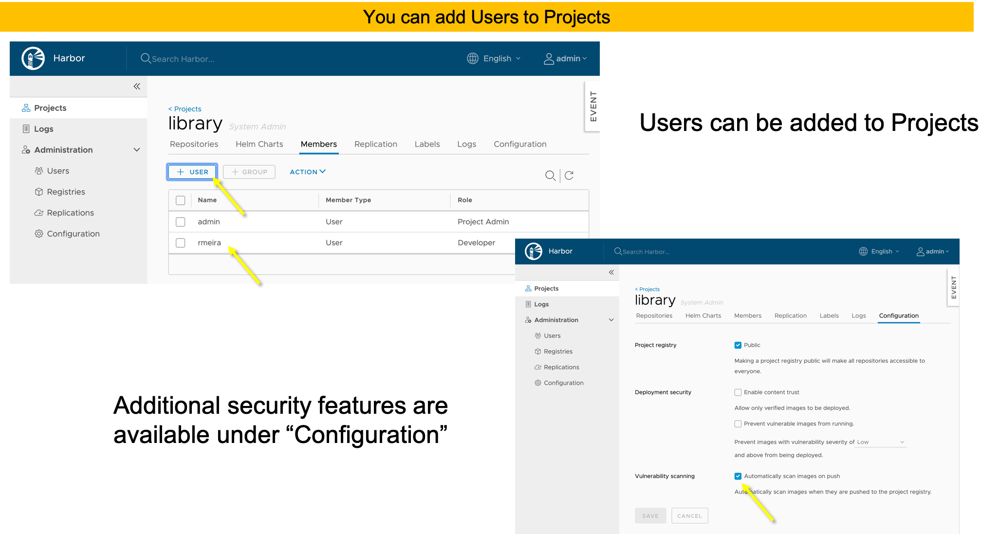

- And there's extensive Harbor documentation:

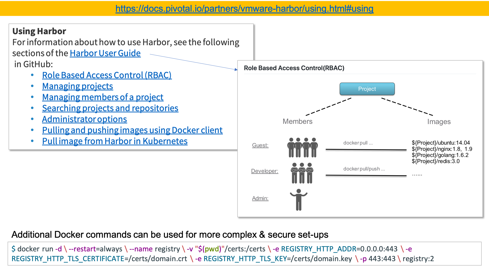


Congratulations, you have completed Lab-9.

-----------------------------------------------------

### LAB-10: A quick look at PKS with NSX-T

- This Lab is a demo. No hands-on is required.
- We will target a PKS on NSX-T installation running on vSphere to see how NSX-T can make K8s easier to use.

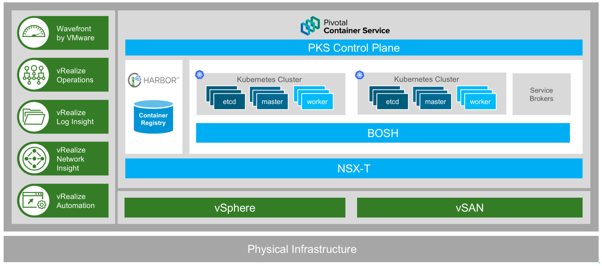

```
pks login -a https://api.run.haas-239.pez.pivotal.io:9021 -u pks_admin -p password -k
# already done: pks login -a https://api.run.haas-239.pez.pivotal.io:9021 -u pks_admin -p password -k
pks cluster small
pks get-credentials small
kubectl run factorial --replicas=3 --image=rmeira/factorial
kubectl expose deployment factorial --type=LoadBalancer --port=80 --target-port=3000 --name=factorial
kubectl get service factorial
```

- The expected output should look something like this:

```
NAME        TYPE           CLUSTER-IP       EXTERNAL-IP                  PORT(S)        AGE
factorial   LoadBalancer   10.100.200.220   10.195.99.135,100.64.176.7   80:32186/TCP   5s
```

- Grab the `10.195.99.135` IP address and give it a try, there's no need to use the port #.

```
curl -k http://10.195.99.135/6; echo
```

**Quick Recap:** We just saw how PKS on NSX-T creates the LoadBalancer entries for you automatically. It eliminates the need for support tickets and access to IaaS CLIs for the creation of LoadBalancers and Network Security rules. NSX-T also enables several network topologies for the deployment of K8s clusters per the examples shown below:

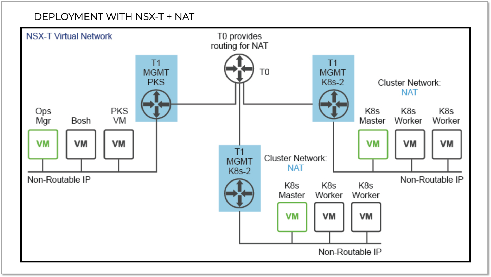

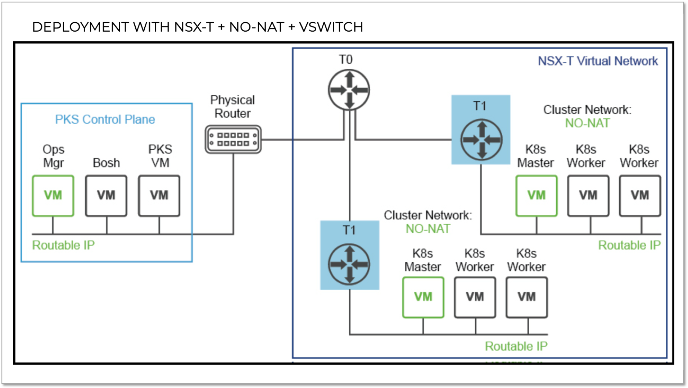

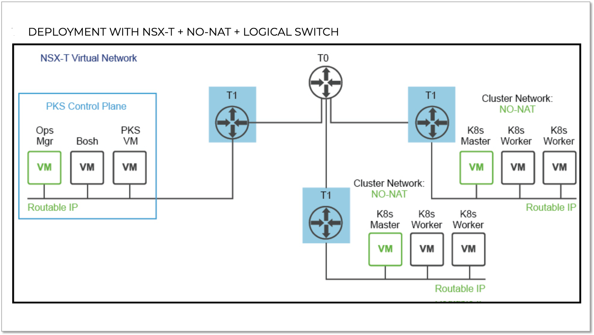

Furthermore, the VMware ecosystem of products and services guarantee a complete end-to-end enterprise-class view of your infrastructure and services:

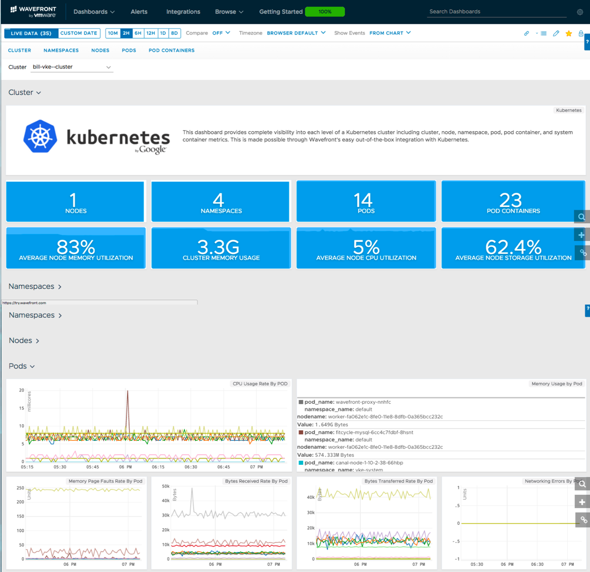

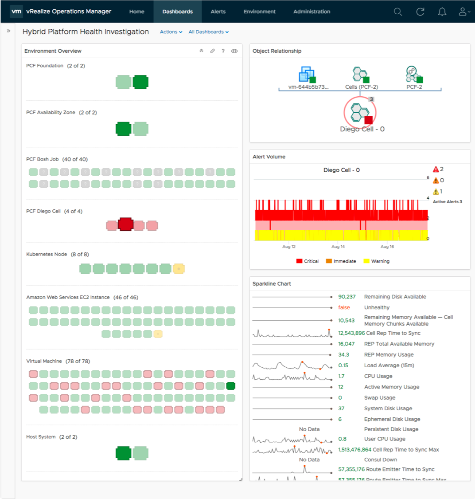

Congratulations, you have completed Lab-10.

_____________________________________________________

### Wrapping-up

We covered a lot of ground today. Lots of new concepts and hopefully lots of valuable learning opportunities.
We've only scratched the surface. Pivotal has a robust set of services and documented best practices to help you get started with greenfield projects and/or brownfield migrations from old architectures to modern cloud native solutions.

Thank you for your time and attention. We look forward to next steps.


