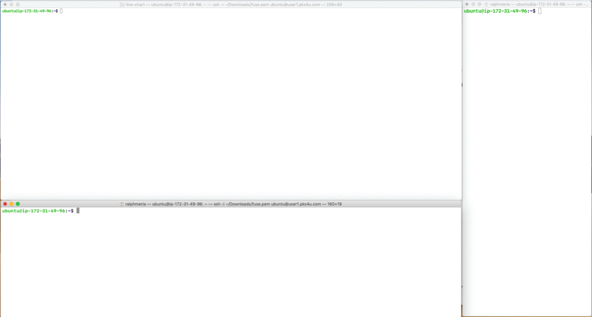
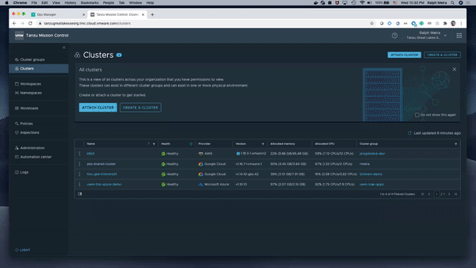

#### [https://tinyurl.com/tkgi4caresource](https://tinyurl.com/tkgi4caresource)   &nbsp;&nbsp;&nbsp;&nbsp;&nbsp;&nbsp;   [SpringOne](https://github.com/rm511130/SpringOne-2020/blob/master/README.md)
#


# VMware Tanzu Workshop 
----------------------------------------------------------
## [Tanzu Workshop Agenda](https://drive.google.com/open?id=1pzVmFNv7hlpOGGuU-C5YopBR9VIRz6FU)
(8:00AM to 12:00PM on 07/30/2020)

- Introduction
     - Workshop Orientation
     - VMware Tanzu Portfolio of Products 
- Platform Architecture 
     - Installation Overview
     - Operations Manager
     - Tile Installation
     - Client Tools
- Demo & Hands-on TKGI Labs on the cloud
     - Operator Experience
     - Developer Experience
     - Observability & Management Tools
     - Contrasting with Tanzu Application Service
- Next Steps & Feedback
-----------------------------------------------------
## Technical Pre-Requisites
- You should be able to access:

    - https://zoom.us/test
    - https://chess.cfapps.io
    - [Workshop Google Sheet](https://docs.google.com/spreadsheets/d/17AG0H2_zJNXWIP8ZOsXjjlPCPKwhskRTg5bgkRR4maI)

### If using a Windows PC
- You will need to use [PuTTY](./PuTTY_and_SSH.md) to access a Ubuntu VM (public IP address) using a `.ppk` private-key file.
- To download [`fuse.ppk`](./fuse.ppk) you can install and use [wget](http://downloads.sourceforge.net/gnuwin32/wget-1.11.4-1-setup.exe) in a PowerShell window.
```
help wget
cd ~\Downloads
wget https://raw.githubusercontent.com/rm511130/Tanzu-Workshop-TKGI/master/fuse.ppk -Outfile fuse.ppk
```
- If you rather not install [wget](http://gnuwin32.sourceforge.net/packages/wget.htm), you can simply click on [`fuse.ppk`](./fuse.ppk) then cut-&-paste its contents to a local file in your Windows machine. The file must be named `fuse.ppk` and set to read-only mode.
- If you need help installing or using PuTTY with [fuse.ppk](./fuse.ppk) check these [detailed instructions](./PuTTY_and_SSH.md).
- If you successfully tested the access to the `ubuntu@user1.pks4u.com` VM, you are ready for the workshop.

### If using a Mac 
- You will need to SSH into a Ubuntu VM (public IP address) using a private-key `.pem` file
- Using a Terminal Window, execute the following commands to download `fuse.pem` and set the downloaded file to read-only mode:
```
cd ~/Downloads
wget https://raw.githubusercontent.com/rm511130/Tanzu-Workshop-TKGI/master/fuse.pem
chmod 400 ~/Downloads/fuse.pem
```
- You can now test whether SSH is working with the `fuse.pem` private key using the following command:
```
ssh -i ~/Downloads/fuse.pem ubuntu@user1.pks4u.com
```
- Please `exit` from the Ubuntu VM if your test was successful. You are ready for the workshop.

### If using Google Chrome or Firefox as your Browser

- Throughout this workshop you will be frequently asked to cut & paste commands from this github page to your terminal window.
- Consequently, the [CodeCopy](https://github.com/zenorocha/codecopy#install) browser extension for Firefox & Google Chrome can be a valuable add-on to have. 
- If installing add-ons does not infringing on corporate security policies, please go ahead and install CodeCopy.


-----------------------------------------------------
## A Brief Introduction - VMware Tanzu

<!-- - [VMware Tanzu](https://drive.google.com/open?id=1idNKL_eTxKu5pEc6Z7GwLaJ_W5zaBmOxFecH96gI3ds) &nbsp;&nbsp;&nbsp; by Account Manager -->

<!-- - [Three Types of Code & Shared KPIs](https://drive.google.com/open?id=12yG6cpR6NP12IjATRhrdq3-65ZUBb6ZaZjgS94wZrsk) &nbsp;&nbsp;&nbsp; by Matt Popovich - Senior Solution Engineer -->

- [VMware Tanzu Customer Success Manager](https://drive.google.com/file/d/1L15cVbpE6_4gYhoLfpNPvOPg6L321qDD/view) &nbsp;&nbsp;&nbsp; by Lynn Strickmeyer - CSM

- [VMware Customer Stories](https://tanzu.vmware.com/customers)

- ["Simply put, we're here to help you build, run, manage, connect and protect any cloud environment", Pat Gelsinger, CEP VMWare](https://www.youtube.com/watch?v=6uQu3ZKJ28o)

- Enterprises rely on software and scalable environments to improve business outcomes.
- A critical factor is the *velocity* of:
    - how ideas are converted to new features, new apps, and new services.
    - how you can expand your infrastructure to make use of private/public/hybrid clouds.
- The ever-accelerating pace of change generates a daunting backlog of work for IT leaders.
- Operations are under pressure to reduce technology spend while addressing security vulnerabilities where perimeters encompass mobile, public and private infrastructure. 
- Applications and the underlying infrastructure need to be self-monitoring and self-healing, while remaining highly available.
- The competing mandates - velocity, security, scalability, stability and operational efficiency - force enterprises to re-evaluate how they develop, architect, and operate software. 

VMware is your trusted partner to help address all of these challenges.


-----------------------------------------------------
## Guidelines & Conventions for this Workshop 

_- TKG / TKG Plus / TKGI are product names aligned to how VMware names all its products in compute, networking and other areas. The ‘i’ in ‘TKGI‘ stands for ‘integrated‘, given the integrated operating system lifecycle management and software defined networking components that are core to the product value. TKGI used to be called PKS (Pivotal Kubernetes Service), so throughout this workshop you will see reminants of the PKS name. For example: the PKS CLI (Command Line Interface)._

- This self-paced workshop includes presentations, videos, demos and hands-on labs.
- The labs are interdependent and must be executed in order.
- The lab environments will only be available during the ~5hrs (a limited window of time) dedicated for the joint start and self-paced completion of the workshop.
- Please use the [Workshop Google Sheet](https://docs.google.com/spreadsheets/d/17AG0H2_zJNXWIP8ZOsXjjlPCPKwhskRTg5bgkRR4maI) to claim a userID for this workshop. For example, Ralph Meira is user1.
- Update the same [Workshop Google Sheet](https://docs.google.com/spreadsheets/d/17AG0H2_zJNXWIP8ZOsXjjlPCPKwhskRTg5bgkRR4maI) as you progress through the Labs, by placing an "X" in the appropriate column.
- Each workshop participant will be assigned a Ubuntu VM previously set up for the execution of hands-on Labs. Your Laptop or Desktop will only be used for two purposes: 
     - SSH'ing or PuTTY'ing into the Ubuntu VM 
     - Browsing web pages
- When carrying out hands-on labs, you will be asked to cut-&-paste the commands shown `in boxes like this one` from this github page to your Ubuntu VM Terminal Window. However, when issuing commands, please make sure to alter the userID to match the one you have claimed, e.g.:
  - `ssh -i fuse.pem ubuntu@user3.pks4u.com` is for `user3` 
  - `ssh -i fuse.pem ubuntu@user15.pks4u.com` is for `user15` 
- In order to simplify the cut-&-paste-&-replace steps described above, once you are operating on your Ubuntu VM Terminal, we will define environment variables that will hold your specific login name as claimed in the [Workshop Google Sheet](https://docs.google.com/spreadsheets/d/17AG0H2_zJNXWIP8ZOsXjjlPCPKwhskRTg5bgkRR4maI). In this way, the cut-&-paste steps will not require you to edit the command line before pressing `return`.
- As you work through the labs, please make every effort to not just cut-&-paste-&-execute the labs without actually asking yourself a few questions:
   - Why am I being asked to cut-&-paste-&-execute these commands?
   - What do I think these commands will do (before actually running them)?
   - What is the role of the person who will be executing these commands in the future?

- Throughout this document, when it's time for hands-on labs, you will see the following icon:
     


- The following icon will show up once or twice during the hands-on labs. It's to remind you to pay special attention to the syntax of the commands you are being asked to execute. The commands will need to match the UserID you claimed for yourself in the [Workshop Google Sheet](https://docs.google.com/spreadsheets/d/17AG0H2_zJNXWIP8ZOsXjjlPCPKwhskRTg5bgkRR4maI).
     


-----------------------------------------------------
## Architecture, Installation & Set-up 

- A Map of the Tanzu Portfolio of products:


- The diagram below shows the general layout of the VMs, K8s Clusters and Platforms that we will be using during this workshop.


- The videos in this section are great for brushing up on your understanding of the technologies we will be working with during this workshop. 

- If you are comfortable with Containers, Docker and Kubernetes, then please move ahead to Lab-1.

   - [Containers vs. VMs 101 in 8 minutes](https://www.youtube.com/watch?v=L1ie8negCjc)

   - [Containers - Deep Dive in 18 minutes](https://www.youtube.com/watch?v=EnJ7qX9fkcU)

   - [Kubernetes 101 in 5 minutes](https://www.youtube.com/watch?v=PH-2FfFD2PU)

   - [TKGI on vSphere, AWS, Azure, and/or GCP](https://docs.pivotal.io/pks/1-6/installing.html)


-----------------------------------------------------

### LAB-1: SSH into your Linux Workshop VM environment & Test the Command Line Interface tools

- Let's start by logging into the Workshop environment from your machine (Mac, PC, Laptop, Desktop, Terminal, VDI). You will need to use the following private key: 
   - [fuse.pem](./fuse.pem) if using a Mac.
   - [fuse.ppk](./fuse.ppk) if using a Windows PC.

- Note that the examples shown below apply to `user1`. If, for example, you are `user11`, your Ubuntu VM will be at `user11.pks4u.com`.


- In the pre-requisites section of this workshop, you were asked to use `ssh` or `PuTTY` to access the Ubuntu VM that has been assigned to your [UserID](https://docs.google.com/spreadsheets/d/17AG0H2_zJNXWIP8ZOsXjjlPCPKwhskRTg5bgkRR4maI). Please go ahead and create a Terminal Session into your VM. The example shown below applies to `user1` if he or she had downloaded the `fuse.pem` key to a Mac. If you need, the `PuTTY` instructions for Windows PC users can be found [here](./PuTTY_and_SSH.md).

```
ssh -i ~/Downloads/fuse.pem ubuntu@user1.pks4u.com 
```

- Once logged in, you can ignore any messages that ask you to perform a `do-release-upgrade`. 

- Please check whether the greeting information matches your UserID. For example, `user22` should see something like this:

```
my_number is 22
openjdk version "11.0.7" 2020-04-14
OpenJDK Runtime Environment (build 11.0.7+10-post-Ubuntu-2ubuntu218.04)
OpenJDK 64-Bit Server VM (build 11.0.7+10-post-Ubuntu-2ubuntu218.04, mixed mode, sharing)
Your UserID is user22
Your DevopsID is devops22
Your Namespace in the Shared-Cluster is namespace22
Your role in the Shared-Cluster is vmware-role22
```

- If you believe your greeting information to be wrong, please alert the workshop organizers. 

- If all is well, please proceed by executing the following commands. These commands will validate that your VM has all the necessary CLIs and frameworks for this workshop.

```
pks --version
kubectl version -o json 2>/dev/null
cf --version
git version
docker --version
go version
jq --version
python3 --version
mvn -version
helm version
java -version
gfsh version
dotnet --version
```

- If any of the commands shown above did not work or produced and error, please alert the workshop organizers.

- For your reference, the CLIs you just invoked were downloaded using the links/commands shown below. Please _do not re-install_ any of the CLIs.

| CLI | Link or Command |
| ---  | --- |
| tkgi, pks, kubectl | https://network.pivotal.io/products/pivotal-container-service/ |
| cf | https://network.pivotal.io/products/tas-for-kubernetes/ |
| gfsh | https://network.pivotal.io/products/pivotal-gemfire/ |
| git | sudo apt-get install --quiet --assume-yes --no-install-recommends git |
| docker | https://download.docker.com/linux/static/stable/x86_64/docker-19.03.9.tgz |
| go, jq, python3, mvn | sudo apt-get install -y jq golang-go python3 maven |
| helm | https://get.helm.sh/helm-v3.2.4-linux-amd64.tar.gz |
| java | sudo apt install default-jre |
| dotnet | https://docs.microsoft.com/en-us/dotnet/core/install/linux |

- Congratulations, you have completed LAB-1.

Please update the [Workshop Google Sheet](https://docs.google.com/spreadsheets/d/17AG0H2_zJNXWIP8ZOsXjjlPCPKwhskRTg5bgkRR4maI) with an "X" in the appropriate column.

-----------------------------------------------------
### LAB-2: Running Apps Locally (on your Ubuntu VM)

- During this Lab, we will experiment with [GoLang](https://golang.org/), [Spring/Java](https://spring.io/) and [.NET Core](https://dotnet.microsoft.com/learn/dotnet/what-is-dotnet) program examples.
- You will first run these examples of code "natively" on your Ubuntu VM.
- You will then create Docker Images of these programs and, once again, run them locally using the Docker Engine that has been pre-installed on your Ubuntu VM. 
- If you are a Developer, the steps in this Lab should be very easy and familiar to you. 
- If you are an Operations person, the steps in this Lab will help you understand what developers do locally on their machines to run their code. 
- Both Developers and Operations will also experience how easy it is to create container images that run well but are somewhat open to [CVE](https://www.cvedetails.com/cve-help.php)-based attacks.

#
#### LAB-2A 
 

- Using your Ubuntu VM, you are going to take this [Factorial GoLang Program](https://github.com/rm511130/fact/blob/master/fact.go) and run it locally.

- Execute the following commands:

```
cd ~ 
git clone https://github.com/rm511130/fact  
cd ~/fact  
go run fact.go 
```

- It may take a few seconds, but you should see a log message indicating that your code is `using port 3000`.

- Leave the code running and use a browser to access the following URL. Remember to use the proper FQDN that corresponds to your UserID: e.g. `user20` should use `http://user20.pks4u.com`.
```
http://user1.pks4u.com:3000/1500
``` 

- Did it work? 
  - Take a look at the [code](https://github.com/rm511130/fact/blob/master/fact.go). 
  - Did you find in the code the additional endpoints that you can call? Try them out:
     - `http://user1.pks4u.com:3000/version` 
     - `http://user1.pks4u.com:3000/header`
  - Did you see the logs on the Terminal Window of your VM?

- Use `CTRL-C` on your Ubuntu VM to cancel out of the `go run fact.go` command.

- Let's proceed with a Java/Spring example.


#
#### LAB-2B 
    

- Execute the following commands:

```
cd ~ 
git clone https://github.com/rm511130/spring-petclinic.git
cd spring-petclinic
```
```
./mvnw -Dmaven.test.skip=true package
```
```
./mvnw spring-boot:run
```

- Once you see in your logs that `Tomcat started on port(s): 8080` you can proceed to test your `Pet Clinic` program.

- To test, open a browser to access the following URL. Remember to use the proper FQDN that corresponds to your UserID: e.g. `user11` should use `http://user11.pks4u.com:8080`.

```
http://user1.pks4u.com:8080
```
- If the `Pet Clinic` App is running you have a good Spring/Java example to work with.

- You can use `CRTL-C` on your Ubuntu VM to cancel out of the `spring-boot Pet Clinic` program.

#
#### LAB-2C 
    

- Execute the following commands:

```
cd ~; rm -rf dotnet
git clone https://github.com/rm511130/dotnet.git 
cd ~/dotnet
dotnet new global
dotnet new mvc
```
- Let's make a couple of edits to personalize the Welcome Message and to make sure our code is listening on port `5001` by running the following script:

```
source ./tweaking_Index.cshtml_and_Program.cs.sh
```

- Let's run our `.Net Core Welcome` program using the following command:

```
dotnet run
```

- Once you see in `Content root path: /home/ubuntu/dotnet` in your logs on the termional screen, you can proceed to test your `.NET Core Welcome` MVC program.

- To test, open a browser to access the following URL. Remember to use the proper FQDN that corresponds to your UserID: e.g. `user11` should use `http://user11.pks4u.com:5001`.

```
http://user1.pks4u.com:5001
```
- If you see a `Welcome` page, your .NET App is running and you have a good .NET Core example to work with.

- You can use `CRTL-C` on your Ubuntu VM to cancel out of the `.NET Core Welcome` program.

**Let's recap:** 
- Your Linux VM is able to run GoLang, Spring/Java and .NET Core programs.
- Your Linux VM has a public IP address and a FQDN (Fully Qualified Domain Name) that lets your friends access and test your Apps. You can also test your code locally using localhost or 127.0.0.1 when ssh'ed into your Linux VM.
- The code examples you executed provided an http interface which you accessed from a browser.
- A developer typically starts by writing his/her code locally. It's when he/she pushes the code to a server that differences in configuration and dependencies can lead to the famous comments _"...but it worked on my machine..."_. In the following hands-on labs, we will see how Container Images can help in this area.

#
#### LAB-2D
        

- Using your Ubuntu VM let's take a look at the `Dockerfile` in the `~/fact` directory. 

```
cat ~/fact/Dockerfile
```

- The `FROM golang:onbuild` automatically copies the package source, fetches the application dependencies, builds the program, and configures it to run on startup.

- Execute the following commands to start with a clean Docker environment:

```
if [ "$(docker ps -aq -f status=running)" ]; then docker stop $(docker ps -a -q); fi; # stops any running containers
docker system prune -a -f                                                             # deletes old container images
docker images; docker ps -a                                                           # check if anything was left behind
```
- Now let's build a Docker Image of your GoLang factorial program:

```
cd ~/fact
docker build -t fact .        # the dot is important 
```

- Execute the following command to run the `Fact` docker image locally on your Ubuntu VM using `port 3000`:

```
docker run -d --publish 3000:3000 --name fact --rm fact
```

- Using `curl` on your Ubuntu VM, or if you'd like, using a browser, access the following URL to test your `Fact` program. You will need to replace `$user` by your correct UserID if using a browser.

```
curl http://$user.pks4u.com:3000/5; echo
```

- During the `docker build` phase, did you notice how many layers were used to create the Docker Image of your GoLang factorial program? Execute the following commands, one-by-one, to learn more about your Docker Image. Pay attention to the layers and how recent they are:

```
docker image inspect fact
```
```
docker history fact
```

- Note that some layers are `<missing>` their Image-IDs. This is a known backward incompatibility [problem](https://github.com/moby/moby/issues/20131#issuecomment-182294926) introduced by the Docker 1.10 content addressability migration project.

```
docker ps
```

- Now let's start an interactive bash shell on your container:

```
docker exec -it fact bash
```
 - You should see a prompt that looks something like this: `root@627ac94efaa7:/go/src/app#`
 - Let's keep working inside your container.
 - Execute the following commands:
 
 ```
 curl http://127.0.0.1:3000/5; echo
 ```
 ```
 cat /etc/*release
 ```
 ```
 whoami
 exit
 ```
 - What release of the [OS](https://www.debian.org/releases/) was used? 
 - What was the answer to the `whoami` command?
 
#
#### LAB-2E
        

- Now let's create a Docker Image from the Petclinic Jar file you created during Lab-2B. 
- Execute the following commands to take a look at the `Dockerfile` we will be using:

```
cd ~/spring-petclinic
cat Dockerfile
```

- Let's build a Docker Container Image and run it locally on your Ubuntu VM. Use the following commands:

```
docker build -t petclinic . 
docker run -d --publish 8080:8080 --name petclinic --rm petclinic
```

- It will take around **15 seconds** for your Petclinic App to start running. You will then be able to access it at the following URL. Please make sure to edit the `<userID#>` and replace it with the appropriate UserID you claimed at the beginning of the workshop.

```
http://<userID#>.pks4u.com:8080
```

- Let's now take a look at the layers used in the creation of your Petclinic container image:

```
docker history petclinic
```
```
docker exec -it petclinic sh -c "cat /etc/*release" | head -n 4
```

- What release of the [OS](https://alpinelinux.org/) was used? 

- As a developer, you have a lot of control over what layers and operating systems are employed in building a container image. It's very easy to _pick what works_ and proceed with code that delivers business functionality. It's also very easy to _stick with what works_ which can open vectors of attack to [Common Vulnerabilities and Exposures (CVEs)](https://www.cvedetails.com/cve-help.php).  

#
#### LAB-2F
        

- Now let's create a Docker Image for the `.NET Core Welcome` program.


- Execute the following commands to publish your `.NET Core Welcome` program and to create a `Dockerfile`:

```
cd ~/dotnet
dotnet publish -c Release
```

- Take a look at the contents of `Dockerfile` using the following commands:

```
cd ~/dotnet
cat Dockerfile
```

- Let's build a Docker image of your `.NET Core Welcome` App, and run it in your Linux VM:

```
docker build -t dotnet-core-welcome -f Dockerfile .
docker run -d -p 5001:5001 --name dotnet-core-welcome dotnet-core-welcome
```

- It may take a few seconds, but you should be able to access your `.NET Core Welcome` App by openning a browser to access the following URL. Please make sure to edit the `<userID#>` and replace it with the appropriate UserID you claimed at the beginning of the workshop.

```
http://<userID#>.pks4u.com:5001
```

- Let's now take a look at the layers used in the creation of your `.NET Core Welcome`  container image:

```
docker history dotnet-core-welcome
```
```
docker exec -it dotnet-core-welcome sh -c "cat /etc/*release" | head -n 4
```
 - What release of the [OS](https://www.debian.org/releases/) was used? 

**Let's recap:** 
- You built and executed Docker Images on your Ubuntu VM using essentially the same files you used during LABs 2A, 2B and 2C.
- Using various commands on your Ubuntu VM or in Docker containers, you were able to see that many layers (and software versions) were assembled together on your behalf as a result of the `docker build` commands.
- Now that you have a working, local container image of your `fact`, `petclinic` and `dotnet-core-welcome` programs, as a developer, you should feel reassured that your Apps have a good chance of working in their containerized image format, when pushed to a server. This is one of the main reasons for the success of Container Images among developers.

Congratulations, you have completed LAB-2.

Please update the [Workshop Google Sheet](https://docs.google.com/spreadsheets/d/17AG0H2_zJNXWIP8ZOsXjjlPCPKwhskRTg5bgkRR4maI) with an "X" in the appropriate column.

-----------------------------------------------------
### LAB-3: Using [Harbor](https://goharbor.io/), [Clair](https://github.com/quay/clair#clair) and [Notary](https://github.com/theupdateframework/notary#notice)

- Harbor is an open source registry that secures artifacts with policies and role-based access control, ensures images are scanned and free from vulnerabilities, and signs images as trusted. Harbor, a CNCF Graduated project, delivers compliance, performance, and interoperability to help you consistently and securely manage artifacts across cloud native compute platforms.

- Let's see how Harbor, Clair and Notary enhance the Ops and Devs experience.


- Harbor was installed next to TKGI in Ops Manager, and `user1`, `user2`, ... were all created using the *same password*: `Password1`. 

- Log into Harbor using a browser: [`https://harbor.pks4u.com/`](https://harbor.pks4u.com/)

- To get acquainted with Harbor's GUI, follow the example below, clicking where the yellow arrows are pointing, so you can get an idea of how Harbor works. Your userID has been given administrator privileges, so please be careful not to change Harbor's configuration.


- Keep Harbor open. You will come back to it in a few minutes.

- Execute the following command:

```
docker images
```
- Verify that you have at least three docker images that are local to your Ubuntu VM: `fact`, `petclinic` and `dotnet-core-welcome`. 
- Proceed by executing the following commands to log into Harbor from your Ubuntu VM and to upload images to the Harbor registry:

```
docker login -p Password1 harbor.pks4u.com -u $user
docker tag fact harbor.pks4u.com/library/$user-fact:latest
docker tag petclinic harbor.pks4u.com/library/$user-petclinic:latest
docker tag dotnet-core-welcome harbor.pks4u.com/library/$user-dotnet-core-welcome:latest
docker images
docker push harbor.pks4u.com/library/$user-fact:latest
docker push harbor.pks4u.com/library/$user-petclinic:latest
docker push harbor.pks4u.com/library/$user-dotnet-core-welcome:latest
```
- Now look for your programs in the Harbor browser session you were asked to leave open.

- If scanning of your images hasn't happened yet, go ahead and select your `userID-fact` image and scan it for vulnerabilities. 
- Do the same for your `userID-petclinic` and `userID-dotnet-core-welcome` images.
- How many CVEs are your `fact`, `petclinic` and `dotnet-core-welcome` Apps exposed to?

- Now execute the following command on your Ubuntu VM:

```
docker pull harbor.pks4u.com/library/$user-fact:latest
```

- The message you received back _`current image with '"Critical" vulnerable' cannot be pulled due to configured policy in 'Prevent images with vulnerability severity of "Critical" from running`_ is a reflection of Harbor's configuration. 

- Note that the image you pushed to Harbor is also not signed. We can set Harbor's configuration to prevent unsigned images from being pulled as well.

- Let's fix your version of the `fact` program. Please execute the following commands on your Workshop VM:

```
cd ~/fact
mv Dockerfile replaced_Dockerfile
mv alternate_Dockerfile Dockerfile
docker build -t fact .
docker login -p Password1 harbor.pks4u.com -u $user
docker tag fact harbor.pks4u.com/library/$user-fact:latest
docker push harbor.pks4u.com/library/$user-fact:latest
```
- Now take a look at your Harbor GUI and check whether your new `fact` image is vulnerable to known Critical CVEs.

- Finally, try to pull the `fact` image from Harbor using the following command:

```
docker pull harbor.pks4u.com/library/$user-fact:latest
```

- This image should have downloaded without problems because it does not expose you to any critical CVEs. Execute the following command to confirm the status of your local Docker images:

```
docker images
```

**Let's recap:**
- You were able to target a Harbor registry.  
- You uploaded container images and downloaded a container image.
- You scanned container images and saw that Harbor did not allow you to download images with `critical` vulnerabilities.

Congratulations, you have completed LAB-3.

Please update the [Workshop Google Sheet](https://docs.google.com/spreadsheets/d/17AG0H2_zJNXWIP8ZOsXjjlPCPKwhskRTg5bgkRR4maI) with an "X" in the appropriate column.

-----------------------------------------------------
### LAB-4: Connecting to TKGI API, Creating and Resizing Kubernetes Clusters

## TKGI Clusters on the Public Cloud

- The creation of a Kubernetes Cluster takes several minutes, so we have already set up a Kubernetes Cluster for each workshop attendee in preparation for this workshop. 

- We are running a big part of this Workshop on Google's GCP Public Cloud given its elastic capacity. The commands used to create the workshop clusters are describe [here](https://docs.pivotal.io/tkgi/1-8/gcp-cluster-load-balancer.html). At a high-level, the GCP-specific steps to create clusters are as follows:
     - Create a GCP Load Balancer
     - Create a DNS Entry
     - Create the Cluster e.g. `pks create-cluster user1-cluster -e user1-cluster-k8s.pks4u.com --plan small --num-nodes 1`
     - Configure Load Balancer Back End
     - Create a Network Tag
     - Create Firewall Rules
     - Access the Cluster
     
- The steps shown above are typically scripted as can be seen [here](https://github.com/rm511130/manage-pks).

## TKGI on vSphere with NSX-T

- When using TKGI/PKS on vSphere with NSX-T, the steps to create a K8s cluster do not require the configuration of a load balancer to access the PKS API VM. A DNAT rule is automatically configured to make the PKS API host accessible. 


- There are just two steps necessary to create a K8s cluster on TKGI running on vSphere with NSX-T. Let's go ahead and create a K8s Cluster on TKGI running on vSphere with NSX-T. Please execute the following commands. Please note that our use of the environment variables `$devops` and `$user` will automatically align each command to match your UserID, so you need not make any changes to the commands shown below:

```
pks login -a https://api.run.haas-266.pez.pivotal.io:9021 -p password -k -u $devops
pks plans
pks create-cluster $user-cluster --plan small --num-nodes 1 -e $user.run.haas-266.pez.pivotal.io
```

- That's it. You can check on the status of the `pks create-cluster` process by executing the following command: 

```
pks cluster $user-cluster
```

- Once you see an output similar to the example shown below, you need only add the appropriate Master Node A-record DNS entry to match its IP address, and the cluster is ready to be used.

```
TKGI Version:             1.8.0-build.16
Name:                     user2-cluster
K8s Version:              1.17.5
Plan Name:                small
UUID:                     115d125a-b387-4005-b36f-28276a08661e
Last Action:              CREATE
Last Action State:        succeeded
Last Action Description:  Instance provisioning completed
Kubernetes Master Host:   user2.run.haas-266.pez.pivotal.io    <-------+
Kubernetes Master Port:   8443                                         |________  A-Record DNS Entry
Worker Nodes:             1                                            |
Kubernetes Master IP(s):  10.195.72.137      <-------------------------+
```

- You can come back later to check on the progress of your `pks create-cluster` process. It normally takes 8 to 10 minutes to complete. 

- Behind the scenes, when a TKGI Kubernetes cluster is created, NSX-T creates and configures a dedicated load balancer that is tied to the cluster. The load balancer is a shared resource designed to provide efficient traffic distribution to master nodes as well as services deployed on worker nodes. Each application service is mapped to a virtual server instance, carved out from the same load balancer. For more information, see [Logical Load Balancer in the NSX-T documentation](https://docs.vmware.com/en/VMware-NSX-T/2.1/com.vmware.nsxt.admin.doc/GUID-46567C8D-A5C5-4793-8CDF-858E58FDE3C4.html).

- From this point onwards we will continue the Workshop Labs using the TKGI on GCP clusters that have already been provisioned for you.


- During this lab you are going to assume the role of a Platform DevOps person.
- Execute the following commands to log into the TKGI/PKS Control Plane (a.k.a. Master Node) of the K8s cluster we created for you on GCP. 
- As you copy and execute these commands in your Linux Workshop VM, please take the time to read each line and try to understand what it does.

```
echo $devops
pks login -a https://api.pks.pks4u.com:9021 -p password -k -u $devops
pks clusters
pks plans
pks cluster $user-cluster
```

- Let's get more detailed information about your cluster. We'll start by erasing your local `config` file. Execute the following commands.

```
rm ~/.kube/config
kubectl config view
```

- Note: the [Kubernetes Cheat Sheet](https://kubernetes.io/docs/reference/kubectl/cheatsheet/) is a valuable resource you should bookmark.

- Let's now get `kubectl` credentials for your `DevOps` user. If prompted for a password, use `password`. Please execute the following commands:

```
pks get-credentials $user-cluster
```
- Let's now take a look at your `kubeconfig`:

```
ls ~/.kube/config                   
kubectl config view                   
```

- The commands shown above helps us check whether your `kubeconfig` file has been re-created with the information `kubectl` needs to choose a cluster and communicate with the API server of that cluster. 
- Let's learn more about your cluster. Please execute the following commands:

```
kubectl cluster-info
nslookup $user-cluster-k8s.pks4u.com
pks cluster $user-cluster
```

- The `kubectl cluster-info` command relays back to you information about the the diagram shown above. You have a Load Balancer entry point that allows `kubectl` commands to get through to the `API Server` (Process) in your cluster's `Control Plane (Master Node VM)` using `https` over `port 8443`. 
- The IP address you obtained by executing the `nslookup` command, is the IP address of the Load Balancer.
- The `pks cluster` command shows you the real IP address of your `Control Plane (Master Node VM)`.
- The `kubectl cluster-info` command also informed you that your cluster is using [`CoreDNS`](https://coredns.io/) instead of the older `Kube-dns`. `CoreDNS` is a flexible, high-performance, extensible DNS server used by your Kubernetes cluster. `CoreDNS` listens for service and endpoint events from the Kubernetes API and updates its DNS records as needed. These events are triggered when you create, update or delete Kubernetes services and their associated pods. Like Kubernetes, the `CoreDNS` project is hosted by the [`CNCF`](https://www.cncf.io/).

- Execute the following commands to get an inventory of the API resources and versions, the namespacing and a general report on all resources and their different types. As you will see, your K8s cluster is already quite busy even though you haven't deployed any Apps to it just yet. Let's start with namespaces. Please execute the following command:

```
kubectl get ns
```
- You should see an output similar to the one shown below:

```
NAME                STATUS   AGE
default             Active   114m
kube-node-lease     Active   114m
kube-public         Active   114m
kube-system         Active   114m
pks-system          Active   80m
vmware-system-tmc   Active   58m
```

- Let's take a look into at least two of these namespaces: pks-system and vmware-system-tmc. Please execute the following command:

```
kubectl  get all -n pks-system
```

- You should see an output similar to the one shown below:

```
NAME                                                                READY   STATUS      RESTARTS   AGE
pod/cert-generator-1311f65a5dfa4bf6774ba070152672eacdb3e6b2-48d5n   0/1     Completed   0          84m
pod/event-controller-6969f56f88-rbhtf                               2/2     Running     0          84m
pod/fluent-bit-b99hx                                                2/2     Running     0          84m
pod/kube-state-metrics-7ff66f6cc9-9p2xf                             2/2     Running     0          73m
pod/metric-controller-5dfd968d6f-dsx74                              1/1     Running     0          84m
pod/node-exporter-m9sfr                                             1/1     Running     0          84m
pod/observability-manager-6fd5d796fb-smw6v                          1/1     Running     0          84m
pod/sink-controller-7799b4f4d7-qq5m4                                1/1     Running     0          84m
pod/telegraf-7x7vs                                                  1/1     Running     0          84m
pod/telemetry-agent-778fc8997d-nv8k9                                2/2     Running     0          48m
pod/validator-5787b98d57-x8kxm                                      1/1     Running     0          84m
pod/vrops-cadvisor-mnl98                                            1/1     Running     0          52m
pod/wavefront-collector-6db4f79654-kskkd                            1/1     Running     0          73m
pod/wavefront-proxy-65695c97dd-bmqw6                                1/1     Running     0          73m

NAME                         TYPE        CLUSTER-IP       EXTERNAL-IP   PORT(S)             AGE
service/fluent-bit           ClusterIP   10.100.200.226   <none>        24224/TCP           84m
service/kube-state-metrics   ClusterIP   10.100.200.71    <none>        8080/TCP,8081/TCP   73m
service/node-exporter        ClusterIP   10.100.200.218   <none>        10536/TCP           84m
service/validator            ClusterIP   10.100.200.179   <none>        443/TCP             84m
service/wavefront-proxy      ClusterIP   10.100.200.30    <none>        2878/TCP            73m

NAME                            DESIRED   CURRENT   READY   UP-TO-DATE   AVAILABLE   NODE SELECTOR   AGE
daemonset.apps/fluent-bit       1         1         1       1            1           <none>          84m
daemonset.apps/node-exporter    1         1         1       1            1           <none>          84m
daemonset.apps/telegraf         1         1         1       1            1           <none>          84m
daemonset.apps/vrops-cadvisor   1         1         1       1            1           <none>          52m

NAME                                    READY   UP-TO-DATE   AVAILABLE   AGE
deployment.apps/event-controller        1/1     1            1           84m
deployment.apps/kube-state-metrics      1/1     1            1           73m
deployment.apps/metric-controller       1/1     1            1           84m
deployment.apps/observability-manager   1/1     1            1           84m
deployment.apps/sink-controller         1/1     1            1           84m
deployment.apps/telemetry-agent         1/1     1            1           48m
deployment.apps/validator               1/1     1            1           84m
deployment.apps/wavefront-collector     1/1     1            1           73m
deployment.apps/wavefront-proxy         1/1     1            1           73m

NAME                                               DESIRED   CURRENT   READY   AGE
replicaset.apps/event-controller-6969f56f88        1         1         1       84m
replicaset.apps/kube-state-metrics-7ff66f6cc9      1         1         1       73m
replicaset.apps/metric-controller-5dfd968d6f       1         1         1       84m
replicaset.apps/observability-manager-6fd5d796fb   1         1         1       84m
replicaset.apps/sink-controller-7799b4f4d7         1         1         1       84m
replicaset.apps/telemetry-agent-778fc8997d         1         1         1       48m
replicaset.apps/validator-5787b98d57               1         1         1       84m
replicaset.apps/wavefront-collector-6db4f79654     1         1         1       73m
replicaset.apps/wavefront-proxy-65695c97dd         1         1         1       73m

NAME                                                                COMPLETIONS   DURATION   AGE
job.batch/cert-generator-1311f65a5dfa4bf6774ba070152672eacdb3e6b2   1/1           19s        84m
```

- The results shown above indicate that your cluster is a standard K8s cluster that is running a telemetry agent, wavefront observability agents, metric collection agents, [cadvisor](https://github.com/google/cadvisor), [fluentbit](https://fluentbit.io/), [telegraph](https://www.influxdata.com/integration/kubernetes-monitoring/), etc... 

- Please execute the following command:

```
kubectl get all -n vmware-system-tmc
```
- You should see an output similar to the one shown below:

```
NAME                                                               READY   STATUS      RESTARTS   AGE
pod/agent-updater-5449bcbccc-wmvsc                                 1/1     Running     0          77m
pod/agentupdater-workload-1596060300-vh825                         0/1     Completed   0          30s
pod/cluster-health-extension-9bffdfbdd-72llq                       1/1     Running     0          76m
pod/extension-manager-f54954d7f-ktn57                              1/1     Running     0          77m
pod/extension-updater-59956b797-w5x5w                              1/1     Running     0          77m
pod/gatekeeper-operator-manager-749c559b7f-vld6l                   1/1     Running     0          76m
pod/inspection-extension-6d67d6455b-x97t4                          1/1     Running     0          76m
pod/intent-agent-6b64ccc897-4zkrg                                  1/1     Running     0          76m
pod/logs-collector-cluster-health-extension-20200729204934-6mh8v   0/1     Completed   0          76m
pod/logs-collector-extension-manager-20200729204935-gxwxp          0/1     Completed   0          75m
pod/logs-collector-gatekeeper-operator-20200729204935-whx6r        0/1     Completed   0          75m
pod/logs-collector-inspection-20200729204935-crgxs                 0/1     Completed   0          75m
pod/logs-collector-policy-sync-extension-20200729204935-rp4pj      0/1     Completed   0          75m
pod/logs-collector-tmc-observer-20200729204934-4slzc               0/1     Completed   0          76m
pod/policy-sync-extension-75745ff84c-48trt                         1/1     Running     0          76m
pod/policy-webhook-779c6f6c6-c78jp                                 1/1     Running     0          76m
pod/policy-webhook-779c6f6c6-ttdqd                                 1/1     Running     0          76m
pod/sync-agent-6b584746f6-5fs87                                    1/1     Running     0          76m
pod/tmc-observer-5456cbf865-g2b76                                  1/1     Running     0          76m

NAME                                  TYPE        CLUSTER-IP       EXTERNAL-IP   PORT(S)    AGE
service/extension-manager-service     ClusterIP   10.100.200.159   <none>        443/TCP    77m
service/extension-updater             ClusterIP   10.100.200.130   <none>        9988/TCP   77m
service/gatekeeper-operator-service   ClusterIP   10.100.200.238   <none>        443/TCP    76m
service/inspection-extension          ClusterIP   10.100.200.107   <none>        443/TCP    76m
service/policy-sync-extension         ClusterIP   10.100.200.40    <none>        443/TCP    76m
service/policy-webhook-service        ClusterIP   10.100.200.72    <none>        443/TCP    76m

NAME                                          READY   UP-TO-DATE   AVAILABLE   AGE
deployment.apps/agent-updater                 1/1     1            1           77m
deployment.apps/cluster-health-extension      1/1     1            1           76m
deployment.apps/extension-manager             1/1     1            1           77m
deployment.apps/extension-updater             1/1     1            1           77m
deployment.apps/gatekeeper-operator-manager   1/1     1            1           76m
deployment.apps/inspection-extension          1/1     1            1           76m
deployment.apps/intent-agent                  1/1     1            1           76m
deployment.apps/policy-sync-extension         1/1     1            1           76m
deployment.apps/policy-webhook                2/2     2            2           76m
deployment.apps/sync-agent                    1/1     1            1           76m
deployment.apps/tmc-observer                  1/1     1            1           76m

NAME                                                     DESIRED   CURRENT   READY   AGE
replicaset.apps/agent-updater-5449bcbccc                 1         1         1       77m
replicaset.apps/cluster-health-extension-9bffdfbdd       1         1         1       76m
replicaset.apps/extension-manager-f54954d7f              1         1         1       77m
replicaset.apps/extension-updater-59956b797              1         1         1       77m
replicaset.apps/gatekeeper-operator-manager-749c559b7f   1         1         1       76m
replicaset.apps/inspection-extension-6d67d6455b          1         1         1       76m
replicaset.apps/intent-agent-6b64ccc897                  1         1         1       76m
replicaset.apps/policy-sync-extension-75745ff84c         1         1         1       76m
replicaset.apps/policy-webhook-779c6f6c6                 2         2         2       76m
replicaset.apps/sync-agent-6b584746f6                    1         1         1       76m
replicaset.apps/tmc-observer-5456cbf865                  1         1         1       76m

NAME                                                               COMPLETIONS   DURATION   AGE
job.batch/agentupdater-workload-1596060300                         1/1           5s         30s
job.batch/logs-collector-cluster-health-extension-20200729204934   1/1           29s        76m
job.batch/logs-collector-extension-manager-20200729204935          1/1           48s        75m
job.batch/logs-collector-gatekeeper-operator-20200729204935        1/1           57s        75m
job.batch/logs-collector-inspection-20200729204935                 1/1           27s        75m
job.batch/logs-collector-policy-sync-extension-20200729204935      1/1           2m28s      75m
job.batch/logs-collector-tmc-observer-20200729204934               1/1           39s        76m

NAME                                                SCHEDULE      SUSPEND   ACTIVE   LAST SCHEDULE   AGE
cronjob.batch/agentupdater-workload                 */1 * * * *   False     0        34s             77m
cronjob.batch/policy-webhook-cert-manager-cronjob   0 0 1 * *     False     0        <none>          76m
```

- The results shown above are specific to Tanzu Mission Control Apps that are installed by default when a `pks create-cluster` command is issued. These TMC Apps allow for the remote monitoring, scanning and policy enforcement operations that can be dictated by your Tanzu Mission Control solution. You will get to interact with TMC in one of the next labs.

- To see api-versions and api-resources that are also part of your cluster, you can run the following commands:

```
kubectl api-versions
kubectl api-resources
```

- You can learn more about Kubernetes APIs at https://kubernetes.io/docs/reference/kubectl/overview/

- As you issue `kubectl` commands, you can make use the `tab` key to auto-complete commands. This is because we added `source <(kubectl completion bash)` to your `~/.bashrc` file.

- Earlier in this lab, you executed the `pks plans` command, so you know the K8s cluster sizing specifications defined by Operations. Operations can define and activate up to 13 different `pks plans` for DevOps to select and use when creating new K8s clusters. 

- Let's take a look at the current capacity of your K8s cluster by executing the following command:

```
kubectl top nodes
```

- You should see an output similar to the one shown below:

```
NAME                                      CPU(cores)   CPU%   MEMORY(bytes)   MEMORY%   
vm-0c3e6eaf-b5dc-4bd4-7cd6-d5cec23121b8   429m         21%    2488Mi          64%
```

   - The results shown above indicate that 64% of the 4GB of VM Worker Node Memory are being used. 
   - You only have one worker node, otherwise more worker nodes would have shown up on the report.
   - The results also show that 21% of 2 vCPUs (2000m) are being consumed.
   
- You can also execute the following command to see how `pods` in system namespaces are performing:

```
kubectl top pods --all-namespaces
```

- Let's scale your cluster horizontally by adding an additional K8s worker node using the following command:

```
pks resize $user-cluster --num-nodes 2
```

- Use the following command to monitor the growth of your cluster:

```
pks cluster $user-cluster
```

- You should see output similar to the example below:

```
PKS Version:              1.7.0-build.26
Name:                     user1-cluster
K8s Version:              1.16.7
Plan Name:                small
UUID:                     6e3907eb-3ac0-4c6e-8196-8f5b1ebd03b0
Last Action:              UPDATE
Last Action State:        in progress
Last Action Description:  Instance update in progress
Kubernetes Master Host:   user1-cluster-k8s.pks4u.com
Kubernetes Master Port:   8443
Worker Nodes:             1
Kubernetes Master IP(s):  10.0.11.10
Network Profile Name:     
Kubernetes Profile Name:  
Tags:    
```
- Note in the output shown above the line that indicates the active resizing of your cluster:

```
Last Action State:        in progress
```
- You don't need to wait while the expansion of the worker nodes is progressing. Let's proceed with the next steps.

- Had we wished to scale the cluster vertically, we would have followed the instructions found [here](https://docs.pivotal.io/pks/1-7/scale-clusters.html). Scaling vertically basically means changing the definition of the `pks plans` and allowing TKGI to upgrade cluster nodes behind the scenes. This is an operation reserved for TKGI Operators.

- Worker and Control Plane node sizing is detailed under https://docs.pivotal.io/tkgi/1-8/vm-sizing.html

**Let's recap:** 
- You created a TKGI Kubernetes Cluster on vSphere and NSX-T using 2 simple steps. 
- You logged into the TKGI Control Plane as a DevOps user, and scaled an existing cluster.
- You executed a few new `kubectl` commands against your cluster as a DevOps user with **TKGI Manager** privileges. Your peers also executed the same commands, but note that you only saw your `userID-cluster` and they only saw their `userID-clusters`. Later on in this workshop you will execute commands as a **TKGI Administrator** and this will allow you to see all the `userID-clusters` running on the TKGI Platform.
- Even though cluster resizing is taking place as you read these words, we're not going to worry about it. TKGI knows what to do. We're just going to continue with Lab-4 and the deployment of Apps to your K8s cluster.

Please update the [Workshop Google Sheet](https://docs.google.com/spreadsheets/d/17AG0H2_zJNXWIP8ZOsXjjlPCPKwhskRTg5bgkRR4maI) with an "X" in the appropriate column.

Congratulations, you have completed LAB-4.

-----------------------------------------------------
### LAB-5: Deploying Apps to Kubernetes Clusters

- Docker container images identical to the ones you created during Lab-2D, Lab-2E and Lab-2F have been tagged and uploaded into the Public Docker Hub as [rmeira/fact](https://hub.docker.com/repository/docker/rmeira/fact), [rmeira/petclinic](https://hub.docker.com/repository/docker/rmeira/petclinic) and [rmeira/dotnet-core-welcome](https://hub.docker.com/repository/docker/rmeira/dotnet-core-welcome). The short documentation found at [rmeira/fact](https://hub.docker.com/repository/docker/rmeira/fact) contains the steps taken to tag and upload a Docker Image into the Public Docker Hub. You will carry out these steps in a subsequent Lab when it's time to upload container images into a private registry called `Harbor`. 

- During this lab you will deploy containerized Apps to your K8s cluster. 

#
#### LAB-5A
        

- Let's use the [rmeira/fact](https://hub.docker.com/repository/docker/rmeira/fact) image to run the Factorial program on your Kubernetes cluster.

- Execute the following commands:

```
kubectl create deployment fact --image=rmeira/fact
kubectl get all
kubectl expose deployment fact --type=LoadBalancer --port=80 --target-port=3000
```
- It takes a minute to create a load balancer and to expose a K8s service, so let's first test if there is a pod running the `rmeira/fact` container image using the following commands:

```
kubectl get pods -w
```
- If you see that your `fact` pod has a `STATUS` of `running`, please use `CTRL-C` to cancel the command above and proceed with the following commands:

```
pod_name=$(kubectl get pods | grep fact | awk '{ print $1 }'); echo $pod_name         # getting the name of the pod that is running your fact app
kubectl exec -t -i $pod_name bash                                                     # open terminal session 
```

- The `kubectl exec` command opens a terminal session on the container that is running the `fact` Docker Image in your cluster. You should see a prompt similar to the example: `root@factorial:/go/src/app#`

- Continue with the following commands to test whether the `fact` program is running:

```
curl 127.0.0.1:3000/40; echo
exit
```
- The `exit` command you just executed will bring you back to the command prompt on your Ubuntu VM. Let's check whether your service has been assigned a load balancer External-IP address, and whether the `pks resize` command from the previous lab has completed successfully.

```
kubectl get service
pks cluster $user-cluster
```
- Execute the commands above every 30 seconds until you see:
   - an `External IP` show up for the `fact` service
   - _Note: you may also see a `Last Action State: succeeded` and `Worker Nodes: 2`_
   
- As soon as the `External IP` address for the `fact` service is available, no matter whether or not the `pks resize` command is still `in progress`, you can proceed by executing the following command to test your `fact` docker image:

```
export factExtIP=$(kubectl get service fact | grep fact | awk  '{ print $4; }')
echo $factExtIP
curl http://$factExtIP/10; echo
```
- You should see the results of the `10!` calculation.

- Let's check your K8s cluster utilization by executing the following command:

```
kubectl top nodes
```

- The results from the command shown above should show that you have plenty of capacity in your cluster. The output shown below is just for reference. Don't worry if you don't see two VMs as shown below. You can use `pks clusters` to check whether the `pks resize` command is still working to create the additional Worker Node.

```
NAME                                      CPU(cores)   CPU%   MEMORY(bytes)   MEMORY%   
vm-0c3e6eaf-b5dc-4bd4-7cd6-d5cec23121b8   349m         17%    2246Mi          58%       
vm-57da0f21-d1ee-4a70-6c37-2276ba0920e4   71m          3%     803Mi           20% 
```

#
#### LAB-5B
        

- Let's use the [rmeira/petclinic](https://hub.docker.com/repository/docker/rmeira/petclinic) image to run the `Petclinic` program on your Kubernetes cluster.

- Execute the following commands:

```
kubectl create deployment petclinic --image=rmeira/petclinic
kubectl expose deployment petclinic --type=LoadBalancer --port=8080
```
- It takes a minute to create a load balancer and to expose a K8s service. You can see the pod being created using the following command:

```
kubectl get pods -w
```

- You can use `CTRL-C` to cancel out of the `-w` watch mode.

- Similarly, the command below will display information about your K8s services:

```
kubectl get service -w
```
- You can use `CTRL-C` to cancel out of the `-w` watch mode once you see an `External IP` show up for the `Petclinic` service
   
- As soon as the `External IP` address is available, access the following URL using a browser to verify that your `Petclinic` docker image is working as expected:

```
http://<External-IP>:8080
```
- You should see the `Petclinic` App.

- Let's check your K8s cluster utilization by executing the following command:

```
kubectl top nodes
```

- The results from the command shown above should show that you have plenty of capacity in your cluster. The results shown below are just for reference:

```
NAME                                      CPU(cores)   CPU%   MEMORY(bytes)   MEMORY%   
vm-0c3e6eaf-b5dc-4bd4-7cd6-d5cec23121b8   338m         16%    2252Mi          58%       
vm-57da0f21-d1ee-4a70-6c37-2276ba0920e4   83m          4%     1083Mi          28%
```

- Comparing the results shown above with the previous `kubectl top nodes` output, we can see that the 2nd VM Worker Node has grown its memory utilization from `20%` to `28%`. This change indicates that the single `pod` running the `Petclinic` App was allocated to run in the 2nd VM Worker Node. We can confirm this by executing the following commmand:

```
kubectl get pods -o json | grep 'nodeName\|\"name\"' | grep 'fact\"\|nic\"\|ome\"\|vm' 
```

#
#### LAB-5C
        

- You can either use the [rmeira/dotnet-core-welcome](https://hub.docker.com/repository/docker/rmeira/dotnet-core-welcome) image to run the `.NET Core Welcome to All` program on your Kubernetes cluster, or you can use your customized image `harbor.pks4u.com/library/$user-dotnet-core-welcome:latest` which will display a welcome message just for you. In the example below, we will be using the image you uploaded to `Harbor`.

- We will also create a namespace just for your `.NET Core Welcome` App.

- Execute the following commands:

```
kubectl create namespace dotnet-core-welcome
kubectl create deployment dotnet-core-welcome --image=harbor.pks4u.com/library/$user-dotnet-core-welcome:latest -n dotnet-core-welcome
kubectl expose deployment dotnet-core-welcome --type=LoadBalancer --target-port=5001 --port=5001 -n dotnet-core-welcome
```
- It takes a minute to create a pod, a load balancer and to expose a K8s service. You can see the pod being created using the following command:

```
kubectl get pods -n dotnet-core-welcome
```

- Similarly, the command below will display information about your K8s services:

```
kubectl get service -n dotnet-core-welcome
```
   
- As soon as the `External IP` address is available, access the following URL using a browser to verify that your `.NET Core Welcome` docker image is working as expected:

```
http://<External-IP>:5001
```
- You should see a `.Net Core Welcome` home page that reads: `Welcome to all Users`.

- Let's check your K8s cluster utilization by executing the following command:

```
kubectl top nodes
```

- The results shown below are just for reference:

```
NAME                                      CPU(cores)   CPU%   MEMORY(bytes)   MEMORY%   
vm-0c3e6eaf-b5dc-4bd4-7cd6-d5cec23121b8   362m         18%    2255Mi          58%       
vm-57da0f21-d1ee-4a70-6c37-2276ba0920e4   100m         5%     1121Mi          29% 
```

**Let's recap:**
- Even though the `pks resize` command was still `in progress`, you were able to carry out App deployments.
- You deployed the `fact`, `petclinic` and `.NET Core Welcome` images to your K8s cluster and tested to make sure they were working.
- Kubernetes fetches images from a registry. You have used both the public Docker Hub image registry and a private Harbor registry, an Enterprise-Class registry for storing and scanning your images.
- You kept an eye on K8s cluster capacity using `kubectl top nodes`
- You exposed `fact`, `petclinic` and `.Net Core Welcome` deployments as services available on the Internet fronted by Load Balancers.
- However:
  - you did not get SSL encrypted, secure URLs accessible on the Internet. 
  - you also did not get a FQDN (Fully Qualified Domain Name) for each exposed service.
- Anyone with access to the correct `External IP` addresses is able to run/access your `fact`, `petclinic` and `.Net Core Welcome` programs.
- If you did wish to secure your programs with TLS and a Let's Encrypt (CA) Certificate, you would need to follow these [instructions](https://docs.bitnami.com/kubernetes/how-to/secure-kubernetes-services-with-ingress-tls-letsencrypt/).

#
#### LAB-5D - Using Ingress Controllers & Helm


- Each one of the apps we are running on your Kubernetes Cluster has been created with a `Service` of the type `LoadBalancer`. You can see this by executing the following command:

```
kubectl get services; echo; kubectl get services -n dotnet-core-welcome
```
- Load Balancers are expensive. Let's take a look at the use of Ingress Controllers instead. Execute the following commands to delete the exposed services of your three Apps. Note: these commands take up to a minute to execute, so be patient.

```
kubectl delete service fact petclinic
kubectl delete service dotnet-core-welcome -n dotnet-core-welcome
```

- Now let's recreate the services as NodePort services by executing the following commands:

```
kubectl expose deployment fact --type=NodePort --port=3000
kubectl expose deployment petclinic --type=NodePort --port=8080
kubectl expose deployment dotnet-core-welcome -n dotnet-core-welcome --type=NodePort --port=5001
```

- Execute the following command to install the NGINX Ingress Controller in your Kubernetes cluster using Helm:

```
helm repo add stable https://kubernetes-charts.storage.googleapis.com/
helm repo update
helm install nginx-ingress stable/nginx-ingress --set rbac.create=true --set controller.config.proxy-buffer-size=16k
```
- The configurable parameters of the NGINX Ingress Controller can be found [here](https://docs.nginx.com/nginx-ingress-controller/installation/installation-with-helm/#configuration).

- Once the `helm install` command has finished, you should see output similar to the example shown below:

```
NAME: nginx-ingress
LAST DEPLOYED: Wed Jul  8 03:32:14 2020
NAMESPACE: default
STATUS: deployed
REVISION: 1
TEST SUITE: None
NOTES:
The nginx-ingress controller has been installed.
It may take a few minutes for the LoadBalancer IP to be available.
You can watch the status by running 'kubectl --namespace default get services -o wide -w nginx-ingress-controller'

An example Ingress that makes use of the controller:

  apiVersion: extensions/v1beta1
  kind: Ingress
  metadata:
    annotations:
      kubernetes.io/ingress.class: nginx
    name: example
    namespace: foo
  spec:
    rules:
      - host: www.example.com
        http:
          paths:
            - backend:
                serviceName: exampleService
                servicePort: 80
              path: /
    # This section is only required if TLS is to be enabled for the Ingress
    tls:
        - hosts:
            - www.example.com
          secretName: example-tls

If TLS is enabled for the Ingress, a Secret containing the certificate and key must also be provided:

  apiVersion: v1
  kind: Secret
  metadata:
    name: example-tls
    namespace: foo
  data:
    tls.crt: <base64 encoded cert>
    tls.key: <base64 encoded key>
  type: kubernetes.io/tls
```

- Let's look for the NGINX service:

```
kubectl get service 
```

- Take note of the `External-IP Address` of your `nginx-ingress-controller` of type `LoadBalancer`. In the example shown below, it's `35.231.44.137`:

```
NAME                            TYPE           CLUSTER-IP       EXTERNAL-IP     PORT(S)                      AGE
fact                            NodePort       10.100.200.198   <none>          3000:30895/TCP               9h
kubernetes                      ClusterIP      10.100.200.1     <none>          443/TCP                      2d10h
nginx-ingress-controller        LoadBalancer   10.100.200.66    35.231.44.137   80:30016/TCP,443:31365/TCP   11m
nginx-ingress-default-backend   ClusterIP      10.100.200.47    <none>          80/TCP                       11m
petclinic                       NodePort       10.100.200.42    <none>          8080:31478/TCP               9h
```

- Please ask the workshop organizers to create an A-Record DNS entry to map your `nginx-ingress-controller` IP address (e.g. `35.231.44.137`) to the following FQDN  `nginx.userID.pks4u.com` where `userID` is your UserID claimed in the [Workshop Google Sheet](https://docs.google.com/spreadsheets/d/17AG0H2_zJNXWIP8ZOsXjjlPCPKwhskRTg5bgkRR4maI). For example, `user22` should ask the workshop organizers to create an A-Record DNS entry mapping `nginx.user22.pks4u.com` to `35.231.44.137`

- Please wait until the command below resolves to the IP Address of your `nginx-ingress-controller`:

```
nslookup nginx.$user.pks4u.com
```

- If the `nslookup` command shown above has returned a valid IP address that maps to your `nginx-ingress-controller`, please proceed by creating the following file: `~/simple-ingress-4-apps.yml`. You can execute cut & paste & execute the complete contents of the box below which will result in the creation of the desired `~/simple-ingress-4-apps.yml` `ingress` definition file:

```
cat << EOF > ~/simple-ingress-4-apps.yml
apiVersion: networking.k8s.io/v1beta1
kind: Ingress
metadata:
  name: workshop-ingress
  annotations:
    kubernetes.io/ingress.class: nginx
    nginx.ingress.kubernetes.io/rewrite-target: /
spec:
  rules:
  - http:
      paths:
        - path: /fact
          backend:
            serviceName: fact
            servicePort: 3000
        - path: /petclinic
          backend:
            serviceName: petclinic
            servicePort: 8080
        - path: /dotnet-core-welcome
          backend:
            serviceName: dotnet-core-welcome
            servicePort: 5001
EOF
```

- Take a good look at the ingress definition shown above. It's the classical example of `nginx ingress` definition. The contents of `~/simple-ingress-4-apps.yml` are deceivingly simple, and won't actually do what you may expect, but let's give it a try. Execute the following command:

```
kubectl apply -f ~/simple-ingress-4-apps.yml
```

- Execute the following command to see what `ingresses` were created:

```
kubectl get ingresses
```

- You should see something similar to the example shown below:

```
NAME               HOSTS   ADDRESS   PORTS   AGE
workshop-ingress   *                 80      38s
```

- Now open a browser window and try to access each of the URLs shown below. Please remember to use the correct `UserID` instead of `user1` in the URLs that follow. 

```
- (1) http://nginx.user1.pks4u.com/fact/15
- (2) http://nginx.user1.pks4u.com/petclinic
- (3) http://nginx.user1.pks4u.com/dotnet-core-welcome
```

- What did you see?
  - (1) A generic `fact` program message was displayed instead of the `15!` calculation. The `15` parameter was not processed.
  - (2) `Petclinic` didn't render images properly. All resources that were, for example, at `/resources/images` were not rendered.
  - (3) `Dotnet-core-welcome` was a no-show because the service in the `dotnet-core-welcome` namespace could not be reached by the `workshop-ingress`.
 
- So let's fix all of these problems with the `ingress` using a [host-based](https://kubernetes.github.io/ingress-nginx/user-guide/basic-usage/) routing definition. Please copy and execute all the content of the following box to create a `~/ingress-4-apps.yml` file.

```
cat << EOF > ~/ingress-4-apps.yml
apiVersion: networking.k8s.io/v1beta1
kind: Ingress
metadata:
  name: fact-ingress
  annotations:
    kubernetes.io/ingress.class: nginx
    nginx.ingress.kubernetes.io/rewrite-target: /$2
spec:
  rules:
  - host: fact.$user.pks4u.com
    http:
      paths:
      - path: /fact(/|$)(.*)
        backend:
          serviceName: fact
          servicePort: 3000
---
apiVersion: networking.k8s.io/v1beta1
kind: Ingress
metadata:
  name: petclinic-ingress
  annotations:
    kubernetes.io/ingress.class: nginx
    nginx.ingress.kubernetes.io/rewrite-target: /
spec:
  rules:
  - host: petclinic.$user.pks4u.com
    http:
      paths:
      - path: /
        backend:
          serviceName: petclinic
          servicePort: 8080
---
apiVersion: networking.k8s.io/v1beta1
kind: Ingress
metadata:
  name: dotnet-ingress
  namespace: dotnet-core-welcome
  annotations:
    kubernetes.io/ingress.class: nginx
    nginx.ingress.kubernetes.io/rewrite-target: /
spec:
  rules:
  - host: dotnet.$user.pks4u.com
    http:
      paths:
      - path: /
        backend:
          serviceName: dotnet-core-welcome
          servicePort: 5001
EOF
sed -i '7s/target: \//target: \/$2/' ~/ingress-4-apps.yml
```

- The commands shown above are common in the Kubernetes world. Here's what they did:
  - The `cat << EOF > ~/ingress-4-apps.yml` was followed by the desired contents of the file `~/ingress-4-apps.yml` being created.
  - Note that `$user` was substituted by its actual value in the file `~/ingress-4-apps.yml`. Use `cat ~/ingress-4-apps.yml` to see the change.
  - The same environment variable substitution mechanism eliminated the `$2` in line 7, so we used an `sed` command to put it back in place.
  - Many times, you will also see Kubernetes DevOps using `envsubst` to substitute parameters in yaml files.
  

- Please execute the following commands to delete the previous ingress definition and to check whether your new `ingresses` have been created:

```
kubectl delete ingress workshop-ingress
kubectl get ingress; echo; kubectl get ingress -n dotnet-core-welcome
```

- You should see results similar to the example shown below:

```
NAME                HOSTS                       ADDRESS         PORTS   AGE
fact-ingress        fact.user1.pks4u.com        35.196.218.80   80      7m49s
petclinic-ingress   petclinic.user1.pks4u.com   35.196.218.80   80      7m49s

NAME             HOSTS                    ADDRESS         PORTS   AGE
dotnet-ingress   dotnet.user1.pks4u.com   35.196.218.80   80      7m49s
```

- In the example shown above, what does the `35.196.218.80` address map to? Execute the following command to find out:

```
kubectl get nodes -o wide
```

- As part of the workshop set-up, we preemptively created CNAME DNS entries for you so that `*.userID.pks4u.com` maps to your `ingress` controller at `nginx.userID.pks4u.com`. Please validate this by executing the following commands:

```
nslookup fact.$user.pks4u.com; nslookup petclinic.$user.pks4u.com; nslookup dotnet.$user.pks4u.com;
```

- The `nslookup` commands should show you that the following URLs all point to the same `nginx-ingress-controller` service of type `LoadBalancer`. Execute the following command to confirm this:

```
kubectl get service
```

- Let's test again. Please open a browser window and try to access each of the URLs shown below. Please remember to use the correct `UserID` instead of `user1` in the URLs that follow. 

```
- (1) http://fact.user1.pks4u.com/fact/15
- (2) http://fact.user1.pks4u.com/fact/header
- (3) http://petclinic.user1.pks4u.com  and you can click on `veterinarians` to validate that the functionality is working.
- (4) http://dotnet.user1.pks4u.com
```

- This time around you attained the desired solution:
   - One `ingress` controller which you can see using the following command: `kubectl get pods | grep ingress`
   - Three `ingresses` all pointing at the same `ingress` controller which you can see using the following commands: 
   ```
   kubectl  get ingresses; echo; kubectl get ingress -n dotnet-core-welcome
   nslookup fact.$user.pks4u.com; nslookup petclinic.$user.pks4u.com; nslookup dotnet.$user.pks4u.com;
   ```
   - A single `IaaS Load Balancer` instead of three, which you can see using the following command: `kubectl get service`
   

#
#### LAB-5E


- Let's clean your K8s cluster. We will use two different methods. 

- Method 1: execute the following commands to delete the `petclinic` and `fact` deployments, services and ingresses:

```
kubectl delete deployment petclinic fact
kubectl delete service petclinic fact
kubectl delete ingress petclinic-ingress fact-ingress
```

- Method 2: delete the namespace where the `.Net Core Welcome` deployment and service were created. Please execute the following command:

```
kubectl delete ns dotnet-core-welcome
```

- We can also uninstall the helm chart for the nginx ingress controller using the `helm uninstall` command. Please execute the following commands:

```
kubectl get deployments
helm uninstall nginx-ingress
kubectl get deployments
```

**Let's recap:**
- You deployed the `fact`, `petclinic` and `.NET Core Welcome` images to your K8s cluster and tested to make sure they were working.
- The `Nginx Ingress Controller` is an effective way of decreasing the number of `Load Balancers` required to expose services.
- If you scope your App, Pod, Deployment, Replicaset and Service to a given namespace, it's easy to delete all the obejcts by just deleting the namespace.

Congratulations, you have deployed a GO App, Java/Spring Boot App and a .NET Core App to a K8s cluster, and completed LAB-5.

Please update the [Workshop Google Sheet](https://docs.google.com/spreadsheets/d/17AG0H2_zJNXWIP8ZOsXjjlPCPKwhskRTg5bgkRR4maI) with an "X" in the appropriate column.

-----------------------------------------------------
### LAB-6: Scaling an App on Kubernetes

- Now let's scale up and down the number of pods running the `fact` container image.


- Let's start by re-deploying `fact` and exposing it using  a `LoadBalancer` service. Please execute the following commands:

```
kubectl create deployment fact --image=rmeira/fact
kubectl get all
kubectl expose deployment fact --type=LoadBalancer --port=80 --target-port=3000
kubectl get service fact -w
```
- It takes a minute to create a `LoadBalancer` and to expose a K8s service, so let's wait until you see an external IP Address assigned to the `fact` service.

- Please use `CTRL-C` to cancel the `kubectl get service fact -w` command shown above, once you see the External IP Address for the `fact` service. On your screen you should have an output similar to the example shown below:

```
NAME   TYPE           CLUSTER-IP      EXTERNAL-IP   PORT(S)        AGE
fact   LoadBalancer   10.100.200.67   <pending>     80:31851/TCP   1s
fact   LoadBalancer   10.100.200.67   35.229.110.102   80:31851/TCP   45s
```

- For this Lab you will need to open 3 (three) terminal windows that access your Ubuntu Workshop VM. Please arrange them side by side, per the example below, keeping all 3 terminal windows simultaneously visible on your screen. 
- If using PuTTY, you can right-click on the top border of your existing terminal window and use the "Duplicate Session" option. 
- If using a Mac, you can open more terminal windows using ⌘ N, command-N. You will need to use the [`ssh`](https://github.com/rm511130/Tanzu-Workshop-TKGI/blob/master/README.md#if-using-a-mac) command to log into your Ubuntu VM.


- Let's denominate as Terminal Window #1 the long, narrower terminal window on the right-side of your screen. 
- Using Terminal Window #1, execute the following commands to run `fact` in a never ending loop:

```
export factExtIP=$(kubectl get service fact | grep fact | awk  '{ print $4; }')
echo $factExtIP
while true; do resp=$(curl -s http://$factExtIP/10); echo $resp | awk '{ if (substr($0,1,1)=="C") printf "."; else print "Oops";}'; done;
```
- You should see a never ending flow of dots. This will be our _canary query_. It will help us determine if Kubermetes is properly orchestrating the deployment of additional containers, and linking them to the `fact` service when we scale up or down the number of pods.

- Let's denominate as Terminal Window #2 the top, wider terminal window.
- Using Terminal Window #2, execute the following command in order to keep an eye on your pods:
```
watch kubectl get pods -o wide
```

- Using Terminal Window #3, i.e. the remaining terminal window that has an available Linux prompt, execute the following commands:
```
kubectl scale deployment fact --replicas=20
```

- Your screen should look like the example shown below:




- On Terminal Window #2, you should see an output similar to the example shown below:

```
NAME                  READY  STATUS    RESTARTS   AGE    IP            NODE                                     
fact-85774cfbb8-268th  1/1   Running      0       3m29s  10.200.44.8   vm-635fc928-8e80-4c61-7498-142b72106e16
fact-85774cfbb8-4l4wt  1/1   Running      0       3m29s  10.200.44.15  vm-635fc928-8e80-4c61-7498-142b72106e16
fact-85774cfbb8-72rqk  1/1   Running      0       3m29s  10.200.85.19  vm-25ed22a9-b268-4ba5-797c-99595d6c5873
fact-85774cfbb8-7v7sv  1/1   Running      0       3m29s  10.200.85.20  vm-25ed22a9-b268-4ba5-797c-99595d6c5873  
...
```
- Note in the output shown above that under `NODE` we see two different VM identifiers. That is to be expected given that you resized your K8s cluster to two worker nodes as part of an earlier Lab.

- While scaling up the number of `replicas`, did you see any 'Oops' error messages on Terminal Window #1? If you did, it's because network traffic was routed to the new pods before they were ready to respond. 

- Once all the `pods` in Terminal Window #2 are running, use Terminal Window #3 to execute the following command:

```
kubectl scale deployment fact --replicas=1
```

- You may see a few `Oops` messages on Terminal Window #1. The errors happen when a pod is terminated before it has finished responding to a `curl` command.

- We need to perform some tuning of the containers to resolve these problems. Let's introduce the concept of configuring [Liveness, Readiness and Startup Probes](https://kubernetes.io/docs/tasks/configure-pod-container/configure-liveness-readiness-startup-probes/#configure-probes). With these `probes` Kubernetes will know to direct traffic to the pods only when they are ready and healthy. Luckily, we created our `fact` program with a `/health` end-point, so we're half-way to a solution.

- Keep Terminal Windows #1 and #2 running. We will come back to them shortly.

- Let's try to fix the `Oops` issue (note: it's usually a `connection refused` error if you take a peek at the logs) by amending the existing deployment specifications with the yaml snippet shown below. Don't make any changes just yet.

```
      containers:
      - image: rmeira/fact
        ports:
          - containerPort: 3000
            protocol: TCP
        readinessProbe:
          httpGet:
            path: /health
            port: 3000
          initialDelaySeconds: 5
          periodSeconds: 10
        livenessProbe:
          httpGet:
            path: /health
            port: 3000
          initialDelaySeconds: 10
          periodSeconds: 20
```

- If you'd like to see the current definition being used by Kubernetes to deploy and maintain `fact` running, you can execute the following commands:

```
cd ~
kubectl get deployment fact -o yaml > fact-deployment.yml
cat fact-deployment.yml
```

- You should see an output similar to the example shown below. Note that there is no mention of `probe`. 

```
apiVersion: apps/v1
kind: Deployment
metadata:
  annotations:
    deployment.kubernetes.io/revision: "1"
  creationTimestamp: "2020-07-28T13:10:17Z"
  generation: 21
  labels:
    app: fact
  name: fact
  namespace: default
  resourceVersion: "2906667"
  selfLink: /apis/apps/v1/namespaces/default/deployments/fact
  uid: 54697525-210c-4cf6-896b-c0c1e1294b6f
spec:
  progressDeadlineSeconds: 600
  replicas: 1
  revisionHistoryLimit: 10
  selector:
    matchLabels:
      app: fact
  strategy:
    rollingUpdate:
      maxSurge: 25%
      maxUnavailable: 25%
    type: RollingUpdate
  template:
    metadata:
      creationTimestamp: null
      labels:
        app: fact
    spec:
      containers:
      - image: rmeira/fact
        imagePullPolicy: Always
        name: fact
        resources: {}
        terminationMessagePath: /dev/termination-log
        terminationMessagePolicy: File
      dnsPolicy: ClusterFirst
      restartPolicy: Always
      schedulerName: default-scheduler
      securityContext: {}
      terminationGracePeriodSeconds: 30
status:
  availableReplicas: 1
  conditions:
  - lastTransitionTime: "2020-07-28T13:10:17Z"
    lastUpdateTime: "2020-07-28T13:10:19Z"
    message: ReplicaSet "fact-786c95bd76" has successfully progressed.
    reason: NewReplicaSetAvailable
    status: "True"
    type: Progressing
  - lastTransitionTime: "2020-07-28T18:12:47Z"
    lastUpdateTime: "2020-07-28T18:12:47Z"
    message: Deployment has minimum availability.
    reason: MinimumReplicasAvailable
    status: "True"
    type: Available
  observedGeneration: 21
  readyReplicas: 1
  replicas: 1
  updatedReplicas: 1
```

- Let's alter the contents of the `fact-deployment.yml` file to include the `livenessProbe` and  `readinessProbe`. Since it's very easy to get the yaml formatting wrong, and the purpose of this workshop is not to test your editing skills, let's proceed by using the `fact-deployment-with-readiness-probe.yml` file, available in your home directory, to recreate a working deployment of your `fact` program.

- Please execute the following commands:

```
kubectl apply -f fact-deployment-with-readiness-probe.yml
```

- It will take K8s a few seconds to achieve the desired state described in the `fact-deployment-with-readiness-probe.yml`. You will probably see a few `Oops` messages in Terminal Window #1 when the `fact pod` is replaced. 

- When you will see the `dots` flowing on Terminal Window #1, you can proceed ahead to the next step.

- Now that we have `readinessProbe` and `livenessProbe` in place, observe whether any `Oops` issues occur when scaling up and down the number of pods in your deployment:

```
kubectl scale deployment fact --replicas=20
```

- Wait until all the pods are running before proceeding with the scaling down command:

```
kubectl scale deployment fact --replicas=1
```

- Clean-up: 
    - We will need three Terminal Windows during the next Lab, so don't close any Terminal Windows just yet.
    - please use `CTRL-C` to halt any loops that may still be actively creating output to any of your Terminal Windows. 
    - please execute the following commands:
    
    ```
    kubectl delete deployment fact
    kubectl delete service fact
    ```

**Let's recap:** 
- The `fact` image deployed with the `kubectl create deployment fact --image=rmeira/fact` command had to be amended with a `livenessProbe` and a `readinessProbe` to reduce the number of network traffic errors observed when scaling horizontally the number of running pods. 
- Kubernetes developers need to understand their environment quite well from a DevOps perspective when developing more complex, microservices based, distributed systems. Order Entry systems, for example, can't afford to suffer from hiccups when the platform is auto-scaling to handle increases in demand.
- For the more advanced users, you may wish to experiment with scaling the K8s cluster using the `pks resize <cluster-name> --num-nodes <#>` command while deploying and scaling the `fact` app. Additional commands such as `kubectl drain <node>` and `kubectl uncordon <node>` also demonstrate the power K8s puts at your fingertips for draining workloads from nodes.
- Advanced workload placement and management using K8s clusters can be a fun area to [explore](https://kubernetes.io/docs/concepts/cluster-administration/manage-deployment/).

Congratulations, you have completed LAB-6.

Please update the [Workshop Google Sheet](https://docs.google.com/spreadsheets/d/17AG0H2_zJNXWIP8ZOsXjjlPCPKwhskRTg5bgkRR4maI) with an "X" in the appropriate column.

-----------------------------------------------------
### LAB-7: K8s Soft and TKGI Hard Tenancy


- We have to be extra-cautious during this Lab because it can be destructive depending on the username you employ.

- Your `devops<#>` user is only allowed to see and manage the K8s clusters that it created, and it's also limited to only creating K8s clusters within the sizing limits and machine types defined by the TKGI Administrator. Please execute the following commands:

```
pks login -a https://api.pks.pks4u.com:9021 -p password -k -u $devops 
pks clusters
pks get-credentials $user-cluster        # if asked, password = password
```

- Now, let's try to resize your K8s cluster to 10 worker nodes:
```
pks resize $user-cluster --num-nodes 10
```
- The command shown above should have returned the following message:

```
Error: Please specify a number of workers that is between 1 and 5
```

- Please execute the following command to get more information about your TKGI platform:

```
pks plans
```


- Please read the next instructions carefully to **avoid deleting your own K8s cluster**.  

- Let's try to delete a cluster that you do not own. Pick a userID different from yours and try to delete its cluster using the `pks delete-cluster` command. For example:
```
pks delete-cluster user2-cluster   # make sure not to use your UserID
```
- You should have seen the following message:

```
Error: Cluster user2-cluster not found
```
- The cluster you attempted to delete does exist, but the `devops` user you are logged-in as, only has the rights to manage K8s clusters it has created.

- As you can see, TKGI Administrators have placed guardrails that kept you from making your K8s cluster too big, or from deleting a cluster that is not yours.

- Let's deploy a new App to your `user<#>-cluster`:

```
kubectl create deployment timer-test --image=rmeira/timer-test
kubectl expose deployment timer-test --type=LoadBalancer --port=80 --target-port=3000
```
- Execute the command below until you see an `External IP` address assigned to your service. You can then use `CTRL-C` to cancel the `watch` loop:

```
kubectl get service timer-test -w
```
- Once the `External IP` address has been assigned to your `timer-test` service, please execute the following commands on your (hopefully still open) Terminal Window #1:

```
export timerExtIP=$(kubectl get service timer-test | grep timer | awk  '{ print $4; }')
echo $timerExtIP
while true; do curl http://$timerExtIP/5; echo; done
```
- Go back from time to time to this Terminal Window #1 to see how your `timer-test` is responding. 
- Check with other colleagues, that are also part of this workshop, whether they have started their `timer-test`.
- We will come back to it in a little while, but the main concept here is that your cluster is a TKGI tenant with hard isolation from other TKGI tenants. Workloads running in separate clusters will not affect your `timer-test` response times.

- Now to the dangerous part of this Lab. Using a second Terminal Window, execute the following command to become a TKGI Administrator:

```
pks login -a https://api.pks.pks4u.com:9021 -u pks_admin -p password -k
```
- Now take a look at the scope of control of the `pks_admin` user, by executing the following command:
```
pks clusters
```
- When logged-in with the scope of a TKGI Administrator, you can see and manage all K8s Clusters created via the TKGI Control Plane. Please make sure not to delete or resize any clusters.

- We have a `shared-cluster` that has not yet been used in any labs. Execute the following command to learn more about this `shared-cluster`:

```
printf 'password\n' | pks get-credentials shared-cluster               
```
- If asked for a password, use `password`. Please continue with the following commands:

```
pks cluster shared-cluster
kubectl cluster-info
kubectl get namespaces
```

- Now, you are going to use the `role` and a `namespace` that were assigned to your UserID. Execute the following commands:

```
kubectl get role $role -n $namespace -o yaml
kubectl get rolebinding $role -n $namespace -o yaml
```

- The `role` and `rolebinding` shown above, limit your `userID` to only be able to perform commands within the scope of your `namespace<#>`.

- Let's switch to playing the role of a developer. We will switch to being `user<#>` instead of `pks_admin` or `devops<#>`. Please execute the following commands:

```
rm ~/.kube/config            # this eliminates all previously used login token information on your Ubuntu VM
./get-pks-k8s-config.sh --API=api.pks.pks4u.com --CLUSTER=shared-cluster-k8s.pks4u.com --USER=$user     # password = password
```
- Now let's check if the `~/.kube/config` you deleted a few seconds ago is back with the correct scopes:

```
cat ~/.kube/config
```

- You are now logged into the `shared-cluster` as the `user<#>` you selected. You are also limited to the role assigned to `user<#>` which is only allowed to operate within a single `namespace<#>`.

- Let's execute the following commands to initiate a `timer-test` in the `shared-cluster` within your `namespace<#>` that has been limited to only allow `user<#>` access and control. Execute the following commands:

```
kubectl create deployment timer-test --image=rmeira/timer-test -n $namespace
kubectl expose deployment timer-test --type=LoadBalancer --port=80 --target-port=3000 -n $namespace
```
- Wait until you have an `External IP` assigned to your service:

```
kubectl get service timer-test -n $namespace -w
```

- Once you have an `External IP` for your service, use `CRTL-C` to stop the `watch` loop and proceed by executing the following commands:

```
export timerExtIP=$(kubectl get service timer-test -n $namespace | grep timer | awk  '{ print $4; }')
echo $timerExtIP
while true; do curl http://$timerExtIP/5; echo; done
```

- As more of your colleagues start their `timer-test` programs in their respective namespaces, you will start to see why namespace-based isolation of workloads is called soft-isolation.

- Leave open all your Terminal Windows that are running the `timer-test` program. We will get back to them in a few minutes.

**Let's recap:** 
- TKGI allows for isolation of workloads in a multi-tenant environment where users such as `devops1` have `management` scope to create and manage their own K8s clusters within the limits set by the operators who set up the TKGI control plane. 
- TKGI enables the separation of responsibilities between DevOps and Ops, without the risk of allowing DevOps to overconsume resources beyond what is approved or available.
- K8s roles and rolebindings are an effective way to limit the scope of control for an individual or a group of users, to specific namespaces.
- K8s namespaces share Master Nodes, Worker Nodes, and Networking, so they can expose workloads to noisy-neighbor effects. K8s has the features to set CPU and Memory limits for workloads, but the sharing and utilization of resources has to be monitored carefully.

Congratulations, you have completed LAB-7.

Please update the [Workshop Google Sheet](https://docs.google.com/spreadsheets/d/17AG0H2_zJNXWIP8ZOsXjjlPCPKwhskRTg5bgkRR4maI) with an "x" in the appropriate column.

-----------------------------------------------------
### LAB-8: A quick look at [TMC (Tanzu Mission Control)](https://players.brightcove.net/1534342432001/default_default/index.html?videoId=6074617846001) 

- VMware's Vision for Tanzu Mission Control is to enable your enterprise:
    - To Manage Any K8s Cluster on Any Public/Private IaaS
    - To Manage Many K8s Clusters across Many Public/Private IaaS
    - Where "Manage" means audit, enforce policies, create, delete, upgrade, ...
    
- VMware's Tanzu Mission Control's current release covers:
    - Attaching any K8s Cluster from any Cloud for monitoring, auditing, and enforcing policies.
    - Life-cycle management of K8s Clusters created on AWS and vSphere. Azure and GCP to follow shortly.
    


- Let's start this lab by looking at a [short 4-minute demo of TMC](https://bcove.video/2VCXSmk)

- Whether you are creating a new TKGI K8s Cluster or just using one, there's no action necessary to have your K8s cluster show up in Tanzu Mission Control. This is because Platform Operations has already performed the necessary set-up to guarantee that every PKS K8s cluster will come with the necessary TMC agents. In the animation shown below, you can observe how a Platform Operator collects a TMC API Token and applies it to the TKGI/PKS Ops Manager Tile. 



- Your K8s cluster communicates often through a secure connection with the TMC SaaS Service. Your cluster collects data about its health and capacity, and ships it to TMC. It also polls TMC for any administrative activities it may need to carry out on the cluster. For example, TMC Administrators may define network policies or require compliance scans that need to be applied or executed on your cluster.

- Ask the worshop facilitator to show you your cluster attached to TMC, it's status, namespaces, workloads, scanning, etc...

- TMC is a powerful tool so if you'd like to dive deeper, please consider our [TMC HOL (Hands-on Labs)](https://docs.hol.vmware.com/HOL-2020/hol-2032-01-cna_html_en/).

**Let's recap:** 
- TMC is a leap forward in simplification and breadth of control for the world of Kubernetes.
- TMC allows you to visualize in a single location all the K8s clusters your enterprise is using across datacenters and the public cloud.
- TMC does not request or store any PHI (Protected Health Information).
- TMC allows you to create, upgraded, delete K8s clusters on AWS and vShere, and soon on all Public IaaS.

Congratulations, you have completed LAB-8.

Please update the [Workshop Google Sheet](https://docs.google.com/spreadsheets/d/17AG0H2_zJNXWIP8ZOsXjjlPCPKwhskRTg5bgkRR4maI) with an "X" in the appropriate column.


-----------------------------------------------------
### LAB-9: A quick look at [Tanzu Observability by Wavefront](https://cloud.vmware.com/tanzu-observability) 

- Observability goes beyond the scope of Tanzu Mission Control, so VMware includes Tanzu Observability by Wavefront in its family of products.


- Please watch this [6 minutes video](https://www.youtube.com/watch?v=nZnbdNHFNyU) to better understand Tanzu Observability by Wavefront.


- In this Lab we will take a look at how easy it is to integrate TKGI with Wavefront:

- If you were following the Labs one-by-one and in sequence, you should still have three Terminal Windows up and running. Two of them should have `timer-test` running in a loop, demonstrating the difference between workload isolation by cluster vs. workload isolation by namespacing.

- Using the third Terminal Window, let's focus on your individual cluster using the `devops` username: 

```
pks login -a https://api.pks.pks4u.com:9021 -p password -k -u $devops
pks clusters    # you should only see one
pks get-credentials $user-cluster
```
- If asked for a password, use `password`. Please continue with the following commands:

```
kubectl cluster-info
helm repo add wavefront https://wavefronthq.github.io/helm/
helm repo update
kubectl create namespace wavefront
```

- Now ask Tim Davis to invite you to join your Wavefront Observability Account.


- Once you have your API Token copied, please add it to your Workshop VM environment as shown in the example below. Please make sure too use your API Token and not the one shown below:

```
export my_wavefront_api_token=b72b40e2-f69e-44eb-8b08-330ab467d365
```

- Now please execute the following command: 

```
helm install wavefront wavefront/wavefront --set wavefront.url=https://longboard.wavefront.com --namespace wavefront --set wavefront.token=$my_wavefront_api_token --set clusterName=$user-cluster
```

- Now ask the workshop organizer to show your cluster data on Wavefront.


**Let's recap:** 
- Tanzu Observability by Wavefront is often referred to as *TO*.
- TO requires the execution of a simple helm chart to integrate with any K8s cluster.
- Wavefront provides a SaaS based approach to handle terabytes of data in the most cost-effective way.

Congratulations, you have completed LAB-9.

Please update the [Workshop Google Sheet](https://docs.google.com/spreadsheets/d/17AG0H2_zJNXWIP8ZOsXjjlPCPKwhskRTg5bgkRR4maI) with an "x" in the appropriate column.


-----------------------------------------------------
### LAB-10: A quick look at [TAS (Tanzu Application Service)](https://cloud.vmware.com/tanzu-application-service) 

- CareSource already has Tanzu Applicatin Service (TAS) ready and in-production. During this workshop you will interact with a TAS environment so you can understand:
   - Why do developers love TAS? (Spoiler: because it is simple to use, fast, scalable, stable and secure).
   - When to use TAS vs. TKGI? (Spoiler: when developing use TAS vs. when a vendor, such as confluent, delivers containerized solutions).
   - And is the really a  question of TAS vs. TKGI? (Spoiler: TAS is a PaaS and TKGI is a CaaS. TAS-4-K8s is TAS running on TKG).
- A bit more on why developers love TAS: there are no IP addresses, no complex YAML files, no need to understand load balancing, routing, SSL certificates, or specifics of any given private or public IaaS. TAS is all about getting from source code to production via a simple `cf push`. TAS manages the creation and orchestration of containers for the Developer, Operations and InfoSec.
- Operators love TAS because it is self-monitoring and self-healing. Through TAS, Ops can enforce policies, carry out updates/upgrades of O/S and middleware layers, add database and other services to the developer's marketplace, expand the environment horizontally and vertically, while maintaining high-availability. 
- TAS effectively simplifies and streamlines developer and operator tasks, enabling productivity, while enforcing security best practices and development techniques that deliver significant gains in speed to market.  


- Before getting to Lab-10 we worked on creating clusters, docker images, uploading images to a registry, scanning them, configuring yaml files and finally running the container images on K8s clusters. 

- Let's go back to our original three Apps and accomplish more (n.b. we'll explain in a second) by doing less. 

- Please execute the following commands:

```
cf login -a api.sys.ourpcf.com -p password -u $user
cd ~/fact;             cf push $user-fact
cd ~/spring-petclinic; cf push $user-pets
cd ~/dotnet; sed -i "s/5001/8080/g" ~/dotnet/Program.cs; cf push $user-dotnet -b dotnet_core_buildpack
```
- And you're done:
   - You have all three Apps running in containers that are guaranteed to be safe from known CVEs at the O/S, FileSystem Stack, and Middleware layers.
   - All three Apps have SSL (encrypted), protected FQDN (human readable URLs), load-balanced routes.
   - All three Apps have been autowired for application performance monitoring and consolidated login.
   - All three Apps have their health proactively monitored, managed, and they are protected against DDoS attacks.
   - Your Apps are isolated from each other to avoid noisy-neighbor issues.
   - Your Apps are restricted from obtaining privileged root-level. 
   - Operations have full visibility into the health of Apps and Platform status (incl. capacity).
   - All your Apps can be scaled vertically or horizontally with a single command.
   - All your Apps can be updated using a zero-downtime-deployment command.
   - All your Apps can benefit from features that enable dark-launching of new features, as well as blue-green deployments.
   - All your Apps can be bound to platform services using a single command.
   - You are using a TAS platform that is IaaS agnostic: i.e. your Apps can run on Azure, AWS, GCP, vSphere, AKS, VMC and GvP.
   - You are using a TAS platform that is Highly Available, self-monitoring, self-healing, and multi-zone aware.
   
- And you didn't have to worry about:
   - Creating, registering, scanning, docker images that become your "pets".
   - Setting up ingress controllers, load balancers, deployments, replicasets, services, certificates, routes for each one of your Apps.
   - You didn't have to work on yaml config files, pods, network policies, cpu restrictions, liveness and readiness probes.
   - You didn't have to work with your networking team to get FQDN (URLs), Certs, firewall and port settings, etc.
   - Even though you used Java, Go and .NET Core, you did not have to worry about any of the required middleware and configurations.
   - You have no concerns about future needs to `cf push` your Apps to any datacenter or Public cloud.
   
- Conclusion: 
   - If you are developing Apps, APIs, Integration middleware or Web/REST Services, use TAS.
   - If you are deploying k8s-ready container images or helm charts supplied by vendors, use TKGI.
   - Vendors are responsible for monitoring CVEs, scanning, updating, re-packaging, testing and supporting the K8s-ready images they provide.

- Some hands-on examples of what you just read. Please execute the following commands:

```
cd ~/fact
cf scale $user-fact -f -m 64M -i 6 -k 512M
cf map-route $user-fact apps.ourpcf.com --hostname $user-factorial
sed -i 's/Calculating Factorial/(v2) The Factorial of/g' fact.go
cf v3-zdt-push $user-fact | awk 'NR>1 { print $0 }'
cf bs $user-fact shared-db
cf ssh $user-fact -i 5 -c 'for i in {2..30}; do kill -9 $i; done'
cf logs $user-fact --recent
cf marketplace
```

- Using the 7 `cf` CLI commands shown above you:
1. Scaled an App vertically down to 64MB of RAM and 512MB of disk, while scaling it horizontally to 6 HA instances.
2. You mapped a new valid SSL encrypted, FQDN Load Balanced route dynamically to your 6 App instances.
3. You performed a rolling, zero-downtime update of all 6 instances to a v2 version.
4. You bound a database to the 6 instances of your App.
5. You forced the sixth App instance to crash with a kill command. TAS immediately brought the instance back up, bound the database instance to it, and began routing traffic to it once it was healthy. While TAS was starting the sixth App Instance, it only routed traffic to the operational containers.
6. You collected recent logs from all 6 App instances.
7. You all the platform provided, self-service data services available to you.

**Let's recap:** 

- If you are developing modern Apps, Tanzu Application Service can significantly improve the developer's experience, accelerate your time-to-market with greater security, stability, scalability and quality of product.

- By delivering TAS for Kubernetes, VMware effectively automates away all the k8s complexities and guarantees the consistent creation of curated, secure container images that will run on k8s clusters on any cloud infrastructure, with the proven efficiency of a `cf push` dial-tone.

Congratulations, you have completed all the LABs in this Workshop.

Please update the [Workshop Google Sheet](https://docs.google.com/spreadsheets/d/17AG0H2_zJNXWIP8ZOsXjjlPCPKwhskRTg5bgkRR4maI) with an "X" in the appropriate column.


------------------------
## Wrapping-up

We covered a lot of ground today. Lots of new concepts and hopefully lots of valuable learning opportunities. We've only scratched the surface. VMware has a robust set of services and documented best practices to help you get started with greenfield projects and/or brownfield modernizations from old architectures to modern cloud native solutions.

Thank you for your time and attention. Please take 30 seconds to provide us some [feedback](https://forms.gle/AQU3Ky3bfduB2c7y6).


