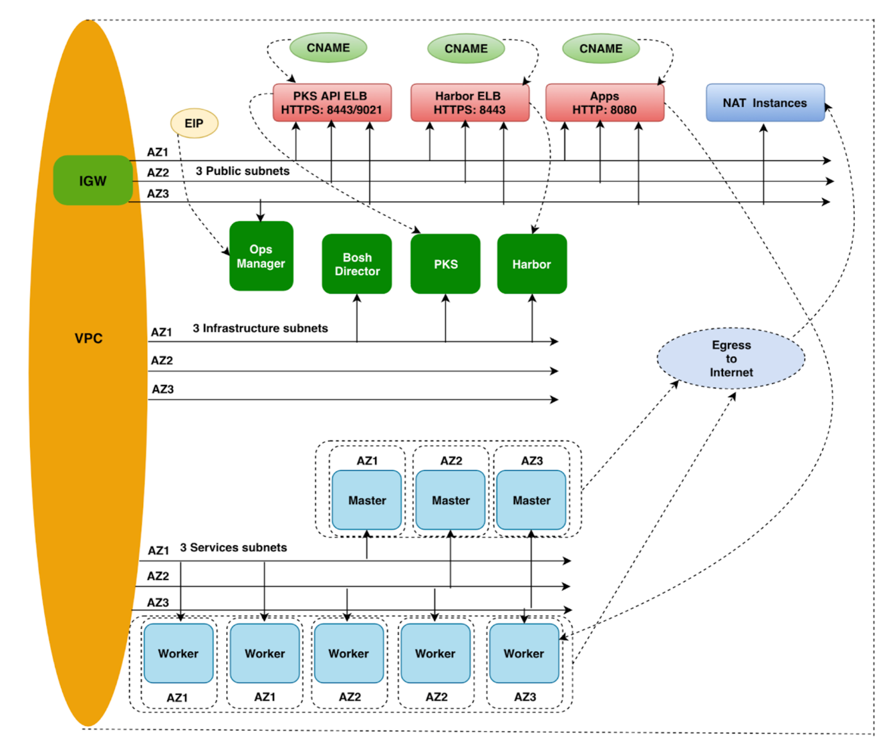
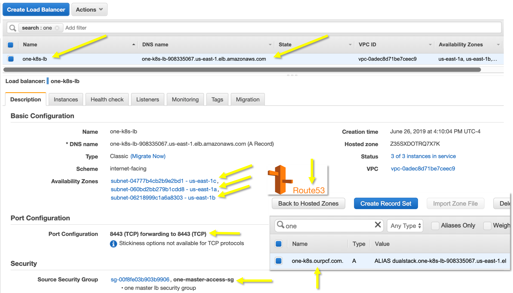
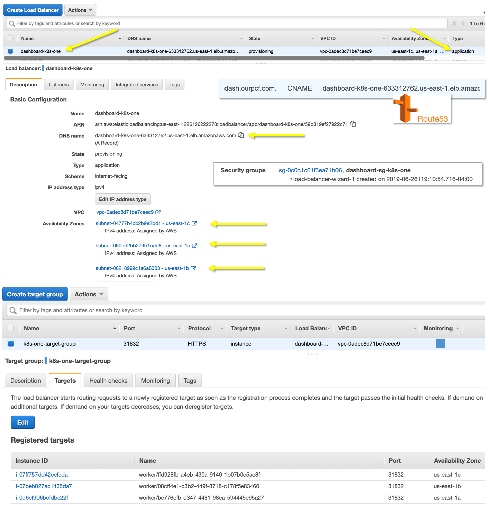
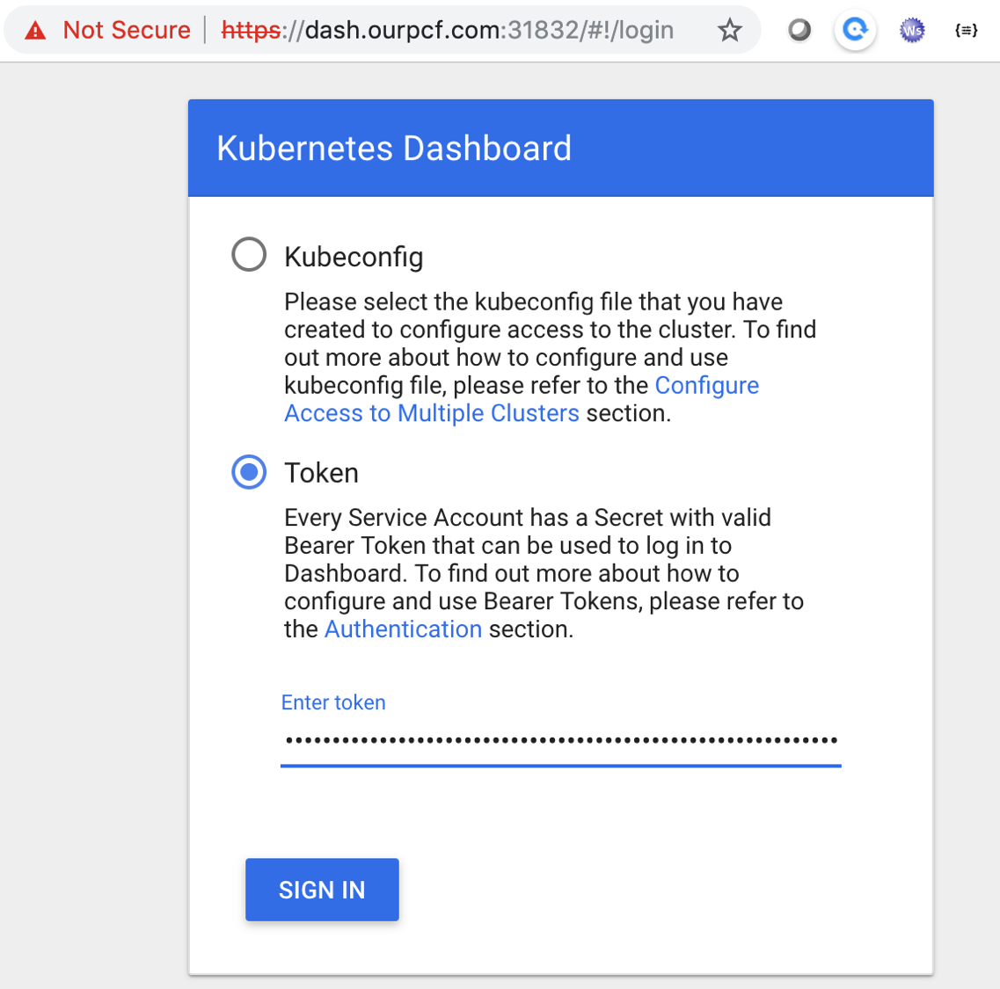
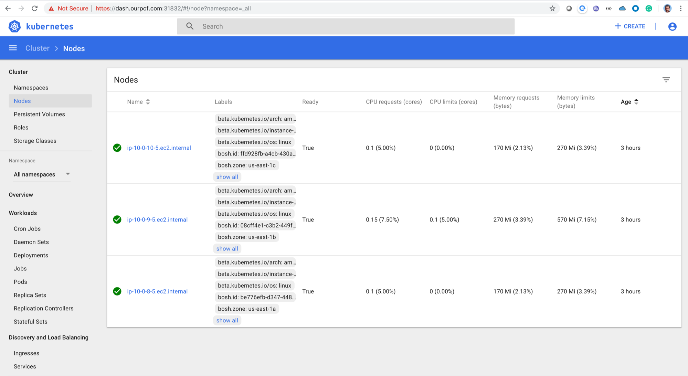
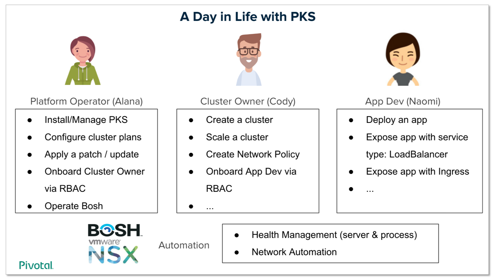

##### https://github.com/ronakbanka/manage-pks by Ronak Banka

# Creating PKS K8s Clusters using Manage-Cluster Utility

Assuming you have a PKS environment running on AWS. 



Assuming that you have the necessary CLIs:  pks, aws and jq.

```
ssh -i ~/Downloads/fuse.pem ubuntu@user24.ourpcf.com
pks login -a https://api.pks.ourpcf.com:9021 -u pks_admin -p password -k
ubuntu@ip-10-0-0-38:~/manage-pks/aws$ export ENV_NAME=pks
ubuntu@ip-10-0-0-38:~/manage-pks/aws$ export ROUTE_53_ZONE_ID=Z3IJH5GRT9EDF0
```

You can execute the following steps to install `manage-cluster` on your Mac:

```
git clone https://github.com/ronakbanka/manage-pks
cd manage-pks/aws
```

Let's make sure my `aws cli` is working:

```
$ aws configure
AWS Access Key ID [****************JETA]: 
AWS Secret Access Key [****************4Yfh]: 
Default region name [us-east-1]: 
Default output format [json]: 
```

A quick way to test your `aws cli`:

```
aws ec2 describe-instances | grep -i privateipaddress
```

# Creating a PKS Cluster using `manage-cluster provision`

Remember to make sure you are in the correct directory:

```
./manage-cluster 
Usage: ./manage-cluster {provision|access|cleanup}
```

OK, then lets create a cluster:

```
./manage-cluster provision
```
```
Enter pks cluster name to be created and press [ENTER]:
one
```
```
Listing pks plans...

Name    ID                                    Description
small   8A0E21A8-8072-4D80-B365-D1F502085560  Example: This plan will configure a lightweight kubernetes cluster. Not recommended for production workloads.
medium  58375a45-17f7-4291-acf1-455bfdc8e371  Medium sized k8s cluster, suitable for more pods.
```
```
Enter pks plan to be provisioned, choose plan from above list and press [ENTER]:
medium
```
```
Fetching domain from provided hosted zone

Creating PKS cluster one with external hostname one-k8s.ourpcf.com. 

Name:                     one
Plan Name:                medium
UUID:                     f79a6c2e-d6ca-4e4e-aa48-aa23909407f6
Last Action:              CREATE
Last Action State:        in progress
Last Action Description:  Creating cluster
Kubernetes Master Host:   one-k8s.ourpcf.com.
Kubernetes Master Port:   8443
Worker Nodes:             3
Kubernetes Master IP(s):  In Progress
Network Profile Name:     

Use 'pks cluster one' to monitor the state of your cluster
```

So notice that the process flows quickly and ends by telling you to use `pks cluster one` to get updates.

Note that the `Kubernetes Master Host:   one-k8s.ourpcf.com`, however there's no AWS Load Balancer, Route53 Entry or Security Group just yet. Once we see the `Last Action State: Succeeded` message we can continue.

```
watch -n 10 pks cluster one
```

```
pks cluster one

Name:                     one
Plan Name:                medium
UUID:                     f79a6c2e-d6ca-4e4e-aa48-aa23909407f6
Last Action:              CREATE
Last Action State:        succeeded
Last Action Description:  Instance provisioning completed
Kubernetes Master Host:   one-k8s.ourpcf.com.
Kubernetes Master Port:   8443
Worker Nodes:             3
Kubernetes Master IP(s):  10.0.10.4, 10.0.9.4, 10.0.8.4
Network Profile Name: 
```

Excellent, now let's get access to this cluster:

```
$ ./manage-cluster access
```

You should see an output similar to this:

```
Listing available clusters...

Name  Plan Name  UUID                                  Status     Action
one   medium     f79a6c2e-d6ca-4e4e-aa48-aa23909407f6  succeeded  CREATE


Enter pks cluster name from above list & press [ENTER]:
one

Getting master nodes for pks cluster one 

Fetching master vms from pks cluster one 

Creating security group for k8s master access

Adding rules to the security group one-master-access-sg 

Fetching public subnets from vpc vpc-0adec8d71be7ceec9 

Adding kubernetes tags to public subnets for LoadBalancer type service

Creating Load balancer for one pks cluster

Adding i-057aecdb121542863 to load balancer one-k8s-lb 
{
    "Instances": [
        {
            "InstanceId": "i-057aecdb121542863"
        }
    ]
}

Adding i-004fdaf591da0c29d to load balancer one-k8s-lb 
{
    "Instances": [
        {
            "InstanceId": "i-057aecdb121542863"
        },
        {
            "InstanceId": "i-004fdaf591da0c29d"
        }
    ]
}

Adding i-05bb15431988d648d to load balancer one-k8s-lb 
{
    "Instances": [
        {
            "InstanceId": "i-057aecdb121542863"
        },
        {
            "InstanceId": "i-05bb15431988d648d"
        },
        {
            "InstanceId": "i-004fdaf591da0c29d"
        }
    ]
}

Creating ELB A record in Hosted Zone

Record change submitted! Change Id: CEVKS005RY1UK 

Waiting for ROUTE changes to be propagated
......
Your record change has now propagated.

Waiting for DNS resolution to go through
...............
Configuring kubectl for creds using pks get-credentials

Fetching credentials for cluster one.
Password: ********
Context set for cluster one.

You can now switch between clusters by using:
$kubectl config use-context <cluster-name>

PKS cluster one information
Kubernetes master is running at https://one-k8s.ourpcf.com.:8443
CoreDNS is running at https://one-k8s.ourpcf.com.:8443/api/v1/namespaces/kube-system/services/kube-dns:dns/proxy

To further debug and diagnose cluster problems, use 'kubectl cluster-info dump'.

Getting all pods across all namespaces...
NAMESPACE     NAME                                    READY   STATUS      RESTARTS   AGE
kube-system   coredns-54586579f6-b2gjh                1/1     Running     0          20m
kube-system   coredns-54586579f6-cxgd2                1/1     Running     0          20m
kube-system   coredns-54586579f6-p8rnf                1/1     Running     0          20m
kube-system   kubernetes-dashboard-6c68548bc9-xhhdd   1/1     Running     0          20m
kube-system   metrics-server-5475446b7f-jjbzh         1/1     Running     0          20m
pks-system    cert-generator-v0.19-68sfc              0/1     Completed   0          20m
pks-system    event-controller-5c764cbc6-6hmhk        2/2     Running     2          20m
pks-system    fluent-bit-b7v4z                        3/3     Running     0          20m
pks-system    fluent-bit-kzsxk                        3/3     Running     0          20m
pks-system    fluent-bit-sj7tg                        3/3     Running     0          20m
pks-system    metric-controller-585878fc8c-lqrpl      1/1     Running     0          20m
pks-system    observability-manager-8d95f455d-w24qw   1/1     Running     0          20m
pks-system    sink-controller-b6bbd7d68-5gvvs         1/1     Running     0          20m
pks-system    telegraf-8ll47                          1/1     Running     0          20m
pks-system    telegraf-c9fqz                          1/1     Running     0          20m
pks-system    telegraf-hjdwg                          1/1     Running     0          20m
pks-system    telemetry-agent-776d45f8d8-7z7m4        1/1     Running     0          17m
pks-system    validator-8568fd5c8f-zm8lj              1/1     Running     0          20m
```

-----------------------------------------------------

## Quick Sanity Check

On the AWS Console we can see:

- A LoadBalancer pointing at 3 Master Nodes
- A Route53 entry pointing `one-k8s.ourpcf.com` to the Load Balancer
- A Security Group definition allowing communication on port 8443



-----------------------------------------------------

## Let's see what Bosh can tell us:

First we need to access Ops Manager: 

```
ssh -i ~/Downloads/fuse.pem ubuntu@opsman.ourpcf.com
```

I've created a `./0.sh` file with the following content:

```
$ cat ./0.sh 
bosh alias-env ci -e 10.0.16.5 --ca-cert /var/tempest/workspaces/default/root_ca_certificate
bosh -e ci login << EOT
director
yba0zJLfwJUyCPes-b4QIOI1GXd5LvZP
EOT
```

So it's easy to get started with Bosh CLI commands:

```
ubuntu@ip-10-0-0-241:~$ ./0.sh 
Using environment '10.0.16.5' as user 'director' (bosh.*.read, openid, bosh.*.admin, bosh.read, bosh.admin)

Name      p-bosh  
UUID      879a3d0c-127f-4bfd-8c9b-6078a6101835  
Version   268.2.3 (00000000)  
CPI       aws_cpi  
Features  compiled_package_cache: disabled  
          config_server: enabled  
          local_dns: enabled  
          power_dns: disabled  
          snapshots: disabled  
User      (not logged in)  

Succeeded
Using environment '10.0.16.5'
Email (): director
Password (): 
Successfully authenticated with UAA
Succeeded
```

Now we can ask Bosh about the PKS Deployments:

```
bosh -e ci vms
```

Here's what you should see:

```
ubuntu@ip-10-0-0-241:~$ bosh -e ci vms
Using environment '10.0.16.5' as user 'director' (bosh.*.read, openid, bosh.*.admin, bosh.read, bosh.admin)

Task 4062
Task 4061. Done
Task 4062 done

Deployment 'pivotal-container-service-9bdbbe836f315bbc999a'

Instance                                                        Process State  AZ          IPs       VM CID               VM Type   Active  
pivotal-container-service/dcde2a9a-43df-4b79-92bb-5163e2b65695  running        us-east-1a  10.0.4.5  i-0e596cdbf3f517a06  r4.large  true  

1 vms

Deployment 'service-instance_f79a6c2e-d6ca-4e4e-aa48-aa23909407f6'

Instance                                     Process State  AZ          IPs        VM CID               VM Type   Active  
master/6ea23c28-b18a-46df-bb58-cf68cdba6c2f  running        us-east-1c  10.0.10.4  i-057aecdb121542863  m4.large  true  
master/c430960d-ad7d-412a-b22b-c0c222e73d8c  running        us-east-1b  10.0.9.4   i-05bb15431988d648d  m4.large  true  
master/e38ea4bd-6c31-4033-b43b-43c430fda8f3  running        us-east-1a  10.0.8.4   i-004fdaf591da0c29d  m4.large  true  
worker/08cff4e1-c3b2-449f-8718-c178f5e83460  running        us-east-1b  10.0.9.5   i-07beb027ac1435da7  m4.large  true  
worker/be776efb-d347-4481-98ea-594445e95a27  running        us-east-1a  10.0.8.5   i-0d6ef906bcfdbc22f  m4.large  true  
worker/ffd928fb-a4cb-430a-9140-1b07b0c5ac8f  running        us-east-1c  10.0.10.5  i-07ff757dd42cefcda  m4.large  true  

6 vms

Succeeded
```

And we can find out what is happening to Worker and Master nodes by looking at Tasks:

```
bosh -e ci tasks --recent       # or bosh -e ci task 4052    # to see the details of Task 4052
```

```
ubuntu@ip-10-0-0-241:~$ bosh -e ci tasks --recent
Using environment '10.0.16.5' as user 'director' (bosh.*.read, openid, bosh.*.admin, bosh.read, bosh.admin)

ID    State  Started At                    Last Activity At              User                                            Deployment                                             Description                                                                                       Result  
4052  done   Wed Jun 26 19:52:54 UTC 2019  Wed Jun 26 19:55:17 UTC 2019  pivotal-container-service-9bdbbe836f315bbc999a  service-instance_f79a6c2e-d6ca-4e4e-aa48-aa23909407f6  run errand telemetry-agent from deployment service-instance_f79a6c2e-d6ca-4e4e-aa48-aa23909407f6  1 succeeded, 0 errored, 0 canceled  
4051  done   Wed Jun 26 19:52:45 UTC 2019  Wed Jun 26 19:52:48 UTC 2019  pivotal-container-service-9bdbbe836f315bbc999a  service-instance_f79a6c2e-d6ca-4e4e-aa48-aa23909407f6  run errand vrops-errand from deployment service-instance_f79a6c2e-d6ca-4e4e-aa48-aa23909407f6     3 succeeded, 0 errored, 0 canceled  
4050  done   Wed Jun 26 19:50:04 UTC 2019  Wed Jun 26 19:52:35 UTC 2019  pivotal-container-service-9bdbbe836f315bbc999a  service-instance_f79a6c2e-d6ca-4e4e-aa48-aa23909407f6  run errand apply-addons from deployment service-instance_f79a6c2e-d6ca-4e4e-aa48-aa23909407f6     1 succeeded, 0 errored, 0 canceled  
4049  done   Wed Jun 26 19:34:12 UTC 2019  Wed Jun 26 19:49:54 UTC 2019  pivotal-container-service-9bdbbe836f315bbc999a  service-instance_f79a6c2e-d6ca-4e4e-aa48-aa23909407f6  create deployment                                                                                 /deployments/service-instance_f79a6c2e-d6ca-4e4e-aa48-aa23909407f6  
4043  done   Wed Jun 26 19:09:04 UTC 2019  Wed Jun 26 19:10:16 UTC 2019  pivotal-container-service-9bdbbe836f315bbc999a  service-instance_1fb4fbda-c596-47e0-a95d-01c66af6b511  delete deployment service-instance_1fb4fbda-c596-47e0-a95d-01c66af6b511                           /deployments/service-instance_1fb4fbda-c596-47e0-a95d-01c66af6b511  
4042  done   Wed Jun 26 19:08:45 UTC 2019  Wed Jun 26 19:08:59 UTC 2019  pivotal-container-service-9bdbbe836f315bbc999a  service-instance_1fb4fbda-c596-47e0-a95d-01c66af6b511  run errand drain-cluster from deployment service-instance_1fb4fbda-c596-47e0-a95d-01c66af6b511    3 succeeded, 0 errored, 0 canceled  
4027  done   Wed Jun 26 17:30:35 UTC 2019  Wed Jun 26 17:33:35 UTC 2019  pivotal-container-service-9bdbbe836f315bbc999a  service-instance_1fb4fbda-c596-47e0-a95d-01c66af6b511  run errand telemetry-agent from deployment service-instance_1fb4fbda-c596-47e0-a95d-01c66af6b511  1 succeeded, 0 errored, 0 canceled  
4026  done   Wed Jun 26 17:30:25 UTC 2019  Wed Jun 26 17:30:34 UTC 2019  pivotal-container-service-9bdbbe836f315bbc999a  service-instance_1fb4fbda-c596-47e0-a95d-01c66af6b511  run errand vrops-errand from deployment service-instance_1fb4fbda-c596-47e0-a95d-01c66af6b511     3 succeeded, 0 errored, 0 canceled  
4024  done   Wed Jun 26 17:27:45 UTC 2019  Wed Jun 26 17:30:21 UTC 2019  pivotal-container-service-9bdbbe836f315bbc999a  service-instance_1fb4fbda-c596-47e0-a95d-01c66af6b511  run errand apply-addons from deployment service-instance_1fb4fbda-c596-47e0-a95d-01c66af6b511     1 succeeded, 0 errored, 0 canceled  
4023  done   Wed Jun 26 17:06:01 UTC 2019  Wed Jun 26 17:27:36 UTC 2019  pivotal-container-service-9bdbbe836f315bbc999a  service-instance_1fb4fbda-c596-47e0-a95d-01c66af6b511  create deployment                                                                                 /deployments/service-instance_1fb4fbda-c596-47e0-a95d-01c66af6b511  
4020  done   Wed Jun 26 16:16:44 UTC 2019  Wed Jun 26 16:17:52 UTC 2019  pivotal-container-service-9bdbbe836f315bbc999a  service-instance_c9ad8374-56c7-418e-92b3-8cf63acd6bee  delete deployment service-instance_c9ad8374-56c7-418e-92b3-8cf63acd6bee                           /deployments/service-instance_c9ad8374-56c7-418e-92b3-8cf63acd6bee  
4019  done   Wed Jun 26 16:16:34 UTC 2019  Wed Jun 26 16:16:39 UTC 2019  pivotal-container-service-9bdbbe836f315bbc999a  service-instance_c9ad8374-56c7-418e-92b3-8cf63acd6bee  run errand drain-cluster from deployment service-instance_c9ad8374-56c7-418e-92b3-8cf63acd6bee    4 succeeded, 0 errored, 0 canceled  
4016  done   Wed Jun 26 15:25:07 UTC 2019  Wed Jun 26 15:27:54 UTC 2019  ops_manager                                     pivotal-container-service-9bdbbe836f315bbc999a         create deployment                                                                                 /deployments/pivotal-container-service-9bdbbe836f315bbc999a  
4015  done   Wed Jun 26 15:25:05 UTC 2019  Wed Jun 26 15:25:05 UTC 2019  ops_manager                                     -                                                      create release                                                                                    Created release 'wavefront-proxy/0.14.0'  
4014  done   Wed Jun 26 15:24:59 UTC 2019  Wed Jun 26 15:24:59 UTC 2019  ops_manager                                     -                                                      create release                                                                                    Created release 'backup-and-restore-sdk/1.8.0'  
4013  done   Wed Jun 26 15:24:50 UTC 2019  Wed Jun 26 15:24:50 UTC 2019  ops_manager                                     -                                                      create release                                                                                    Created release 'bpm/1.0.4'  
4012  done   Wed Jun 26 15:24:47 UTC 2019  Wed Jun 26 15:24:48 UTC 2019  ops_manager                                     -                                                      create release                                                                                    Created release 'uaa/71.0'  
4011  done   Wed Jun 26 15:24:43 UTC 2019  Wed Jun 26 15:24:43 UTC 2019  ops_manager                                     -                                                      create release                                                                                    Created release 'pks-telemetry/2.0.0-build.175'  
4010  done   Wed Jun 26 15:24:39 UTC 2019  Wed Jun 26 15:24:39 UTC 2019  ops_manager                                     -                                                      create release                                                                                    Created release 'sink-resources-release/0.1.27'  
4009  done   Wed Jun 26 15:24:30 UTC 2019  Wed Jun 26 15:24:30 UTC 2019  ops_manager                                     -                                                      create release                                                                                    Created release 'pks-vrops/0.13.0'  
4008  done   Wed Jun 26 15:24:28 UTC 2019  Wed Jun 26 15:24:28 UTC 2019  ops_manager                                     -                                                      create release                                                                                    Created release 'syslog/11.4.0'  
4007  done   Wed Jun 26 15:24:26 UTC 2019  Wed Jun 26 15:24:26 UTC 2019  ops_manager                                     -                                                      create release                                                                                    Created release 'pks-vrli/0.9.0'  
4006  done   Wed Jun 26 15:24:25 UTC 2019  Wed Jun 26 15:24:25 UTC 2019  ops_manager                                     -                                                      create release                                                                                    Created release 'nsx-cf-cni/2.4.0.12511604'  
4005  done   Wed Jun 26 15:24:22 UTC 2019  Wed Jun 26 15:24:22 UTC 2019  ops_manager                                     -                                                      create release                                                                                    Created release 'pks-nsx-t/1.25.1'  
4004  done   Wed Jun 26 15:24:19 UTC 2019  Wed Jun 26 15:24:19 UTC 2019  ops_manager                                     -                                                      create release                                                                                    Created release 'pks-api/1.4.0-build.194'  
4003  done   Wed Jun 26 15:24:14 UTC 2019  Wed Jun 26 15:24:15 UTC 2019  ops_manager                                     -                                                      create release                                                                                    Created release 'on-demand-service-broker/0.26.0'  
4002  done   Wed Jun 26 15:24:11 UTC 2019  Wed Jun 26 15:24:11 UTC 2019  ops_manager                                     -                                                      create release                                                                                    Created release 'kubo-service-adapter/1.4.0-build.194'  
4001  done   Wed Jun 26 15:24:09 UTC 2019  Wed Jun 26 15:24:09 UTC 2019  ops_manager                                     -                                                      create release                                                                                    Created release 'cfcr-etcd/1.10.0'  
4000  done   Wed Jun 26 15:24:06 UTC 2019  Wed Jun 26 15:24:06 UTC 2019  ops_manager                                     -                                                      create release                                                                                    Created release 'kubo/0.31.0'  
3999  done   Wed Jun 26 15:23:59 UTC 2019  Wed Jun 26 15:23:59 UTC 2019  ops_manager                                     -                                                      create release                                                                                    Created release 'docker/35.1.0'  

30 tasks

Succeeded
```

-----------------------------------------------------

## Using Kubectl

Let's get back into the VM that has access to our K8s cluster:

```
ssh -i ~/Downloads/fuse.pem ubuntu@user24.ourpcf.com
pks login -a https://api.pks.ourpcf.com:9021 -u pks_admin -p password -k
ubuntu@ip-10-0-0-38:~/manage-pks/aws$ export ENV_NAME=pks
ubuntu@ip-10-0-0-38:~/manage-pks/aws$ export ROUTE_53_ZONE_ID=Z3IJH5GRT9EDF0
```

Let's obtain the Kubectl credentials:

```
pks get-credentials one
```

You should see an output similar to the one shown below:

```
ubuntu@ip-10-0-0-38:~$ pks get-credentials one

Fetching credentials for cluster one.
Password: ********
Context set for cluster one.

You can now switch between clusters by using:
$kubectl config use-context <cluster-name>
```

Let's take a look and Worker Nodes:

```
kubectl get nodes --all-namespaces
```

You should see:

```
ubuntu@ip-10-0-0-38:~$ kubectl get nodes --all-namespaces
NAME                        STATUS   ROLES    AGE     VERSION
ip-10-0-10-5.ec2.internal   Ready    <none>   3h9m    v1.13.5
ip-10-0-8-5.ec2.internal    Ready    <none>   3h15m   v1.13.5
ip-10-0-9-5.ec2.internal    Ready    <none>   3h12m   v1.13.5
```

And Services:

```
kubectl get services --all-namespaces
```

```
ubuntu@ip-10-0-0-38:~$ kubectl get services --all-namespaces
NAMESPACE     NAME                   TYPE        CLUSTER-IP       EXTERNAL-IP   PORT(S)         AGE
default       kubernetes             ClusterIP   10.100.200.1     <none>        443/TCP         3h20m
kube-system   kube-dns               ClusterIP   10.100.200.2     <none>        53/UDP,53/TCP   3h6m
kube-system   kubernetes-dashboard   NodePort    10.100.200.19    <none>        443:31832/TCP   3h6m
kube-system   metrics-server         ClusterIP   10.100.200.217   <none>        443/TCP         3h6m
pks-system    fluent-bit             ClusterIP   10.100.200.131   <none>        24224/TCP       3h6m
pks-system    validator              ClusterIP   10.100.200.207   <none>        443/TCP         3h6m
```

So we should be able to access the K8s Dashboard on port 31832. We'll need a token for that, or access to `~/.kube/config`.

Let's create a Load Balancer for the K8s Dashboard that will give us insight into how the cluster `one` is behaving:



Now let's access the Dashboard at `https://dash.ourpcf.com:31832` and use the following commands to get the Token:

```
ubuntu@ip-10-0-0-38:~$ cat ~/.kube/config | grep "name:\|id-token:"
  name: one
  name: pks_managers_cluster
  name: one
  name: pks_managers_cluster
- name: pks_admin
        id-token: eyJhbGciOiJSUzI1NiIsImprdSI6Imh0dHBzOi8vYXBpLnBrcy5vdXJwY2YuY29tOjg0NDMvdG9rZW5fa2V5cyIsImtpZCI6ImtleS0xIiwidHlwIjoiSldUIn0.eyJqdGkiOiIzNjFkMjcwOTA4ZWE0MDU0YTI4YWZhN2UxNjZkOTMzZiIsInN1YiI6IjQ4NjI0MjE5LWRhNDUtNGY5MC05Y2FjLWVkYzY2Y2FjYzdjMCIsInNjb3BlIjpbIm9wZW5pZCIsInJvbGVzIl0sImNsaWVudF9pZCI6InBrc19jbHVzdGVyX2NsaWVudCIsImNpZCI6InBrc19jbHVzdGVyX2NsaWVudCIsImF6cCI6InBrc19jbHVzdGVyX2NsaWVudCIsImdyYW50X3R5cGUiOiJwYXNzd29yZCIsInVzZXJfaWQiOiI0ODYyNDIxOS1kYTQ1LTRmOTAtOWNhYy1lZGM2NmNhY2M3YzAiLCJvcmlnaW4iOiJ1YWEiLCJ1c2VyX25hbWUiOiJwa3NfYWRtaW4iLCJlbWFpbCI6InBrc19hZG1pbkBwaXZvdGFsLmlvIiwiYXV0aF90aW1lIjoxNTYxNTg5Nzg2LCJyZXZfc2lnIjoiNmU5ODg4YjQiLCJpYXQiOjE1NjE1ODk3ODYsImV4cCI6MTU2MTYzMjk4NiwiaXNzIjoiaHR0cHM6Ly9hcGkucGtzLm91cnBjZi5jb206ODQ0My9vYXV0aC90b2tlbiIsInppZCI6InVhYSIsImF1ZCI6WyJvcGVuaWQiLCJwa3NfY2x1c3Rlcl9jbGllbnQiXX0.i4DSaFOsPYYUvx_3D62rSlOW3O7R8CBPJAri7beMcipx-KKu9osLI5Bok44zw9E-mbKxY26xEmt3KDDoLPQpiZQlwtRK4NJ2TiuEB6xztnjDuZLKuQztRT7FiElrbp2F_4G49dhOnH79xhRtdXgNRnwj4EiaF_GIUJdPiFS_Mf-mxFTlw9XzlIZbRrPsYW587G7RdxIN7SozM5Tnz2sDLzskWbvITyn4sJitzqTSyHbk38_XztIT4H2KtU6yH4dmM4CKiTRhaeJDByqx3nLtt666damzEuNjlggrEPF2YCoQP0naGZ-UwxUNYXkEsnKbyOM2q7IbO_jxm-dfoXGRzw
```

The Token starts with `eyJhb` and ends with `XGRzw`



And you should see the K8s Dashboard.




-----------------------------------------------------

## Using PKS to resize a cluster

Let's resize our cluster `one` to 4 Worker Nodes:

```
pks resize one -n 4
```

You should see an output similar to the one shown below:

```
ubuntu@ip-10-0-0-38:~$ pks resize one -n 4

Are you sure you want to resize cluster one to 4? (y/n): y
Use 'pks cluster one' to monitor the state of your cluster

ubuntu@ip-10-0-0-38:~$ pks cluster one

Name:                     one
Plan Name:                medium
UUID:                     f79a6c2e-d6ca-4e4e-aa48-aa23909407f6
Last Action:              UPDATE
Last Action State:        in progress
Last Action Description:  Instance update in progress
Kubernetes Master Host:   one-k8s.ourpcf.com.
Kubernetes Master Port:   8443
Worker Nodes:             4
Kubernetes Master IP(s):  10.0.10.4, 10.0.9.4, 10.0.8.4
Network Profile Name: 
```

After approximately 9 minutes you should see `Last Action: succeeded`

-----------------------------------------------------

## Who's who in the PKS World



-----------------------------------------------------

## Noisy Neighbors using namepaces: Development and Production 

We are going to need three terminal sessions with kubectl access to our cluster `one`:

1. Let's spin up a pod using an Ubuntu image in a `development` namespace, and then access it via a command line prompt:

```
kubectl config current-context
kubectl create namespace development
kubectl run -i --tty ubuntu --image=ubuntu:18.04 --restart=Never -n development -- /bin/bash -il
If you don't see a command prompt, try pressing enter.
Note: If it crashes, clean-up using $ kubectl delete pods ubuntu -n development
```

2. Using a second terminal session:

```
Mac $ ssh -i ~/Downloads/fuse.pem ubuntu@user24.ourpcf.com
ubuntu@ip-10-0-0-38:~$ watch -n 2 kubectl top node
NAME                        CPU(cores)   CPU%   MEMORY(bytes)   MEMORY%   
ip-10-0-10-5.ec2.internal   42m          2%     825Mi           10%       
ip-10-0-8-5.ec2.internal    50m          2%     771Mi           9%        
ip-10-0-8-7.ec2.internal    39m          1%     615Mi           7% 
ip-10-0-9-5.ec2.internal    60m          3%     872Mi           11%
```

3. Using a third terminal session let's kick off a lightweight workload in a `production` namespace:

```
Mac $ ssh -i ~/Downloads/fuse.pem ubuntu@user24.ourpcf.com
ubuntu@ip-10-0-0-38:~$ kubectl create namespace production
ubuntu@ip-10-0-0-38:~$ kubectl run -i --tty ubuntu-v2 --image=ubuntu:18.04 --restart=Never -n production -- /bin/bash -il
root@ubuntu-v2:/# while true; do time echo 1| awk '{ for(i=1;i<=220000000;i++); }'; done
```

You should see something like this:

```
real	0m5.511s
user	0m5.503s
sys     0m0.004s

real	0m5.539s
user	0m5.536s
sys     0m0.000s

real	0m5.517s
user	0m5.516s
sys     0m0.000s
```

4. Back to the first terminal. Using the Ubuntu command prompt:

```
root@ubuntu:/# while true; do echo 1 | awk '{ for(i=1;i<100000000;i++) u=sqrt(1.2131415272*i*i/5); }'; done &
[1] 14
root@ubuntu:/# while true; do echo 1 | awk '{ for(i=1;i<100000000;i++) u=sqrt(1.2131415272*i*i/5); }'; done &
[2] 17
root@ubuntu:/# ps -ef
UID        PID  PPID  C STIME TTY          TIME CMD
root         1     0  0 01:44 pts/0    00:00:00 /bin/bash -il
root        14     1  0 01:44 pts/0    00:00:00 /bin/bash -il
root        17     1  0 01:44 pts/0    00:00:00 /bin/bash -il
root        23    17 88 01:44 pts/0    00:00:07 awk { for(i=1;i<100000000;i++) u=sqrt(1.2131415272*i*i/5); }
root        25    14 88 01:44 pts/0    00:00:03 awk { for(i=1;i<100000000;i++) u=sqrt(1.2131415272*i*i/5); }
root        26     1  0 01:44 pts/0    00:00:00 ps -ef
```

5. Observe the second terminal session which is running the `watch -n 2 kubectl top node` command:

```
NAME                        CPU(cores)   CPU%   MEMORY(bytes)   MEMORY%   
ip-10-0-10-5.ec2.internal   42m          2%     825Mi           10%       
ip-10-0-8-5.ec2.internal    50m          2%     771Mi           9%        
ip-10-0-8-7.ec2.internal    2001m        100%   575Mi           7%        
ip-10-0-9-5.ec2.internal    60m          3%     872Mi           11%
```

6. And now take a look at the third terminal window, the one showing the workload in the `production` namespace:


```
real	0m11.559s
user	0m8.443s
sys     0m0.004s

real	0m12.115s
user	0m8.427s
sys     0m0.004s

real	0m10.228s
user	0m8.443s
sys     0m0.009s

real	0m12.138s
user	0m8.429s
sys     0m0.008s
```

7. Cleaning-up:

```
ubuntu@ip-10-0-0-38:~$ kubectl delete pods ubuntu-v2 -n production
ubuntu@ip-10-0-0-38:~$ kubectl delete pods ubuntu -n development
```

-----------------------------------------------------

## Bosh Autoscaling

- [Bosh AutoScaler Presentation](https://www.slideshare.net/i_yudai/autoscaling-cloud-foundry-with-bosh)

- [Bosh AutoScaler on GitHub](https://github.com/cloudfoundry-community/bosh-scaler-boshrelease)

-----------------------------------------------------


## Addendum

- [PKS deep-dive presentation](https://docs.google.com/presentation/d/1PIrcWkMsGgRb7NnYGSXSE0QD-hrNtDqS_jt6ANlQOyQ/edit#slide=id.g4c9449bda2_2_22935) 

- [Kubectl Cheat-Sheet](https://kubernetes.io/docs/reference/kubectl/cheatsheet/#kubectl-context-and-configuration)

- [Deep VMware Dive into PKS](https://kb.vmtestdrive.com/hc/en-us/articles/360006367673-Pivotal-Container-Service-Advanced-Walkthroughs)


